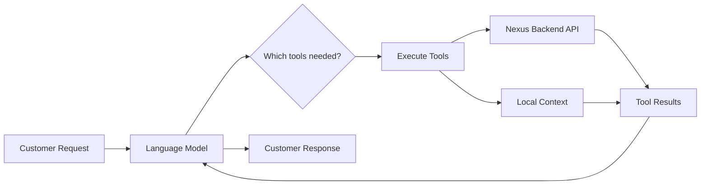

## Complete Tools Reference

This comprehensive guide covers every tool available to LeClerk's AI agent. These tools allow the chatbot to interact with restaurant systems, manage orders, validate information, and provide intelligent customer service.

Tools are the bridge between natural language conversations and concrete business operations. When a customer says "I want pizza delivered to my address," the AI uses tools to check the address, search the menu, and update the order draft.

### Tool Architecture



## Address & Location Tools

### `check_address`

**Purpose**: Validates delivery addresses and determines which location should serve the customer.

**When to use**:

- Customer requests delivery
- Customer provides a new address
- Organization mode needs location selection

**Parameters**:

- `address`: The delivery address to validate
- `service_type`: "delivery" or "pickup"

**Example Usage**:

```json
{
  "address": "123 Rue de Rivoli, Paris 75001",
  "service_type": "delivery"
}
```

**Returns**:

- Delivery availability and fees
- Location assignment (in organization mode)
- Error messages for invalid addresses

**Backend Operation**: Calls `/addresses/check` endpoint with geocoding and zone validation.

For detailed information, see [Check Address Functionality](/working-with-the-chatbot/check-address).

### `switch_location`

**Purpose**: Changes the active location context in organization mode.

**When to use**:

- Customer explicitly requests a different location
- Current location can't fulfill the request
- Customer wants to compare options

**Parameters**:

- `location_id`: The new location to switch to
- `reason`: Why the switch is happening

**Example Usage**:

```json
{
  "location_id": "loc_champs_elysees",
  "reason": "customer_preference"
}
```

**Returns**:

- Confirmation of location switch
- New location details and capabilities
- Updated delivery information

## Menu & Catalog Tools

### `menu_lookup`

**Purpose**: Searches and retrieves menu information including products, categories, deals, and availability.

**When to use**:

- Customer asks about menu items
- Customer wants to browse categories
- Need to check item availability or pricing

**Parameters**:

- `query`: Search terms (optional)
- `category_id`: Specific category to browse (optional)
- `fields`: Which data to return (name, price, description, etc.)
- `include_deals`: Whether to include promotional offers

**Example Usage**:

```json
{
  "query": "pepperoni pizza",
  "fields": ["name", "price", "description", "available_sizes"],
  "include_deals": true
}
```

**Returns**:

- Matching menu items with details
- Available sizes and options
- Current promotions
- Availability status

**Backend Operation**: Queries the catalog system with search and filtering.

## Order Management Tools

### `update_order_draft`

**Purpose**: The central tool for all order modifications - adding items, changing quantities, setting delivery details, applying discounts.

**When to use**:

- Customer wants to add items to their order
- Customer changes their mind about something
- Need to apply discounts or set delivery preferences

**Parameters**:

- `operation`: Type of update (add_item, remove_item, set_delivery, etc.)
- `items`: Items to add/modify
- `delivery_address`: Delivery location
- `discount_code`: Promotion code to apply
- `service_type`: Delivery or pickup
- Various other operation-specific parameters

**Example Usage**:

```json
{
  "operation": "add_item",
  "items": [
    {
      "product_id": "pizza_pepperoni",
      "size": "large",
      "quantity": 2,
      "options": { "crust": "thin" }
    }
  ]
}
```

**Returns**:

- Updated order summary
- New totals and taxes
- Validation messages
- Delivery estimates

**Backend Operation**: Calls order draft management endpoints with validation and pricing.

For comprehensive details, see [Update Order Draft Functionality](/working-with-the-chatbot/update-order-draft).

### `send_order_form`

**Purpose**: Sends an interactive WhatsApp order form to the customer.

**When to use**:

- Location has WhatsApp ordering flows enabled
- Customer prefers visual ordering interface
- Complex orders benefit from structured forms

**Parameters**:

- `form_type`: Type of form to send (menu_selection, customization, etc.)
- `context`: Current order context for pre-filling

**Returns**:

- Confirmation that form was sent
- Instructions for customer on how to use it

**Backend Operation**: Triggers WhatsApp Business API flow messaging.

## Customer Context Tools

### `get_customer_previous_orders`

**Purpose**: Retrieves customer's order history, favorites, and ordering patterns.

**When to use**:

- Customer asks "what did I order last time?"
- Want to suggest reorders or favorites
- Need to understand customer preferences

**Parameters**:

- `limit`: Number of orders to retrieve
- `include_items`: Whether to include detailed item information
- `time_period`: Optional filter for recent orders

**Example Usage**:

```json
{
  "limit": 5,
  "include_items": true,
  "time_period": "last_30_days"
}
```

**Returns**:

- List of previous orders with details
- Frequently ordered items
- Order timing patterns
- Spending statistics

### `manage_customer_memory`

**Purpose**: Stores and retrieves persistent notes about customer preferences.

**When to use**:

- Customer mentions allergies or dietary restrictions
- Customer expresses preferences worth remembering
- Need to recall previously stored information

**Parameters**:

- `operation`: "set", "get", or "delete"
- `key`: Memory category (allergies, preferences, etc.)
- `value`: Information to store (for set operation)

**Example Usage**:

```json
{
  "operation": "set",
  "key": "dietary_restrictions",
  "value": "gluten-free, no mushrooms"
}
```

**Returns**:

- Confirmation of memory operation
- Current or updated memory values

### `change_customer_language`

**Purpose**: Updates the customer's language preference for future interactions.

**When to use**:

- Customer requests to switch languages
- Customer is more comfortable in a different language

**Parameters**:

- `language_code`: ISO language code (en, fr, es, etc.)

**Returns**:

- Confirmation of language change
- Notification that future messages will be in new language

## Order Status & Tracking Tools

### `query_live_order_status`

**Purpose**: Gets real-time information about active orders including payment, preparation, and delivery status.

**When to use**:

- Customer asks "where is my order?"
- Need to provide delivery updates
- Customer has questions about payment status

**Parameters**:

- `order_id`: Specific order to check (optional, defaults to current)
- `include_payment`: Whether to include payment information
- `include_delivery`: Whether to include delivery tracking

**Returns**:

- Current order status and timeline
- Payment confirmation details
- Delivery tracking information
- Estimated completion times

## Communication & Scheduling Tools

### `schedule_message`

**Purpose**: Schedules a message to be sent to the customer at a future time.

**When to use**:

- Want to send order reminders
- Need to follow up about delivery
- Proactive customer service opportunities

**Parameters**:

- `message`: Content to send
- `send_time`: When to send it (ISO timestamp)
- `message_type`: Category of message (reminder, follow_up, etc.)

**Example Usage**:

```json
{
  "message": "Your order will be ready for pickup in 10 minutes!",
  "send_time": "2024-01-15T19:20:00Z",
  "message_type": "pickup_reminder"
}
```

**Returns**:

- Confirmation of scheduled message
- Message ID for future reference

### `list_scheduled_messages`

**Purpose**: Retrieves currently scheduled messages for the customer.

**When to use**:

- Customer wants to know what reminders are set
- Need to avoid duplicate scheduling
- Managing message queue

**Returns**:

- List of pending scheduled messages
- Timing and content of each message

### `cancel_scheduled_message`

**Purpose**: Cancels a previously scheduled message.

**When to use**:

- Customer requests to stop reminders
- Order circumstances changed
- Duplicate messages were scheduled

**Parameters**:

- `message_id`: ID of message to cancel

**Returns**:

- Confirmation of cancellation

### `react_to_message`

**Purpose**: Adds emoji reactions to customer messages.

**When to use**:

- Acknowledge customer excitement or satisfaction
- Provide quick positive feedback
- Enhance conversational experience

**Parameters**:

- `emoji`: Emoji to react with
- `message_id`: Which message to react to (optional)

**Example Usage**:

```json
{
  "emoji": "👍",
  "message_id": "msg_12345"
}
```

## Feedback & Support Tools

### `register_feedback`

**Purpose**: Records structured customer feedback and satisfaction scores.

**When to use**:

- After order completion
- Customer expresses satisfaction or complaints
- Systematic feedback collection

**Parameters**:

- `rating`: Numerical score (1-5)
- `category`: Type of feedback (food_quality, delivery_speed, etc.)
- `comment`: Free-text feedback
- `order_id`: Related order (optional)

**Example Usage**:

```json
{
  "rating": 5,
  "category": "food_quality",
  "comment": "Pizza was perfectly cooked and delicious!",
  "order_id": "order_12345"
}
```

**Returns**:

- Confirmation of feedback recorded
- Thank you message to customer

### `report`

**Purpose**: Reports technical issues or escalates problems to support teams.

**When to use**:

- System errors occur
- Customer reports serious problems
- Unusual situations need human attention

**Parameters**:

- `issue_type`: Category of problem
- `description`: Detailed description
- `severity`: How urgent the issue is
- `customer_context`: Relevant customer information

**Returns**:

- Confirmation that issue was reported
- Reference number for tracking
- Next steps for resolution

**Backend Operation**: Creates Linear issues and sends Discord notifications to support teams.

## Organization & Location Tools

### `get_organization_locations`

**Purpose**: Retrieves information about all locations in a restaurant organization.

**When to use**:

- Customer wants to know about other locations
- Need to compare options for customer
- Organization mode location discovery

**Returns**:

- List of all locations with details
- Operating hours and contact information
- Service capabilities of each location

For detailed multi-location concepts, see [Multi-Location Management](/working-with-the-chatbot/multi-location-management).

## Tool Usage Best Practices

### Efficiency Guidelines

1. **Batch Related Operations**: Use single tool calls for multiple related items when possible
2. **Check Prerequisites**: Validate addresses before updating orders
3. **Use Minimal Fields**: Only request data you actually need
4. **Cache Results**: Don't repeatedly call the same tools with same parameters

### Error Handling

1. **Graceful Degradation**: Provide alternatives when tools fail
2. **Clear Error Messages**: Explain what went wrong and what customer can do
3. **Escalation Paths**: Use `report` tool for serious issues
4. **Retry Logic**: Some operations can be safely retried

### Customer Experience

1. **Latency Awareness**: Minimize tool calls that slow response time
2. **Proactive Information**: Use tools to anticipate customer needs
3. **Confirmation**: Always confirm important operations like order changes
4. **Transparency**: Let customers know when you're checking information

### Development Guidelines

1. **Tool Testing**: Test each tool with various parameters and edge cases
2. **Parameter Validation**: Ensure required parameters are provided
3. **Response Parsing**: Handle all possible response formats
4. **Monitoring**: Track tool usage and success rates

Tools are the foundation of LeClerk's intelligence. They transform conversational AI from a simple chat interface into a powerful business automation system that can handle complex restaurant operations while maintaining natural, helpful customer interactions.
