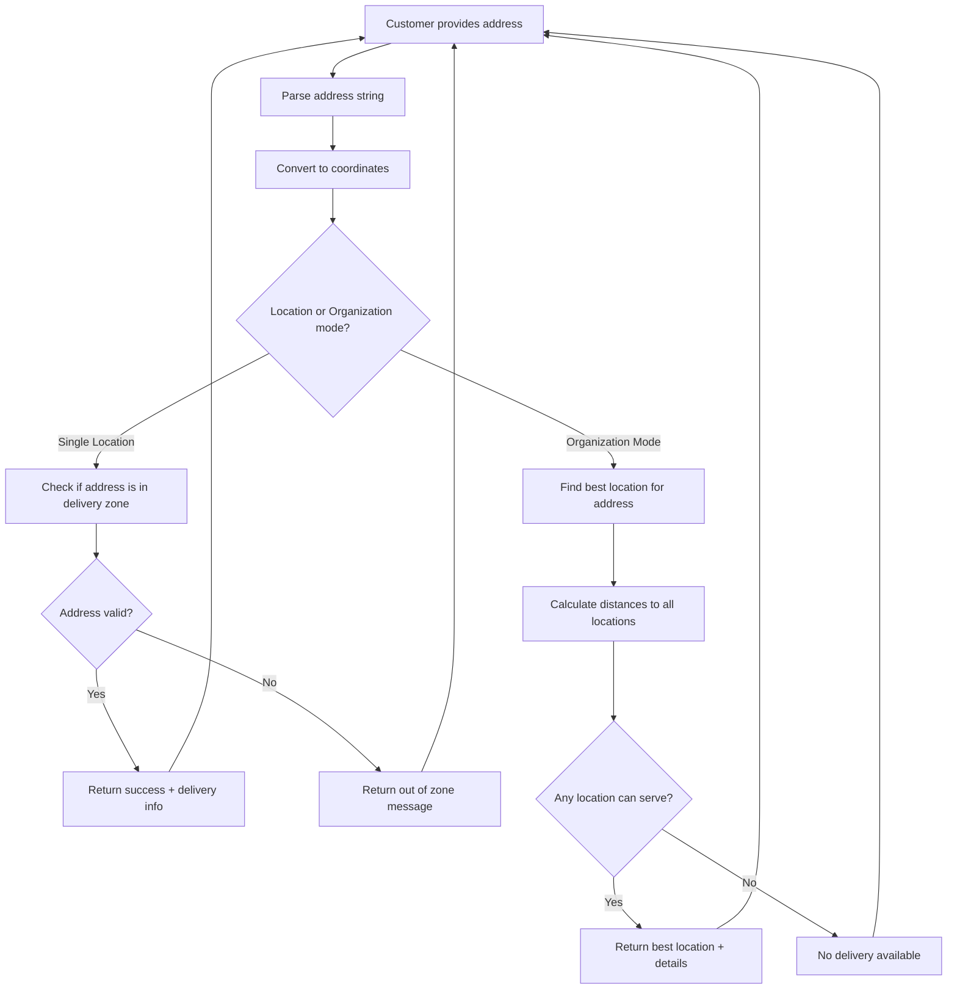

## Check Address Functionality

The `check_address` tool is one of the most critical functions in LeClerk. It validates whether a restaurant can deliver to a customer's location and, in multi-location scenarios, determines which restaurant location should handle the order.

### Why Address Checking Matters

Before a customer can place a delivery order, several things need to be validated:

- **Service Area**: Is the address within the delivery zone?
- **Location Selection**: For restaurant chains, which location should fulfill the order?
- **Delivery Feasibility**: Can drivers actually reach this address?
- **Pricing**: What's the delivery fee for this location?

### How Check Address Works



### Single Location Mode

When a customer is talking to a specific restaurant location, address checking is straightforward:

#### Input

```json
{
  "address": "123 Rue de Rivoli, Paris 75001",
  "service_type": "delivery"
}
```

#### Process

1. **Geocoding**: Convert the address to latitude/longitude coordinates
2. **Zone Check**: Verify the coordinates fall within the restaurant's delivery polygon
3. **Distance Calculation**: Calculate delivery distance and estimated time
4. **Fee Calculation**: Determine delivery cost based on distance/zone

#### Success Response

```json
{
  "valid": true,
  "deliverable": true,
  "delivery_fee": 3.5,
  "estimated_delivery_time": 45,
  "message": "We deliver to that address! Delivery fee is €3.50 and estimated time is 45 minutes."
}
```

#### Failure Response

```json
{
  "valid": true,
  "deliverable": false,
  "message": "Sorry, that address is outside our delivery zone. We deliver within 5km of our restaurant. Would you like to try pickup instead?"
}
```

### Organization Mode (Multi-Location)

When a customer contacts a restaurant chain, address checking becomes more sophisticated:

#### Input

```json
{
  "address": "456 Avenue des Champs-Élysées, Paris 75008",
  "service_type": "delivery"
}
```

#### Process

1. **Geocoding**: Convert address to coordinates
2. **Location Discovery**: Find all restaurant locations in the organization
3. **Distance Calculation**: Calculate distance from address to each location
4. **Serviceability Check**: For each location, check if they deliver to this address
5. **Optimization**: Select the best location based on:
   - Distance (closer is better)
   - Delivery zones (must be serviceable)
   - Current load (avoid overwhelmed locations)
   - Special preferences (flagship stores, faster kitchens)

#### Success Response

```json
{
  "valid": true,
  "deliverable": true,
  "location_id": "loc_champs_elysees",
  "location_name": "Pizza Palace - Champs-Élysées",
  "delivery_fee": 2.5,
  "estimated_delivery_time": 35,
  "distance_km": 2.1,
  "message": "Perfect! Our Champs-Élysées location can deliver to you in about 35 minutes for €2.50."
}
```

### Address Parsing and Validation

LeClerk handles various address formats:

#### Complete Addresses

- "123 Rue de la Paix, 75001 Paris, France"
- "45 Baker Street, London W1U 6TW, UK"

#### Partial Addresses

- "Rue de Rivoli, Paris" → Asks for house number
- "75001" → Asks for street address
- "Near the Louvre" → Asks for specific address

#### Invalid Addresses

- "asdfgh" → Asks customer to provide a real address
- "New York" → (For Paris restaurant) Explains service area

### Integration with Order Flow

Address checking integrates seamlessly with the ordering process:

#### Early Validation

```xml
<thinking>
Customer said "I want delivery" but we don't have their address yet.
I should ask for their address and then validate it.
</thinking>

<response_for_customer>
I'd be happy to help you with delivery! What's your delivery address?
</response_for_customer>
```

#### Successful Validation

```xml
<thinking>
Customer provided "123 Rue Saint-Honoré, Paris". Let me check if we deliver there.
</thinking>

<!-- check_address tool call happens -->

<response_for_customer>
Great! We can deliver to Rue Saint-Honoré. Delivery fee is €3.00 and it will take about 40 minutes.

Now, what would you like to order? Here are some popular items:
🍕 Margherita - €12.50
🍕 Pepperoni - €14.00
</response_for_customer>
```

#### Failed Validation with Alternative

```xml
<thinking>
Address check failed - they're outside our delivery zone.
I should offer pickup as an alternative and maybe suggest our nearest location.
</thinking>

<response_for_customer>
I'm sorry, but that address is outside our delivery zone. However, you can still order for pickup!

Our nearest location is Pizza Palace Châtelet (15 minutes by metro). Would you like to place a pickup order there instead?
</response_for_customer>
```

### Advanced Features

#### Smart Address Suggestions

When customers provide ambiguous addresses:

```json
{
  "address": "Rue de la Paix",
  "suggestions": ["Rue de la Paix, 75001 Paris", "Rue de la Paix, 75002 Paris"],
  "message": "I found multiple Rue de la Paix locations. Which one do you mean?"
}
```

#### Previous Address Memory

For returning customers:

```xml
<thinking>
This customer has ordered before. Let me check if they want to use their previous delivery address: "123 Rue Saint-Antoine, Paris".
</thinking>

<response_for_customer>
Welcome back! Would you like delivery to your usual address at 123 Rue Saint-Antoine? Or do you have a different address today?
</response_for_customer>
```

#### Apartment and Building Details

For complex addresses:

```json
{
  "address": "123 Rue de Rivoli, Building A, Apt 4B, 75001 Paris",
  "delivery_instructions": "Building A, Apartment 4B, Ring doorbell",
  "valid": true,
  "deliverable": true
}
```

### Error Handling

#### Geocoding Failures

When the address can't be found:

- Ask customer to provide more details
- Suggest common address formats
- Offer to try nearby landmarks

#### System Errors

When the address service is down:

- Fall back to manual address collection
- Note the order may need manual verification
- Escalate to human support if needed

#### Edge Cases

- Addresses on delivery zone boundaries → Manual review
- New construction not in maps → Customer provides landmarks
- Temporary street closures → Alternative routing suggestions

### Development and Testing

#### Testing Address Validation

```bash
# Test various address formats
curl -X POST /message \
  -H "Authorization: Bearer $API_KEY" \
  -d '{"customer_message": "I want delivery to [test address]"}'
```

#### Common Test Cases

- Valid addresses in delivery zone
- Addresses just outside delivery zone
- Malformed or invalid addresses
- International addresses (if applicable)
- Addresses with special characters

#### Monitoring Address Success Rates

Track metrics like:

- Percentage of addresses successfully validated
- Average time for address validation
- Most common validation failures
- Geographic patterns in delivery requests

### Integration Points

The check_address tool integrates with:

- **Order Draft System**: Automatically updates delivery address
- **Customer Profiles**: Saves validated addresses for future use
- **Delivery Estimation**: Provides realistic timing expectations
- **Pricing Engine**: Calculates location-specific delivery fees

Address checking is the foundation that makes reliable delivery possible. By validating addresses early and providing clear feedback, LeClerk ensures customers have realistic expectations and orders can be fulfilled successfully.
