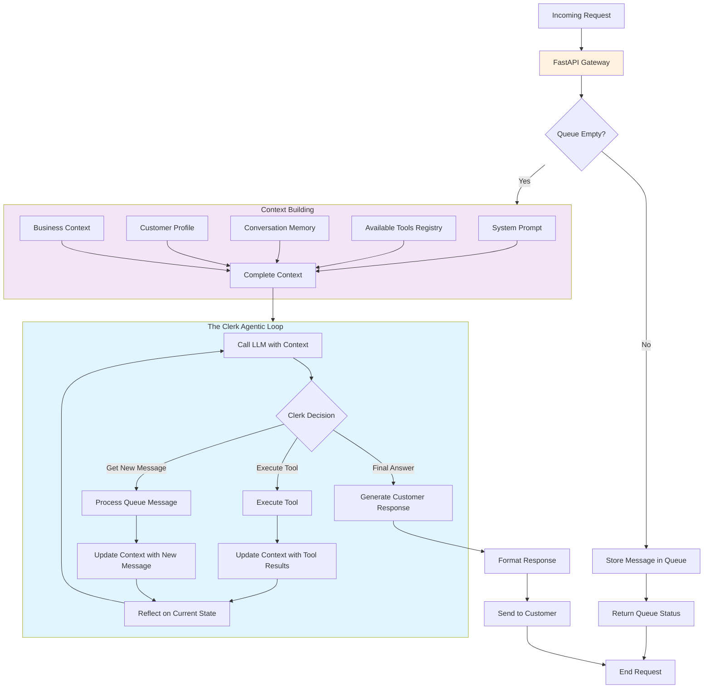
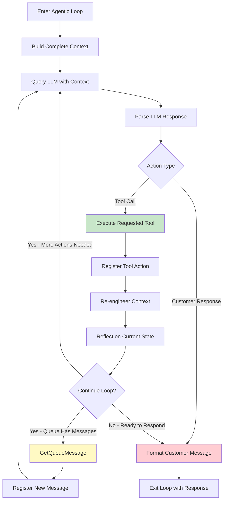

# Framework structure

The Clerk framework is built around a central agent architecture with everything managed by the Clerk - the single central piece of the entire system.

## System Overview



## Core Components

### The Clerk
The Clerk is the heart of the system, defined by two fundamental elements:
- **Context** - The memory and state management system
- **Tools** - The capabilities and actions the agent can perform

Everything flows through the Clerk, which serves as the central orchestrator for all operations and decision-making.

### The Context
The context is the second most important component of the system, responsible for:
- **Memory Management** - Maintaining all agent memory and conversation state
- **Message Crafting** - Building the list of messages to query the LLM
- **Tool Selection** - Determining which tools are available for each interaction
- **Prompt Engineering** - Crafting optimal prompts for the language model
- **Context Engineering** - Managing the overall context structure and flow

## The Agentic Loop in Detail



## Architecture Layers

```mermaid
graph TB
    subgraph "FastAPI Layer"
        API[Request/Response Handling]
        Queue[Queue Management]
        Validation[Input Validation]
    end
    
    subgraph "Clerk Agent Layer"
        ClerkCore[Clerk Core Engine]
        AgenticLoop[Agentic Loop Manager]
        DecisionEngine[Decision Engine]
    end
    
    subgraph "Context Layer"
        ContextManager[Context Manager]
        MemorySystem[Memory System]
        PromptEngineering[Prompt Engineering]
    end
    
    subgraph "Tools Layer"
        ToolRegistry[Tool Registry]
        ToolExecutor[Tool Executor]
        ToolValidation[Tool Validation]
    end
    
    subgraph "Infrastructure Layer"
        LLMInterface[LLM Interface]
        Database[Database]
        ExternalAPIs[External APIs]
    end
    
    API --> ClerkCore
    Queue --> ClerkCore
    Validation --> ClerkCore
    
    ClerkCore --> ContextManager
    AgenticLoop --> ContextManager
    DecisionEngine --> ContextManager
    
    ContextManager --> ToolRegistry
    MemorySystem --> ToolRegistry
    PromptEngineering --> ToolRegistry
    
    ToolRegistry --> LLMInterface
    ToolExecutor --> Database
    ToolValidation --> ExternalAPIs
    
    style "Clerk Agent Layer" fill:#e3f2fd
    style "Context Layer" fill:#f1f8e9
    style "Tools Layer" fill:#fff3e0
```

## Repository Structure

### Modification Points
The framework is designed with clear separation of concerns:
- **Prompts and Tools** - These are the single pieces of code and mechanics that users should modify for the bot to function
- **Core Framework** - The rest of the system must remain purely agnostic, blindly conducting reflection and code execution

```mermaid
graph LR
    subgraph "User Modifiable"
        Prompts[System Prompts]
        Tools[Tool Definitions]
        Config[Tool Configuration]
    end
    
    subgraph "Core Framework (Agnostic)"
        AgenticEngine[Agentic Engine]
        ContextEngine[Context Engine]
        ExecutionEngine[Execution Engine]
    end
    
    Prompts --> AgenticEngine
    Tools --> AgenticEngine
    Config --> AgenticEngine
    
    AgenticEngine --> ContextEngine
    ContextEngine --> ExecutionEngine
    
    style "User Modifiable" fill:#c8e6c9
    style "Core Framework (Agnostic)" fill:#ffecb3
```

### Design Philosophy
This separation ensures that:
- Business logic and customizations are isolated to prompts and tools
- The core agentic loop remains stable and reusable
- Users can focus on defining behavior without touching the execution engine

## FastAPI Integration

### Request Flow
FastAPI serves as the entry point that:
- **Redirects to Clerk** - All requests are forwarded to the Clerk for processing
- **Queue Verification** - Performs verification that the message queue is not empty
- **Minimal Logic** - Contains minimal business logic, acting primarily as a gateway

### Separation of Concerns
The FastAPI layer maintains clean separation by handling only:
- Request validation and routing
- Queue management verification
- Response formatting and delivery

The actual intelligence and decision-making remains entirely within the Clerk's domain.