# The context manager

The context manager is the second most important component of the Leclerk system, orchestrating all memory, state management, and conversation flow throughout the Clerk's agentic loop.

## Context in the Clerk Loop

The context manager works hand-in-hand with the Clerk, managing the complete lifecycle of conversation state from initialization to cleanup.

```mermaid
flowchart TD
    Init[Context Initialization] --> Build[Context Build]
    Build --> LoopEntry[Enter Agentic Loop]
    
    LoopEntry --> RestartCount[Restart Counter]
    RestartCount --> LoopIteration[Loop Iteration]
    
    subgraph "Single Iteration"
        IncrementCount[Increment Count]
        GetMessages[Get Context Messages]
        LLMCall[LLM Call with Messages]
        RegisterResponse[Register Model Response]
        AddAssistant[Add Assistant Message]
        ToolExecution[Tool Execution]
        RegisterTool[Register Tool Calls/Results]
        AddToolResult[Add Tool Results]
        SyncContext[Sync Context]
    end
    
    LoopIteration --> IncrementCount
    IncrementCount --> GetMessages
    GetMessages --> LLMCall
    LLMCall --> RegisterResponse
    RegisterResponse --> AddAssistant
    AddAssistant --> ToolExecution
    ToolExecution --> RegisterTool
    RegisterTool --> AddToolResult
    AddToolResult --> SyncContext
    
    SyncContext --> StoppingCondition{Stopping Condition?}
    StoppingCondition -->|No| LoopIteration
    StoppingCondition -->|Yes| Cleanup[Context Cleanup]
    
    style "Single Iteration" fill:#e3f2fd
```

## Step-by-Step Context Usage in Clerk Loop

### 1. Context Initialization
```python
# In clerk.py __init__
self.context = context
```

The context is injected into the Clerk with:
- **Payload** - Conversation and customer data
- **Nexus Client** - API communication
- **Redis Client** - State persistence
- **Settings** - Configuration parameters

### 2. Context Building (`await context.build()`)

```mermaid
flowchart LR
    BuildStart[Build Context] --> SystemPrompt[Generate System Prompt]
    SystemPrompt --> ToolGuidelines[Add Tool Guidelines]
    ToolGuidelines --> MessageHistory[Build Message History]
    MessageHistory --> CustomerData[Load Customer Context]
    CustomerData --> BusinessData[Load Business Context]
    BusinessData --> ValidationRules[Apply Validation Rules]
    ValidationRules --> CompleteContext[Complete Context Ready]
```



**Key operations:**
- Loads conversation history from database
- Builds system prompts with business rules
- Integrates customer preferences and order state  
- Prepares tool definitions and guidelines
- Creates the complete message array for LLM

### 3. Loop Control Methods

#### `context.restart_count()`
Resets iteration counters at the start of each conversation turn:
- `_count = 0` - Total iterations
- `_tool_call_count = 0` - Tool execution count
- `_consecutive_tool_calls = {}` - Per-tool consecutive calls

#### `context.increment_count()`
Increments counters for each iteration:
- Tracks loop iterations for stopping conditions
- Monitors tool usage patterns
- Enables loop termination logic

#### `context.stopping_condition()`
Determines when to exit the agentic loop based on:
- Maximum iteration limits (`_max_iterations = 10`)
- Consecutive tool call limits (`_max_consecutive_calls = 4`) 
- Tool execution patterns
- Error conditions

### 4. Message Management During Iterations

```mermaid
flowchart TD
    GetMessages[context.messages] --> LLMCall[LLM Query]
    LLMCall --> ResponseReceived[LLM Response Received]
    
    ResponseReceived --> RegisterModel[context.register_model_response()]
    RegisterModel --> AddAssistant[context.add_assistant_message_to_context()]
    
    AddAssistant --> HasTools{Has Tool Calls?}
    HasTools -->|Yes| ProcessTools[Process Tool Calls]
    HasTools -->|No| EndIteration[End Iteration]
    
    ProcessTools --> RegisterTool[context.register_tool_call()]
    RegisterTool --> ExecuteTool[Execute Tool]
    ExecuteTool --> RegisterResult[context.register_tool_result()]
    RegisterResult --> AddToolMsg[context.add_tool_result_to_context()]
    
    AddToolMsg --> MoreTools{More Tools?}
    MoreTools -->|Yes| ProcessTools
    MoreTools -->|No| SyncContext[context.sync()]
    
    SyncContext --> NextIteration[Continue Loop]
```

**Context message operations:**
- `context.messages` - Current conversation thread
- `add_assistant_message_to_context()` - Adds LLM responses
- `add_tool_result_to_context()` - Adds tool execution results
- Messages accumulate throughout the loop for context continuity

### 5. Tool Registration and Tracking

#### Tool Call Registration
```python
await context.register_tool_call(tool_name, tool_id, arguments)
```
**Tracks:**
- Tool execution frequency
- Consecutive calls per tool type
- Tool arguments for audit trail
- Nexus integration for persistence

#### Tool Result Registration  
```python
nexus_instruction = await context.register_tool_result(tool_name, tool_id, result)
```
**Handles:**
- Result persistence to database
- Change detection for duplicate results
- Nexus instruction processing
- Error state management

### 6. Response Registration
```python
await context.register_model_response(response_content)
```

**Processes:**
- Extracts customer-facing content from LLM response
- Registers assistant messages with Nexus
- Handles XML tag parsing for clean customer communication
- Updates conversation state

### 7. Context Synchronization
```python
await context.sync()
```

**Synchronization operations:**
- Fetches new messages from Redis queue
- Handles concurrent message scenarios  
- Updates conversation state
- Manages race condition resolution

### 8. Context Cleanup
```python
return await context.cleanup(last_response_content)
```

**Cleanup process:**
- Removes Redis conversation locks
- Persists final conversation state
- Returns formatted customer response
- Handles cleanup errors gracefully

## Context State Management

### Local Context (`context.messages`)
Maintains the current conversation thread including:
- System prompts and instructions
- User messages and responses
- Assistant responses with tool calls
- Tool execution results
- Nexus instructions

### Persistent Context (via Nexus)
Manages long-term conversation data:
- Customer profiles and preferences
- Order drafts and transaction state
- Conversation history across sessions
- Business context and settings

### Concurrent Context (via Redis)
Handles real-time synchronization:
- Message queuing for concurrent requests
- Conversation locking mechanisms  
- State synchronization across instances
- Race condition prevention

## Error Handling and Recovery

### LLM Error Handling
```python
def error_using_llm(self, error: Exception):
    self.logger.error(f"LLM error in context {self.name}: {error}")
```

**Error recovery:**
- Logs LLM failures for debugging
- Maintains conversation continuity
- Enables graceful degradation
- Preserves context state

### Tool Error Handling
- Individual tool failures don't break the loop
- Tool results include error information
- Context continues with error responses
- Failed tools are tracked and logged

## Context Performance Optimization

### Message History Management
- Intelligent message truncation for token limits
- Context compression for long conversations
- Strategic message selection for relevance
- Memory-efficient state management

### Caching and Persistence
- Redis for session-level caching
- Database for permanent state
- Context serialization optimization
- Lazy loading of business context

The context manager ensures that every aspect of the conversation is tracked, persisted, and synchronized throughout the Clerk's decision-making process, making it the backbone of coherent, stateful AI interactions.