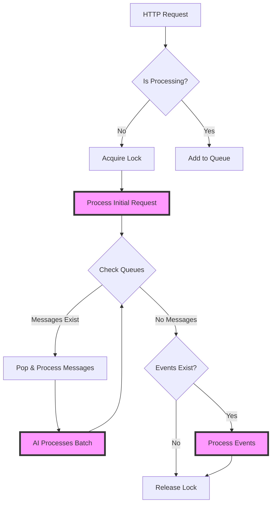

This guide explains how to implement queue-aware logic in your chatbot's `agent.py`. The queue system ensures messages are processed sequentially per conversation while allowing the AI to check for new messages and events during execution.

## System Architecture

### Dual Queue Design

Each conversation maintains two separate Redis queues:

```
conv:{conversation_id}:messages    → User messages (WhatsApp)
conv:{conversation_id}:events      → System events (payments, orders)
conv:{conversation_id}:processing  → Processing lock (TTL: 2 minutes)
```

### Control Flow Diagram



### Processing Priority

1. **Messages always process first** - User intent takes priority
2. **Events process after messages** - System updates handled secondarily
3. **AI can peek/pop events during message processing** - Optional integration
4. **Maximum 10 iterations, 2-minute timeout** - Prevents infinite loops

## Environment Variables

```bash
REDIS_URL=redis://localhost:6379  # Redis connection URL
```

## How It Works: Step by Step

### 1. Message Arrival

When a message arrives at `/message` endpoint:

```python
# main.py - FastAPI endpoint
@app.post("/message")
async def handle_message(payload: ChatbotPayloadDTO):
    # Check if conversation is already processing
    if await queue_manager.is_processing(payload.conversation.id):
        # Add to message queue
        await queue_manager.add_message_to_queue(
            payload.conversation.id,
            payload
        )
        return {"status": "queued"}

    # Not processing - start new processing
    await conversation_processor.handle_new_message(
        payload.conversation.id,
        process_conversation_messages
    )
    return {"status": "processing"}
```

### 2. Event Arrival

When an event arrives at `/nexus/event` endpoint:

```python
# main.py - FastAPI endpoint
@app.post("/nexus/event")
async def handle_event(event: NexusEvent):
    # Events always queue if messages are processing
    if await queue_manager.is_processing(event.conversation.id):
        await queue_manager.add_event_to_queue(
            event.conversation.id,
            event
        )
        return {"status": "queued"}

    # Process immediately if no messages
    await conversation_processor.handle_new_event(
        event.conversation.id,
        process_conversation_events
    )
    return {"status": "processing"}
```

### 3. Processing Logic

```python
# Simplified processing flow
async def process_conversation_messages(conversation_id: str):
    # Pop all queued messages
    messages = await queue_manager.pop_all_messages_from_queue(conversation_id)

    for batch in messages:
        # Create agent with queue helpers
        agent = ChatAgent()
        agent.set_queue_helpers(AgentQueueHelpers(queue_manager))

        # Process the message batch
        await agent.process_message(batch.get_payload())
```

## Understanding Queue Helpers in Agent.py

### What Are Queue Helpers?

Queue helpers are your interface to the queue system from within agent.py. They're automatically injected when your agent processes a message, giving you methods to check for additional messages that arrived while you were thinking/processing.

```python
class ChatAgent:
    def __init__(self):
        self.queue_helpers = None  # Automatically set by main.py

    def set_queue_helpers(self, queue_helpers: AgentQueueHelpers):
        """Called by main.py before processing each message"""
        self.queue_helpers = queue_helpers
```

### Key Concept: Why Check for New Messages?

While your agent is processing (calling APIs, thinking, generating responses), users might send additional messages:

- "I want pizza" → [Agent starts processing]
- "Make it large" → [Queued]
- "Actually, pepperoni" → [Queued]

Without queue checks, you'd create a small pizza. With queue checks, you can catch these modifications.

### Queue Helper Methods Explained

The queue helpers provide several methods to interact with queued messages. Here's what each does:

```python
# 1. has_new_messages() - Quick boolean check
if await self.queue_helpers.has_new_messages(conversation_id):
    # Returns True/False - doesn't tell you what the messages are
    print("User sent more messages!")

# 2. check_message_queue() - Look without taking (PEEK)
peeked = await self.queue_helpers.check_message_queue(conversation_id, count=5)
# Returns list of QueuedMessage objects
# Messages STAY in queue - you're just looking
for msg in peeked:
    content = msg.get_payload().lastMessage.content
    print(f"User said: {content}")

# 3. get_new_messages() - Take all messages (POP)
new_messages = await self.queue_helpers.get_new_messages(conversation_id)
# Returns list of QueuedMessage objects
# Messages are REMOVED from queue
# This is what you'll use 90% of the time

# 4. pop_message_from_queue() - Take just one message
single_msg = await self.queue_helpers.pop_message_from_queue(conversation_id)
# Rarely used - usually you want all messages
```

### Working with QueuedMessage Objects

When you get messages from the queue, they come wrapped in a `QueuedMessage` object:

```python
# Get messages from queue
messages = await self.queue_helpers.get_new_messages(conversation_id)

for queued_msg in messages:
    # Extract the actual ChatbotPayloadDTO
    payload = queued_msg.get_payload()

    # Now you can access all the usual fields
    user_text = payload.lastMessage.content
    user_phone = payload.customer.whatsappNumber
    timestamp = payload.lastMessage.timestamp

    # The payload has the same structure as your main process_message payload
    print(f"User {user_phone} said: {user_text}")
```

## Practical Implementation Patterns

### Pattern 1: Check Before Critical Actions

The most important pattern is checking for new messages before any action that would be hard to undo:

```python
async def process_message(self, payload: ChatbotPayloadDTO):
    conversation_id = payload.conversation.id

    # Initial processing of "I want a pizza"
    intent = self.analyze_intent(payload)

    if intent == "create_order":
        # Extract initial order details
        order = self.build_order_from_message(payload)

        # CRITICAL: Check for new messages before creating order
        if self.queue_helpers:  # Always check if helpers are available
            new_messages = await self.queue_helpers.get_new_messages(conversation_id)

            if new_messages:
                # User sent "make it large" and "extra cheese" while we processed
                self.logger.info(f"Found {len(new_messages)} additional messages")

                # Merge all messages together
                all_messages = [payload] + [m.get_payload() for m in new_messages]

                # Rebuild order with ALL information
                order = self.build_order_from_messages(all_messages)

                # Let user know we saw everything
                await self.send_message(
                    f"Got it! I've included your {len(new_messages)} additional requests."
                )

        # Now create order with complete information
        await self.create_order(order)
```

### Pattern 2: Continuous Context Building

For longer conversations, continuously aggregate messages:

```python
async def handle_complex_order(self, initial_payload: ChatbotPayloadDTO):
    conversation_id = initial_payload.conversation.id
    context = {
        'messages': [initial_payload.lastMessage.content],
        'order_items': [],
        'special_requests': []
    }

    # Process initial message
    await self.process_initial_request(initial_payload, context)

    # Check for follow-up messages multiple times
    while context['status'] != 'complete':
        # Simulate some processing time (API calls, etc.)
        await self.call_some_api()

        # Check if user sent more messages
        new_messages = await self.queue_helpers.get_new_messages(conversation_id)

        if new_messages:
            for msg in new_messages:
                payload = msg.get_payload()
                user_text = payload.lastMessage.content.lower()

                # Add to our running context
                context['messages'].append(payload.lastMessage.content)

                # Check for special keywords
                if 'cancel' in user_text:
                    return await self.handle_cancellation()
                elif 'change' in user_text or 'actually' in user_text:
                    context['has_modifications'] = True
                elif any(size in user_text for size in ['small', 'medium', 'large']):
                    context['size_preference'] = self.extract_size(user_text)

            # Reprocess with new context
            await self.update_order_with_context(context)

        # Continue processing...
        context['status'] = self.check_if_complete(context)
```

### Pattern 3: Message Aggregation in Tool Calls

When using tools (like update_order_draft), always check for new messages first:

```python
async def execute_tool_call(self, tool_name: str, tool_args: dict, context: dict):
    conversation_id = context['conversation_id']

    # Special handling for order-related tools
    if tool_name in ['update_order_draft', 'create_order', 'send_order_form']:
        # Check for last-minute changes
        new_messages = await self.queue_helpers.get_new_messages(conversation_id)

        if new_messages:
            self.logger.info(f"Found {len(new_messages)} new messages before {tool_name}")

            # Extract any modifications from new messages
            for msg in new_messages:
                payload = msg.get_payload()
                content = payload.lastMessage.content

                # Quick parse for common modifications
                if 'no ' in content.lower():
                    # "no onions", "no ice", etc.
                    tool_args = self.apply_negation_to_order(tool_args, content)
                elif any(word in content.lower() for word in ['add', 'extra', 'more']):
                    # "add bacon", "extra cheese"
                    tool_args = self.apply_addition_to_order(tool_args, content)
                elif 'deliver' in content.lower() or 'pickup' in content.lower():
                    # Service type change
                    tool_args = self.update_service_type(tool_args, content)

            # Add note about modifications
            tool_args['customer_note'] = self.merge_customer_notes(
                tool_args.get('customer_note', ''),
                f"Modified based on {len(new_messages)} additional messages"
            )

    # Execute tool with potentially modified args
    return await self.nexus.execute_tool(tool_name, tool_args)
```

### Pattern 4: Handling Rapid-Fire Messages

Users often send multiple short messages quickly. Aggregate them intelligently:

```python
async def handle_rapid_messages(self, initial_payload: ChatbotPayloadDTO):
    conversation_id = initial_payload.conversation.id
    messages_buffer = [initial_payload.lastMessage.content]

    # Wait a brief moment for rapid-fire messages
    await asyncio.sleep(0.5)  # Small delay to let messages queue up

    # Get all queued messages
    new_messages = await self.queue_helpers.get_new_messages(conversation_id)

    if new_messages:
        # Add all to buffer
        for msg in new_messages:
            messages_buffer.append(msg.get_payload().lastMessage.content)

    # Combine related messages intelligently
    combined_intent = self.intelligent_message_combination(messages_buffer)

    # Example: ["I want pizza", "large", "pepperoni", "no wait", "hawaiian"]
    # Becomes: "I want a large hawaiian pizza" (recognized the correction)

    return await self.process_combined_intent(combined_intent)

def intelligent_message_combination(self, messages: List[str]) -> str:
    """Combine multiple messages into coherent intent"""
    # Handle corrections (last relevant message wins)
    if any('no wait' in m.lower() or 'actually' in m.lower() for m in messages):
        # Find the correction point and use messages after it
        correction_index = next(
            i for i, m in enumerate(messages)
            if 'no wait' in m.lower() or 'actually' in m.lower()
        )
        messages = messages[correction_index:]

    # Simple combination for now
    return ' '.join(messages)
```

## When to Check for New Messages

### Critical Decision Points

Always check for new messages at these key moments:

```python
# 1. Before ANY tool call that creates/modifies data
if tool_name in ['update_order_draft', 'create_order', 'send_order_form']:
    new_messages = await self.queue_helpers.get_new_messages(conversation_id)

# 2. After time-consuming operations
response = await self.call_menu_api()  # Takes 1-2 seconds
new_messages = await self.queue_helpers.get_new_messages(conversation_id)

# 3. Before sending confirmations or summaries
if "confirm" in response_text or "is this correct" in response_text:
    # User might have sent corrections
    new_messages = await self.queue_helpers.get_new_messages(conversation_id)

# 4. When conversation seems complete
if intent == "order_complete":
    # Last chance to catch "wait, one more thing..."
    final_messages = await self.queue_helpers.get_new_messages(conversation_id)
```

### Real Example from Agent.py

Here's how this actually looks in a real agent implementation:

```python
async def process_message(self, payload: ChatbotPayloadDTO):
    """Main entry point for message processing"""
    conversation_id = payload.conversation.id

    # Analyze what the user wants
    intent = self.extract_intent(payload)

    if intent == "order_food":
        # Start building the order
        order_context = {
            'items': self.extract_items(payload),
            'conversation_id': conversation_id
        }

        # Maybe we need to look up menu items (slow operation)
        menu_matches = await self.search_menu(order_context['items'])

        # CHECK POINT 1: After slow operation
        new_msgs = await self.queue_helpers.get_new_messages(conversation_id)
        if new_msgs:
            # User might have added "make it spicy" or "large size"
            for msg in new_msgs:
                additional_text = msg.get_payload().lastMessage.content
                order_context['modifications'] = self.extract_modifications(additional_text)

        # Prepare to create order
        order_data = self.build_order_data(menu_matches, order_context)

        # CHECK POINT 2: Before tool call
        final_msgs = await self.queue_helpers.get_new_messages(conversation_id)
        if final_msgs:
            # Last-second changes like "actually, cancel the drinks"
            order_data = self.apply_final_modifications(order_data, final_msgs)

        # Now safe to create order
        result = await self.tools.update_order_draft(order_data)

        return f"Great! I've added {len(order_data['items'])} items to your order."
```

## Common Pitfalls and Solutions

### Pitfall 1: Forgetting to Check

```python
# ❌ BAD: No queue check before order creation
async def create_order_bad(self, payload):
    order = self.parse_order(payload)
    return await self.tools.create_order(order)  # Misses "wait, add fries!"

# ✅ GOOD: Always check before critical actions
async def create_order_good(self, payload):
    order = self.parse_order(payload)

    # Check for last-minute additions
    new_messages = await self.queue_helpers.get_new_messages(payload.conversation.id)
    if new_messages:
        order = self.merge_order_updates(order, new_messages)

    return await self.tools.create_order(order)
```

### Pitfall 2: Checking Too Late

```python
# ❌ BAD: Checking after the action
async def process_order_bad(self, payload):
    result = await self.tools.create_order(order_data)  # Already created!

    # Too late - order already placed
    new_messages = await self.queue_helpers.get_new_messages(conversation_id)

# ✅ GOOD: Check before irreversible actions
async def process_order_good(self, payload):
    # Check BEFORE creating
    new_messages = await self.queue_helpers.get_new_messages(conversation_id)
    if new_messages:
        order_data = self.update_with_new_messages(order_data, new_messages)

    result = await self.tools.create_order(order_data)
```

### Pitfall 3: Not Handling Message Context

```python
# ❌ BAD: Treating each message independently
for msg in new_messages:
    content = msg.get_payload().lastMessage.content
    if "large" in content:
        size = "large"
    if "small" in content:
        size = "small"  # Oops, overwrote large!

# ✅ GOOD: Consider message relationships
messages_text = [m.get_payload().lastMessage.content for m in new_messages]
# ["make it large", "no wait", "small please"]
# Recognize "no wait" as a correction indicator
final_size = self.extract_final_intent(messages_text)  # Returns "small"
```

## A Quick Note on Events

While this guide focuses on messages, the queue system also handles events (payment updates, order status changes, etc.). Events work similarly but have lower priority:

```python
# Events are processed after all messages are done
if await self.queue_helpers.has_pending_events(conversation_id):
    events = await self.queue_helpers.pop_all_events(conversation_id)
    # Handle payment failures, order updates, etc.
```

The key difference: Messages interrupt processing, events wait their turn.

## Summary: Queue-Aware Agent Development

### The Mental Model

Think of your agent as having "checkpoints" where you pause and ask: "Did the user say anything else while I was thinking?"

```python
# Your agent's thought process:
1. Receive: "I want pizza"
2. Think: "Let me look up pizzas..." (2 seconds pass)
3. CHECKPOINT: Check queue → Found: "large please"
4. Think: "Okay, large pizza it is"
5. CHECKPOINT: Check queue → Found: "with pepperoni"
6. Action: Create large pepperoni pizza order
```

### Essential Checklist

- [ ] **Always check before tool calls** that create/modify data
- [ ] **Check after slow operations** (API calls, complex calculations)
- [ ] **Aggregate messages intelligently** (handle corrections, additions)
- [ ] **Test with rapid messages** (users don't wait for responses)
- [ ] **Handle the no-queue case** (`if self.queue_helpers:`)

### Final Implementation Tip

The best place to add queue checks is right before you're about to do something you can't easily undo. When in doubt, check the queue - it's a fast operation and prevents user frustration.

```python
# The golden rule:
if about_to_do_something_important:
    new_messages = await self.queue_helpers.get_new_messages(conversation_id)
    if new_messages:
        # Update your understanding before proceeding
        context = merge_new_information(context, new_messages)
```
