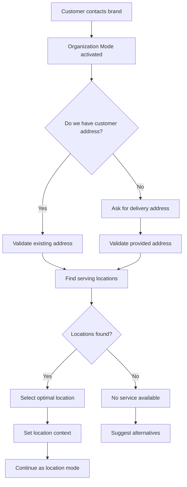

## Multi-Location Management in Business Organizations

One of LeClerk's most sophisticated features is its ability to handle restaurant chains and business organizations with multiple locations. This system allows customers to interact with a brand while automatically routing them to the most appropriate location for their needs.

### Understanding Organization vs Location Mode

LeClerk operates in two distinct modes depending on how a customer initiates contact:

#### Location Mode

- Customer contacts a specific restaurant location directly
- All interactions are scoped to that single location
- Menu, pricing, and availability are location-specific
- Orders are automatically assigned to that location

#### Organization Mode

- Customer contacts the brand/chain generally
- LeClerk must determine the best location to serve them
- Requires address validation and location selection logic
- Can switch between locations during the conversation

### How Organization Mode Works



### Location Selection Algorithm

When multiple locations could serve a customer, LeClerk uses a sophisticated algorithm to choose the best one:

#### Distance-Based Selection

```javascript
// Simplified location scoring
function scoreLocation(location, customerAddress) {
  const distance = calculateDistance(
    location.coordinates,
    customerAddress.coordinates
  );
  const baseScore = Math.max(0, 100 - distance * 10); // Prefer closer locations

  // Adjust for business factors
  let score = baseScore;
  score += location.isOpen ? 20 : -50; // Heavily favor open locations
  score += location.currentLoad < 0.8 ? 10 : -10; // Prefer less busy locations
  score += location.averageRating > 4.5 ? 5 : 0; // Slight preference for high-rated

  return score;
}
```

### The Location Switching Process

#### Automatic Location Assignment

```xml
<thinking>
Customer wants delivery to "123 Rue Saint-Antoine, Paris" but we're in organization mode.
I need to check which location can serve this address.
</thinking>

<!-- check_address tool call happens -->

<!-- switch_location tool call happens -->

<response_for_customer>
Perfect! I can help you order for delivery to Rue Saint-Antoine.

I've connected you with our Bastille location (closest to your address - just 1.2km away). They can deliver to you in about 30 minutes for €2.50.

What would you like to order today?
</response_for_customer>
```

#### Customer-Requested Location Switch

```xml
<thinking>
Customer said "Actually, I want to order from your Champs-Élysées location instead."
I need to use the switch_location tool to change their context.
</thinking>

<!-- switch_location tool call -->

<response_for_customer>
No problem! I've switched you to our Champs-Élysées location.

This location can also deliver to your address, but it will take about 45 minutes (€3.50 delivery fee) since it's a bit further. Their menu is the same, but they have some exclusive desserts!

Would you like to see what's available?
</response_for_customer>
```

### Managing Location-Specific Data

#### Menu Variations

Different locations might have:

- **Availability Differences**: Some items sold out at specific locations
- **Pricing Variations**: Different costs based on local factors (rent, wages)
- **Special Items**: Location-exclusive menu items
- **Seasonal Menus**: Different seasonal offerings per location

#### Service Capabilities

- **Delivery Zones**: Each location has its own delivery area
- **Service Types**: Some locations might be pickup-only
- **Operating Hours**: Different hours per location

#### Staffing and Languages

- **Language Support**: Locations in different areas might speak different languages
- **Staff Expertise**: Some locations might have specialized knowledge
- **Customer Service Hours**: Phone support availability varies

### Organization-Level Features

#### Brand Consistency

- **Unified Ordering Experience**: Customers feel like they're ordering from one brand
- **Consistent Pricing**: Core items maintain consistent pricing across locations
- **Shared Promotions**: Brand-wide campaigns work across all locations
- **Customer Accounts**: Profiles and history work across all locations

#### Cross-Location Services

```xml
<response_for_customer>
I see you've ordered from our République location before! Your usual order was:
• 1x Large Margherita Pizza
• 1x Tiramisu

Would you like the same thing today, or shall I show you our menu?
</response_for_customer>
```

#### Inventory Sharing

```xml
<thinking>
Customer wants a specific dessert that's out of stock at the assigned location.
Let me check if nearby locations have it available and can help.
</thinking>

<response_for_customer>
That tiramisu is sold out at our Bastille location today, but our République location (15 minutes away) has it in stock.

Would you like me to:
1. Order from République instead (45 min delivery)
2. Choose a different dessert from Bastille
3. Skip dessert for today

What works best for you?
</response_for_customer>
```

### Customer Experience Scenarios

#### New Customer Journey

1. **First Contact**: "Hi, I'd like to order pizza"
2. **Address Collection**: "What's your delivery address?"
3. **Location Assignment**: "Great! Our Marais location can deliver to you"
4. **Menu Browsing**: Show location-specific menu and pricing
5. **Order Completion**: Process order through assigned location

#### Returning Customer Journey

1. **Recognition**: "Welcome back! I see you usually order from our Belleville location"
2. **Address Confirmation**: "Delivering to your usual address on Rue Oberkampf?"
3. **Preference Continuity**: "Would you like your usual Large Pepperoni?"
4. **Seamless Ordering**: Quick reorder or menu exploration

#### Complex Scenario Handling

```xml
<thinking>
Customer wants delivery to a new address that's between two of our locations.
Both can deliver, but with different times and fees. I should present options.
</thinking>

<response_for_customer>
I found two locations that can deliver to your new address:

🏪 **Bastille Location**
• 25 minutes delivery
• €2.50 delivery fee
• All menu items available

🏪 **République Location**
• 35 minutes delivery
• €3.00 delivery fee
• Has our exclusive truffle pizza

Which location would you prefer, or shall I just go with the faster option?
</response_for_customer>
```

Multi-location management transforms LeClerk from a simple chatbot into an intelligent routing system that provides customers with seamless access to restaurant chains while optimizing operations for the business. Understanding this system is crucial for anyone working on enterprise restaurant solutions.
