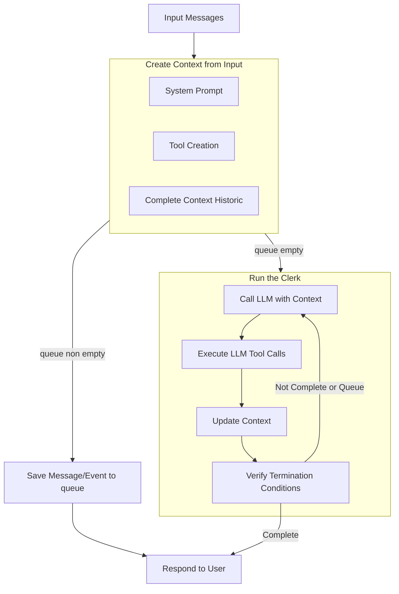

## Message Processing Logic & XML Tags

Understanding how LeClerk processes messages internally is crucial for developers working on the chatbot. This page explains the sophisticated message processing pipeline and the XML tag system that makes it work.

### The Internal Processing Pipeline

When the agent receives a message to process, it goes through several stages:



### XML Tag System

LeClerk uses XML tags to structure the language model's responses. This allows the LLM to think through problems, take notes, and separate what gets sent to customers from internal processing.

#### Customer-Facing Tags

##### `<response_for_customer>`

This is the only tag that gets sent to the customer. Everything else is stripped away.

```xml
<response_for_customer>
Hello! I can help you order pizza today. Here are our most popular options:

🍕 Margherita - €12.50
🍕 Pepperoni - €14.00
🍕 Four Cheese - €15.50

Which one sounds good to you?
</response_for_customer>
```

#### Internal Processing Tags

##### `<thinking>`

The LLM uses this to reason through problems step by step. This content is never shown to customers but helps the model make better decisions.

```xml
<thinking>
The customer asked about gluten-free options. Let me check what we have:
1. I should use the menu_lookup tool to search for gluten-free items
2. I need to be specific about what's safe for celiac vs. just gluten-reduced
3. I should also mention our preparation practices to avoid cross-contamination
</thinking>
```

##### `<scratchpad>`

Used for temporary notes, calculations, or working through complex scenarios.

```xml
<scratchpad>
Customer's order so far:
- 2x Large Pepperoni (€14.00 each) = €28.00
- 1x Coke (€2.50)
- Delivery fee: €3.00
Total: €33.50

They mentioned they have a "SAVE10" code - need to check if that's valid.
</scratchpad>
```

##### `<nexus_instructions>`

Special instructions from system events that guide the LLM's response. These are injected by LeClerk when processing events like payment confirmations or delivery updates.

```xml
<nexus_instructions>
The customer's payment for order #12345 just succeeded.
Payment method: Visa ending in 4242
Amount: €25.50
Next step: Confirm the payment success and let them know preparation is starting.
</nexus_instructions>
```

### Message Processing Flow

Here's how a typical message gets processed:

#### 1. Prompt Construction

The ChatAgent builds a comprehensive prompt that includes:

- System instructions and personality guidelines
- Restaurant information (hours, menu highlights, policies)
- Customer context (history, preferences, current orders)
- Conversation history
- Available tools and when to use them

#### 2. LLM Processing

The language model receives this rich context and generates a response using the XML structure:

```xml
<thinking>
Customer is asking "What's good for a family dinner?" This is a recommendation request.
I should:
1. Look at family-sized options in our menu
2. Consider variety (pizza + sides + drinks)
3. Check for any family deals
4. Ask about dietary restrictions
</thinking>

<scratchpad>
Family options to suggest:
- Family Pizza Bundle (2 large pizzas + garlic bread + 2L drink)
- Mix & Match deal
- Need to check if they have kids (simpler flavors)
</scratchpad>

<response_for_customer>
Great question! For families, I'd recommend our Family Bundle - 2 large pizzas of your choice, garlic bread, and a 2L drink for €35.

Popular family combinations:
🍕 1x Margherita + 1x Pepperoni (classic crowd-pleasers)
🍕 1x Hawaiian + 1x BBQ Chicken (sweet & savory)

Do you have any dietary restrictions I should know about? And how many people are you feeding?
</response_for_customer>
```

#### 3. XML Parsing and Extraction

LeClerk parses the response and:

- Extracts the `<response_for_customer>` content
- Logs internal tags for debugging and monitoring
- Processes any special instructions
- Validates the response format

#### 4. Tool Call Integration

If the LLM requested tool calls during processing, they're executed, the response is stored in the conversation and the LLM is runned again

````

### Quality Control and Validation

#### Response Validation

Before sending any message to customers, LeClerk validates:

- Contains exactly one `<response_for_customer>` tag
- No internal tags leaked into customer content
- Response is appropriate length (not too short or too long)
- Contains no obvious errors or placeholder text

#### Error Recovery

If XML parsing fails:

1. Log the full LLM response for debugging
2. Attempt to extract customer-facing content using fallback methods
3. Send a generic helpful response if extraction fails
4. Alert developers about parsing issues

### Advanced Processing Features

#### Context Switching

LeClerk can maintain context across conversation turns:

```xml
<thinking>
Customer said "add another one" referring to the pizza we just discussed.
I need to remember we were talking about Large Pepperoni.
</thinking>

<response_for_customer>
Perfect! I've added another Large Pepperoni to your order. You now have:

2x Large Pepperoni Pizza (€14.00 each)
Total: €28.00

Ready to add anything else or shall we proceed to checkout?
</response_for_customer>
````

#### Multi-turn Tool Usage

Complex scenarios might require multiple tool calls:

```xml
<thinking>
Customer wants delivery to a new address. I need to:
1. Check if we deliver there (check_address)
2. If yes, update their order draft with the new address
3. Calculate delivery fee for the new location
</thinking>

<!-- Tool calls happen here -->

<response_for_customer>
Good news! We do deliver to that address. I've updated your order with:

📍 New delivery address: 123 Rue de la Paix, Paris
🚚 Delivery fee: €3.50
⏰ Estimated delivery: 45-60 minutes

Your updated total is €31.50. Ready to proceed with payment?
</response_for_customer>
```

### Debugging Message Processing

#### Common Issues

**Missing XML Tags**

```xml
<!-- Wrong: No tags -->
Sure, I can help you order pizza. What would you like?

<!-- Correct: Properly tagged -->
<response_for_customer>
Sure, I can help you order pizza. What would you like?
</response_for_customer>
```

**Leaked Internal Content**

```xml
<!-- Wrong: Internal thinking leaked to customer -->
<response_for_customer>
<thinking>Let me check the menu</thinking>
Here are our pizzas...
</response_for_customer>

<!-- Correct: Clean customer response -->
<response_for_customer>
Here are our pizzas...
</response_for_customer>
```

#### Monitoring Tools

- **Langfuse Traces**: See full conversation flows with timing
- **Response Logs**: Review XML structure and content
- **Error Alerts**: Get notified when parsing fails
- **Quality Metrics**: Track response appropriateness and success rates

### Best Practices for Developers

1. **Always Use XML Structure**: Never modify prompts to skip XML formatting
2. **Keep Internal Tags Clean**: Don't put customer-facing content in thinking/scratchpad
3. **Test Edge Cases**: What happens with very long responses? Empty responses?
4. **Monitor Response Quality**: Regularly review logs to catch issues early
5. **Validate Changes**: Test prompt modifications thoroughly before deployment

The XML tag system is what makes LeClerk capable of sophisticated reasoning while maintaining clean customer interactions. Understanding this system is essential for anyone working on prompt engineering or chatbot behavior modifications.
