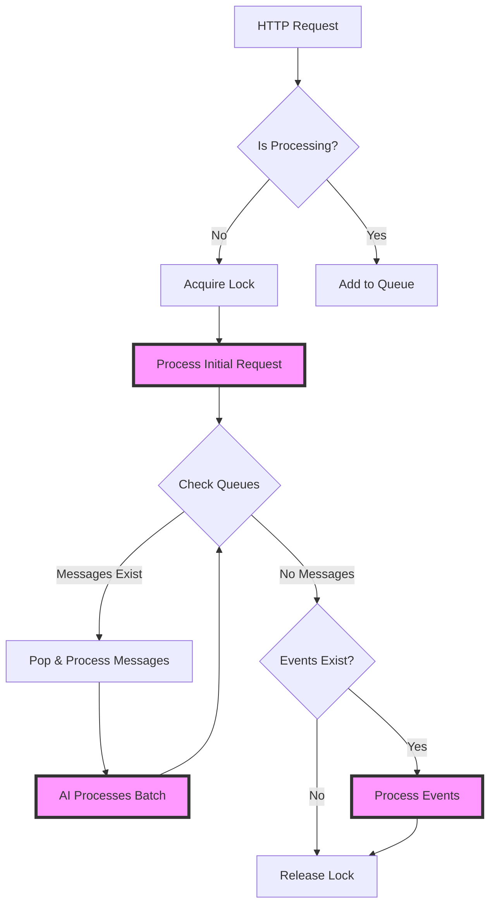
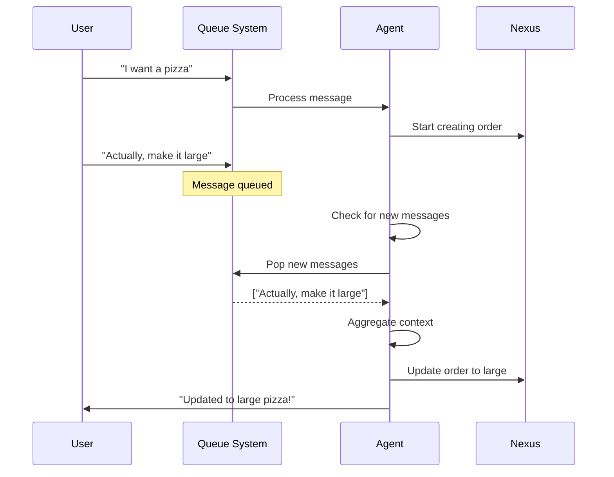
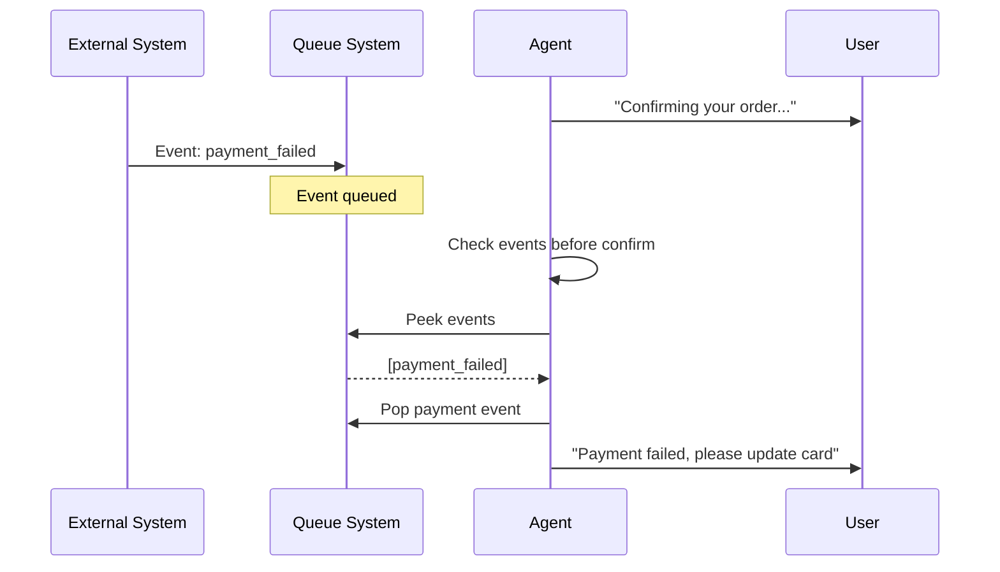

This guide explains how to implement queue-aware logic in your chatbot's `agent.py`. The queue system ensures messages are processed sequentially per conversation while allowing the AI to check for new messages and events during execution.

## System Architecture

### Dual Queue Design

Each conversation maintains two separate Redis queues:

```
conv:{conversation_id}:messages    → User messages (WhatsApp)
conv:{conversation_id}:events      → System events (payments, orders)
conv:{conversation_id}:processing  → Processing lock (TTL: 2 minutes)
```

### Control Flow Diagram



### Processing Priority

1. **Messages always process first** - User intent takes priority
2. **Events process after messages** - System updates handled secondarily
3. **AI can peek/pop events during message processing** - Optional integration
4. **Maximum 10 iterations, 2-minute timeout** - Prevents infinite loops

## Environment Variables

```bash
REDIS_URL=redis://localhost:6379  # Redis connection URL
```

## How It Works: Step by Step

### 1. Message Arrival

When a message arrives at `/message` endpoint:

```python
# main.py - FastAPI endpoint
@app.post("/message")
async def handle_message(payload: ChatbotPayloadDTO):
    # Check if conversation is already processing
    if await queue_manager.is_processing(payload.conversation.id):
        # Add to message queue
        await queue_manager.add_message_to_queue(
            payload.conversation.id,
            payload
        )
        return {"status": "queued"}

    # Not processing - start new processing
    await conversation_processor.handle_new_message(
        payload.conversation.id,
        process_conversation_messages
    )
    return {"status": "processing"}
```

### 2. Event Arrival

When an event arrives at `/nexus/event` endpoint:

```python
# main.py - FastAPI endpoint
@app.post("/nexus/event")
async def handle_event(event: NexusEvent):
    # Events always queue if messages are processing
    if await queue_manager.is_processing(event.conversation.id):
        await queue_manager.add_event_to_queue(
            event.conversation.id,
            event
        )
        return {"status": "queued"}

    # Process immediately if no messages
    await conversation_processor.handle_new_event(
        event.conversation.id,
        process_conversation_events
    )
    return {"status": "processing"}
```

### 3. Processing Logic

```python
# Simplified processing flow
async def process_conversation_messages(conversation_id: str):
    # Pop all queued messages
    messages = await queue_manager.pop_all_messages_from_queue(conversation_id)

    for batch in messages:
        # Create agent with queue helpers
        agent = ChatAgent()
        agent.set_queue_helpers(AgentQueueHelpers(queue_manager))

        # Process the message batch
        await agent.process_message(batch.get_payload())
```

## Agent.py Integration Guide

### Setting Up Queue Helpers

In your `agent.py`, the queue helpers are automatically injected:

```python
class ChatAgent:
    def __init__(self):
        self.queue_helpers = None  # Injected by main.py

    def set_queue_helpers(self, queue_helpers: AgentQueueHelpers):
        self.queue_helpers = queue_helpers
```

### Available Queue Methods

```python
# Check for new messages (non-destructive peek)
new_messages = await self.queue_helpers.check_message_queue(conversation_id)

# Get and remove new messages from queue
messages = await self.queue_helpers.get_new_messages(conversation_id)

# Check if events exist
has_events = await self.queue_helpers.has_pending_events(conversation_id)

# Peek at events without removing
events = await self.queue_helpers.peek_events(conversation_id)

# Pop specific event types
payment_events = await self.queue_helpers.pop_matching_events(
    conversation_id,
    lambda e: e.type in ["payment_completed", "payment_failed"]
)

# Pop all events
all_events = await self.queue_helpers.pop_all_events(conversation_id)
```

## Real-World Scenarios

### Scenario 1: Order Modification During Processing



**Implementation in agent.py:**

```python
async def handle_order_creation(self, context):
    # Start order creation
    order_details = self.extract_order_details(context)

    # Before finalizing, check for modifications
    new_messages = await self.queue_helpers.get_new_messages(
        context.conversation_id
    )

    if new_messages:
        # Aggregate all messages
        all_messages = context.messages + [m.get_payload() for m in new_messages]

        # Re-extract order with modifications
        order_details = self.extract_order_details({
            'messages': all_messages,
            'original_order': order_details
        })

        # Acknowledge the modification
        await self.send_message(
            "I've updated your order based on your latest message!"
        )

    # Create the final order
    return await self.nexus.create_order(order_details)
```

### Scenario 2: Payment Event During Confirmation



**Implementation in agent.py:**

```python
async def send_order_confirmation(self, context):
    # Check for payment events before confirming
    payment_events = await self.queue_helpers.pop_matching_events(
        context.conversation_id,
        lambda e: e.type in ["payment_completed", "payment_failed"]
    )

    if payment_events:
        latest_payment = payment_events[-1].get_payload()

        if latest_payment.type == "payment_failed":
            return await self.handle_payment_failure(
                context,
                latest_payment.failureReason
            )
        elif latest_payment.type == "payment_completed":
            # Payment succeeded after initial attempt
            context.payment_confirmed = True

    # Proceed with confirmation
    return await self.nexus.send_order_confirmation(context.order_id)
```

### Scenario 3: Multiple Messages While Processing

```mermaid
graph LR
    A[User: "Pizza"] --> B[Processing]
    C[User: "Large"] --> D[Queue]
    E[User: "Extra cheese"] --> D
    F[User: "Deliver at 8pm"] --> D

    B --> G[Check Queue]
    D --> G
    G --> H[Process All: Pizza + Large + Extra cheese + 8pm delivery]
```

**Implementation in agent.py:**

```python
async def process_message(self, payload: ChatbotPayloadDTO):
    conversation_id = payload.conversation.id

    # Your main processing logic
    response = await self.generate_response(payload)

    # Critical decision point - check for additional context
    if self.is_about_to_create_order(response):
        additional_messages = await self.queue_helpers.get_new_messages(
            conversation_id
        )

        if additional_messages:
            # Build complete context
            full_context = self.merge_contexts(
                original=payload,
                new_messages=[m.get_payload() for m in additional_messages]
            )

            # Regenerate response with full context
            response = await self.generate_response(full_context)

            # Acknowledge all messages
            message_count = len(additional_messages)
            await self.send_message(
                f"I've included your {message_count} additional messages!"
            )

    return response
```

## Decision Points for Queue Checks

### When to Check for New Messages

```python
# 1. Before finalizing any order
if self.is_creating_order():
    new_msgs = await self.queue_helpers.get_new_messages(conversation_id)

# 2. Before sending confirmations
if self.is_sending_confirmation():
    new_msgs = await self.queue_helpers.check_message_queue(conversation_id)

# 3. Before payment processing
if self.is_processing_payment():
    # Check both messages and payment events
    new_msgs = await self.queue_helpers.check_message_queue(conversation_id)
    payment_events = await self.queue_helpers.peek_events(conversation_id)

# 4. After any long-running operation
after_api_call = await self.some_slow_operation()
new_context = await self.check_for_updates(conversation_id)
```

### Event Processing Patterns

```python
# Pattern 1: Check-and-consume specific events
async def before_order_confirmation(self, conversation_id):
    # Only consume events that affect this action
    relevant_events = await self.queue_helpers.pop_matching_events(
        conversation_id,
        lambda e: e.type in ["payment_failed", "order_cancelled", "address_updated"]
    )

    for event in relevant_events:
        payload = event.get_payload()
        if payload.type == "payment_failed":
            raise PaymentFailedException(payload.failureReason)
        elif payload.type == "order_cancelled":
            raise OrderCancelledException()
        elif payload.type == "address_updated":
            self.context.delivery_address = payload.address

# Pattern 2: Peek without consuming
async def should_show_payment_options(self, conversation_id):
    events = await self.queue_helpers.peek_events(conversation_id)

    # Check if payment method was recently added
    has_recent_payment = any(
        e.type == "payment_method_added"
        for e in events
        if e.timestamp > datetime.now() - timedelta(minutes=5)
    )

    return not has_recent_payment

# Pattern 3: Process all events after messages
async def process_conversation_events(self, conversation_id):
    all_events = await self.queue_helpers.pop_all_events(conversation_id)

    # Group by type for batch processing
    events_by_type = defaultdict(list)
    for event in all_events:
        events_by_type[event.get_payload().type].append(event)

    # Process each type
    for event_type, events in events_by_type.items():
        await self.handle_event_batch(event_type, events)
```

## Complete Flow Example

Here's a complete example showing how messages and events interact:

```mermaid
graph TD
    subgraph "Time 0: Initial State"
        A1[Empty Queues]
    end

    subgraph "Time 1: User starts order"
        B1[Message: "I want pizza"] --> B2[Process & Lock acquired]
        B3[Agent processing...]
    end

    subgraph "Time 2: Multiple inputs arrive"
        C1[Message: "Large please"] --> C2[→ Message Queue]
        C3[Event: payment_method_added] --> C4[→ Event Queue]
        C5[Message: "Extra cheese"] --> C6[→ Message Queue]
        C7[Still processing initial message...]
    end

    subgraph "Time 3: Agent checks queues"
        D1[Agent: Check for updates] --> D2[Pop 2 messages]
        D3[Aggregate: Pizza + Large + Extra cheese]
        D4[Event still in queue]
    end

    subgraph "Time 4: Order creation"
        E1[Create order with aggregated details]
        E2[Check payment events] --> E3[Pop payment_method_added]
        E4[Skip payment form - already has method]
    end

    subgraph "Time 5: Complete"
        F1[Send confirmation]
        F2[Release lock]
        F3[Queues empty]
    end
```

## Advanced Patterns

### Pattern: Transactional Event Processing

```python
async def process_with_event_transaction(self, conversation_id, action):
    """Process action with event rollback capability"""

    # Peek at all events first
    events_snapshot = await self.queue_helpers.peek_events(conversation_id)

    try:
        # Perform the action
        result = await action()

        # If successful, consume the events we processed
        processed_event_ids = [e.id for e in events_snapshot]
        await self.queue_helpers.pop_events_by_ids(conversation_id, processed_event_ids)

        return result

    except Exception as e:
        # On failure, events remain in queue for retry
        self.logger.error(f"Action failed, events remain queued: {e}")
        raise
```

### Pattern: Priority Message Handling

```python
async def get_prioritized_messages(self, conversation_id):
    """Get messages with priority detection"""

    messages = await self.queue_helpers.get_new_messages(conversation_id)

    # Separate urgent vs normal messages
    urgent = []
    normal = []

    for msg in messages:
        payload = msg.get_payload()
        content = payload.lastMessage.content.lower()

        if any(word in content for word in ['cancel', 'stop', 'urgent', 'help']):
            urgent.append(msg)
        else:
            normal.append(msg)

    # Process urgent first
    return urgent + normal
```

### Pattern: Event-Driven State Machine

```python
class OrderStateMachine:
    def __init__(self, queue_helpers):
        self.queue_helpers = queue_helpers
        self.state = "initial"

    async def process_with_events(self, conversation_id):
        while True:
            # Check for state-changing events
            events = await self.queue_helpers.pop_matching_events(
                conversation_id,
                lambda e: e.type in self.get_valid_events_for_state()
            )

            if not events:
                break

            for event in events:
                self.transition(event.get_payload())

    def get_valid_events_for_state(self):
        return {
            "initial": ["order_started"],
            "ordering": ["item_added", "item_removed", "order_confirmed"],
            "payment": ["payment_completed", "payment_failed"],
            "complete": ["order_delivered", "order_cancelled"]
        }.get(self.state, [])
```

## Key Takeaways

1. **Messages have priority** - Always process user messages before system events
2. **Check at decision points** - Before orders, payments, confirmations
3. **Selective event consumption** - Only pop events you'll process immediately
4. **Aggregate intelligently** - Merge messages while preserving intent
5. **Fail safely** - Queue system unavailability should not break the bot
