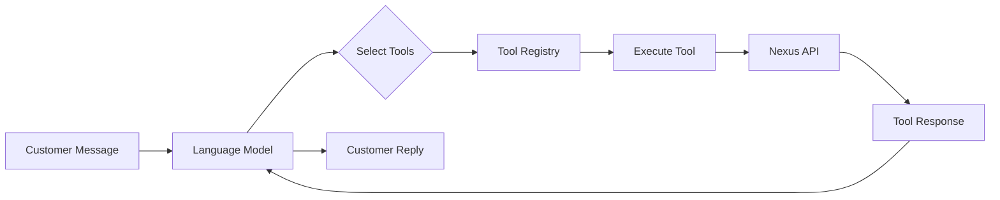
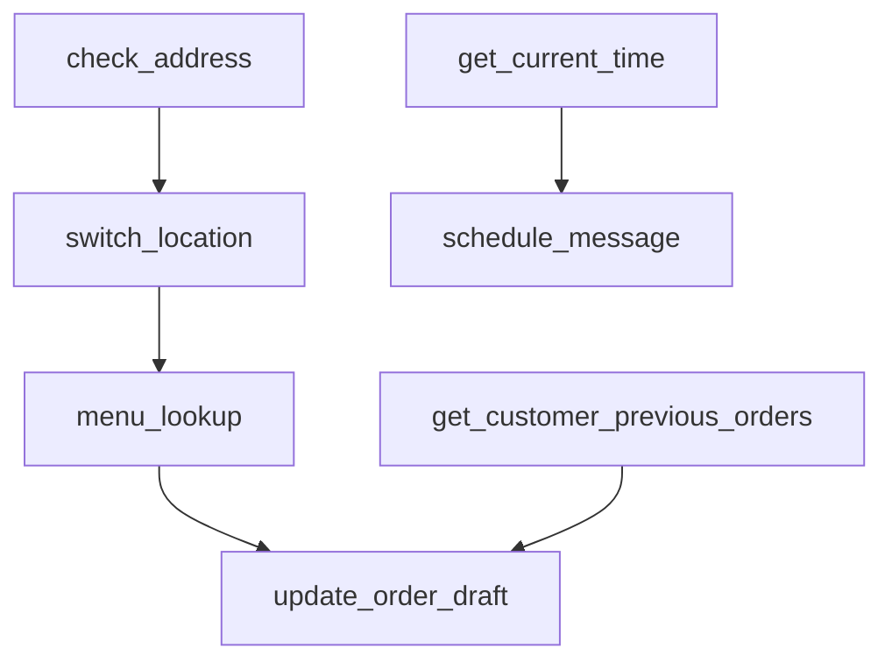

# All Tools Overview

The Leclerk chatbot system uses 21 specialized tools to handle customer interactions, manage orders, and provide restaurant services. Tools are the bridge between natural language conversations and concrete business operations.

## Tool Architecture

All tools inherit from `BaseTool` and are managed by `ToolRegistry`. Each tool implements:
- `name`: Unique identifier
- `definition`: JSON schema for the LLM
- `prompt_definition`: Instructions for when/how to use
- `execute`: Async method that performs the operation



## Tool Categories

### Order Management (5 tools)

#### update_order_draft
The central tool for managing order state. Handles items, delivery details, payment methods, and all order modifications.

**Key Features:**
- Add/modify items with SKU IDs and options
- Set delivery or collection service type
- Apply promo codes and deals
- Configure payment methods
- Schedule orders for specific times

#### menu_lookup
Powerful menu search and browsing with 7 query types:
- `browse_categories` - Minimal token usage overview
- `search_skus` - Fuzzy search for items and deals
- `list_categories` - Full category details
- `list_skus` - Filter and list items
- `get_sku_details` - Detailed item information
- `list_deals` - Available promotions
- `get_deal_details` - Deal specifications

**Performance Tips:**
- Supports batch queries for multiple items
- Use field selection to reduce token usage
- Organization mode requires location_id parameter

#### check_address
Validates delivery addresses and finds serviceable locations.

**Behavior by Mode:**
- **Location Mode**: Simple validation against delivery zone
- **Organization Mode**: Returns best location (lowest fee/shortest distance)

Automatically triggers `switch_location` when address is validated in organization mode.

#### send_order_form
Sends WhatsApp interactive flow for visual menu browsing.

**Requirements:**
- Location must have WhatsApp flows enabled
- In organization mode, location must be set first
- Customer receives native WhatsApp form interface

#### query_live_order_status
Real-time status for active orders with multiple query types:
- `status` - Basic order status
- `payment` - Payment confirmation
- `delivery` - Full delivery details
- `tracking` - Tracking URL
- `driver` - Courier information
- `collection` - Pickup details
- `timing` - Time estimates
- `all` - Complete information

### Customer Information (3 tools)

#### get_customer_previous_orders
Retrieves order history for personalization:
- Previous orders with items
- Favorite products (frequently ordered)
- Order statistics and patterns
- Automatically included in context at conversation start

#### get_current_time
Gets current time in specified timezone.
- Essential before scheduling orders or messages
- Default timezone: Europe/Zurich
- Returns ISO 8601 formatted datetime

#### get_store_information
Fetches restaurant configuration and details:
- Basic info (name, ID)
- Location and address
- Opening hours by service type
- Payment methods available
- Delivery settings
- Average preparation time

### Messaging & Engagement (5 tools)

#### schedule_message
Schedules WhatsApp messages up to 24 hours ahead.

**Message Types:**
- `permanent` - Always sent at scheduled time
- `until_next_message` - Cancelled if customer messages first

Always call `get_current_time` first for accurate scheduling.

#### cancel_scheduled_message
Cancels scheduled messages using ID from creation.

#### list_scheduled_messages
Shows all pending scheduled messages for the conversation.

#### react_to_message
Adds emoji reactions to acknowledge customer messages.
- Enhances conversational experience
- Use sparingly and appropriately

#### generate_fortune_wheel_link
Creates promotional game links for customer engagement.
- Location-specific promotions
- One-time play per customer
- Secure phone number hashing

### Customer Management (3 tools)

#### change_customer_language
Updates UI language preference.

**Supported Languages:**
- French (fr)
- English (en)
- German (de)
- Italian (it)
- Spanish (es)

Affects WhatsApp flows, buttons, and order summaries.

#### manage_customer_memory
Persistent storage for customer preferences.

**Operations:**
- `get` - Retrieve stored information
- `set` - Store new preferences
- `delete` - Remove memory

**Scopes:**
- `location` - Restaurant-specific
- `businessOrganization` - Chain-wide

**Best for:**
- Dietary restrictions
- Delivery preferences
- Special instructions

#### register_feedback
Structured feedback collection with scoring:
- `general_score` (required) - Overall satisfaction
- `food_score` - Food quality
- `delivery_score` - Delivery service
- `ordering_experience_score` - Ordering process

Scores range 0-100 (90+ excellent, 70-89 good, 50-69 average).

### Multi-location Support (2 tools)

#### switch_location
Changes active location in organization mode.
- Resets current order draft
- Updates menu and settings
- Only available in organization mode

#### organization_location_query
Information about other organization locations.

**Query Types:**
- `list_all` - All locations overview
- `get_location_details` - Specific location info
- `check_availability` - Operating status

Read-only tool for information purposes.

### Internal Tools (2 tools)

#### think
Internal reasoning for complex logic.

**When to Use:**
- Validation error troubleshooting
- Complex orders (5+ items)
- Ambiguous customer requests
- Menu searches with specific criteria

⚠️ Adds latency - use strategically.

#### report
Escalates issues to support team.

**Priority Levels:**
- P0 - Critical: System down
- P1 - High: Major feature broken
- P2 - Medium: Non-critical bug
- P3 - Low: Minor issues
- P4 - Trivial: Cosmetic issues

Creates Linear tickets and sends Discord notifications.

## Organization vs Location Mode

The system operates differently based on context:

### Location Mode
- Single restaurant location
- Direct menu access
- Simple address validation
- Straightforward tool behavior

### Organization Mode
- Multiple locations in chain
- Requires location selection first
- `check_address` finds best location
- Tools need location_id parameter
- `switch_location` available

## Payment Flow Integration

Three payment scenarios handled through tools:

1. **RegisterWithoutPayment**
   - Store handles payment directly
   - Order registered without payment processing

2. **InstantPayment**
   - Saved card on file
   - Immediate charge upon confirmation
   - Shows card details (brand, last 4 digits)

3. **CheckoutPayment**
   - One-time payment
   - Payment link sent to customer
   - Secure checkout process

4. **noPaymentMethod**
   - Card setup required
   - Setup URL sent automatically
   - Order held until payment configured

## Common Tool Patterns

### Batch Operations
Several tools support batch queries for performance:
```json
// menu_lookup batch search
{
  "query_type": "search_skus",
  "query": ["pizza", "pasta", "salad"],
  "fields": ["name", "price"]
}
```

### Field Selection
Reduce token usage by requesting only needed fields:
```json
// menu_lookup with minimal fields
{
  "query_type": "list_skus",
  "fields": ["name", "price"],  // Skip description, options
  "limit": 10
}
```

### Error Response Pattern
All tools return consistent error structures:
```json
{
  "success": false,
  "error": "Error message",
  "code": "ERROR_CODE",
  "details": {} // Optional additional context
}
```

## Best Practices

### Performance Optimization
1. **Batch related operations** - Multiple queries in single call
2. **Use minimal fields** - Only request needed data
3. **Cache when appropriate** - Don't repeat identical queries
4. **Think tool sparingly** - Adds significant latency

### Reliability
1. **Validate early** - Check address before building order
2. **Handle errors gracefully** - Provide alternatives
3. **Report issues promptly** - Use report tool for problems
4. **Check prerequisites** - Ensure required data exists

### Customer Experience
1. **Be proactive** - Validate addresses early
2. **Provide feedback** - Acknowledge with reactions
3. **Personalize** - Use order history and memory
4. **Stay organized** - Use proper tool sequencing

### Organization Mode Specifics
1. **Set location first** - Required for most operations
2. **Include location_id** - In tool parameters when needed
3. **Handle switching** - Update context after location changes
4. **Check capabilities** - Not all locations have same features

## Tool Dependencies

Some tools work together in sequences:



## Integration Points

- **Nexus API**: Backend for all operations
- **WhatsApp Business API**: Messaging and flows
- **Payment Providers**: Card processing
- **Langfuse**: Observability and tracing
- **Linear**: Issue tracking
- **Discord**: Team notifications

## Monitoring & Observability

All tools use Langfuse `@observe` decorators for:
- Execution tracing
- Performance metrics
- Error tracking
- Usage analytics

Helper methods are also observed for granular debugging.

## Security Considerations

- Phone numbers hashed in fortune wheel
- Payment data handled by secure endpoints
- Customer memory sanitized for sensitive data
- Location-scoped vs organization-scoped data separation

Tools form the operational backbone of the Leclerk system, transforming natural language into concrete business actions while maintaining context, performance, and reliability.