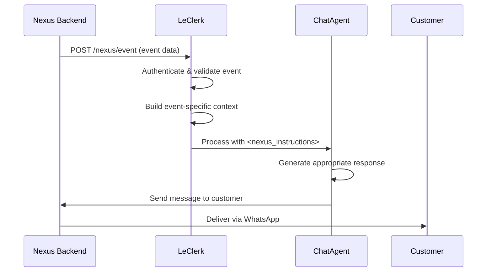

**`POST`** `https://${chatbotUrl}/nexus/event`

## Headers

| Name         | Value              |
| ------------ | ------------------ |
| Content-Type | `application/json` |

## Body

| Name                   | Type                                                                                                                                                                        | Description                                                                                     |
| ---------------------- | --------------------------------------------------------------------------------------------------------------------------------------------------------------------------- | ----------------------------------------------------------------------------------------------- |
| `type`                 | `"payment_method_registered"` \| `"payment_method_registration_failed"` \| `"payment_confirmed"` \| `"payment_failed"` \| `"order_status_changed"` \| `"nexus_instruction"` | The message of the customer that triggered the chatbot                                          |
| `conversation`         | [conversation](/chatbot/types/conversation)                                                                                                                                 | Data about the conversation between the customer and the restaurant                             |
| `location`             | [location](/chatbot/types/location) (optional)                                                                                                                              | Data about the restaurant. Only present if mode is `"location"`                                 |
| `businessOrganization` | [Business Organization](/chatbot/types/business-organization)                                                                                                               | Data about the organization and its locations. Only present if mode is `"businessOrganization"` |
| `customer`             | [customer](/chatbot/types/customer)                                                                                                                                         | Data about the customer                                                                         |
| `paymentMethod`        | [payment-method](/chatbot/types/payment-method)                                                                                                                             | Data about the payment method that was registered. If type is `"payment_method_registered"`     |
| `failureReason`        | string (optional)                                                                                                                                                           | Reason of failure if type is `"payment_method_registration_failed"` or `"payment_failed"`       |
| `order`                | [order](/chatbot/types/order) (optional)                                                                                                                                    | Data about the order concerned by the event if type is `"order_status_changed"`                 |
| `message`              | string (optional)                                                                                                                                                           | The nexus message, present only if type is `"nexus_instruction"`                                |
| `mode`                 | `"location"` \| `"businessOrganization"`                                                                                                                                    | Whether the event is sent to a location or organizaition conversation                           |

## Event Webhook Processing

The Event Webhook endpoint (`POST /nexus/event`) is how LeClerk receives notifications about important system events that require customer communication. Unlike regular messages from customers, these events are triggered by backend processes and need the chatbot to proactively reach out to customers.

### What Are Events?

Events represent significant changes in a customer's order journey that warrant communication. Think of them as automated moments where the restaurant needs to update the customer about their experience.

### Types of Events

LeClerk handles several categories of events:

#### Payment Events

- **`payment_succeeded`**: Customer's payment went through successfully
- **`payment_failed`**: Payment was declined or encountered an error
- **`payment_requires_action`**: Payment needs additional verification (3D Secure, etc.)

#### Order Status Events

- **`order_status_changed`**: Order moved to a new stage (confirmed, preparing, ready, etc.)

#### Delivery Events

- **`delivery_status_changed`**: Delivery status updated (assigned driver, picked up, delivered, etc.)

#### System Events

- **`feedback_request`**: Time to ask customer for feedback about their experience
- **`nexus_instruction`**: Direct instruction from the backend with specific messaging requirements

### How Event Processing Works



### Event Processing Flow

1. **Event Reception**: LeClerk receives the event with rich context about the customer, order, and what happened

2. **Context Building**: The system extracts relevant information and builds specialized instructions for the ChatAgent

3. **Instruction Generation**: Based on the event type, LeClerk creates `<nexus_instructions>` that tell the agent:

   - What happened (payment failed, order ready, etc.)
   - What information to include (ETA, courier details, next steps)
   - What tone to use (congratulatory, helpful, urgent)

4. **Agent Processing**: The ChatAgent processes these instructions like any other message, but with event-specific context

5. **Customer Communication**: The response is sent to the customer through the normal messaging flow

### Event Data Structure

Each event includes:

- **Event Type**: What kind of event this is
- **Customer Context**: Who to message and their conversation history
- **Order Information**: Details about the relevant order
- **Event-Specific Data**:
  - Payment method details (for payment events)
  - Delivery information like ETA and courier details (for delivery events)
  - Order status and timing (for status changes)

### Examples

#### Payment Success Event

```json
{
  "type": "payment_succeeded",
  "customer": { "id": "cust_123", "name": "Alice" },
  "order": { "id": "order_456", "total": 25.5 },
  "paymentMethod": { "lastFourDigits": "4242", "brand": "Visa" }
}
```

This generates a message like: "Great news Alice! Your payment of €25.50 has been processed successfully. Your order is confirmed and we're starting preparation now!"

#### Delivery Status Event

```json
{
  "type": "delivery_status_changed",
  "deliveryStatus": "driver_assigned",
  "delivery": {
    "estimatedDeliveryTime": "2024-01-15T19:30:00Z",
    "courierName": "Marco",
    "courierPhone": "+33123456789"
  }
}
```

This generates: "Good news! Your order has been assigned to Marco for delivery. Estimated arrival: 7:30 PM. You can reach Marco at +33123456789 if needed."

### Event-Specific Behaviors

#### Payment Events

- **Success**: Celebratory tone, confirm order progression
- **Failure**: Helpful tone, provide retry options and support contact
- **Action Required**: Clear instructions for completing payment

#### Delivery Events

- **Driver Assigned**: Share courier details and ETA
- **Picked Up**: Confirm order is on the way
- **Delivered**: Ask for confirmation and offer support

#### Feedback Requests

- **Post-Delivery**: Ask about food quality, delivery experience
- **Post-Cancellation**: Understand what went wrong and how to improve

### Integration with Regular Conversations

Events don't interrupt ongoing conversations—they extend them. If a customer is actively chatting when an event occurs, the event response becomes part of the natural conversation flow. This creates a seamless experience where automated updates feel like natural communication.

### Error Handling

If an event can't be processed (invalid data, system errors), LeClerk:

1. Logs the error with full context
2. Sends notifications to the development team via Discord
3. Attempts graceful degradation (generic fallback messages when possible)
4. Never leaves customers without communication for critical events like payment failures

### Development & Testing

When developing new event types:

1. Define the event structure in `models.py`
2. Add event handling logic in `main.py`'s `/nexus/event` endpoint
3. Create appropriate instruction templates

Events are a powerful way to keep customers informed and engaged throughout their entire experience with the restaurant, turning what could be silent backend processes into opportunities for positive customer interaction.
