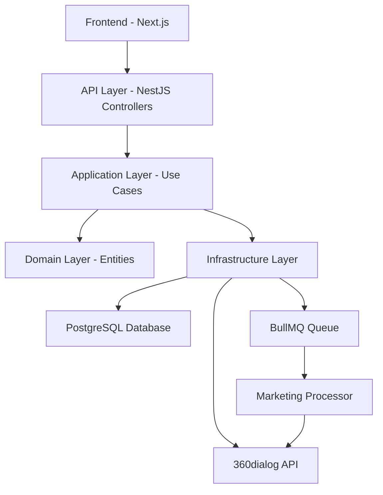
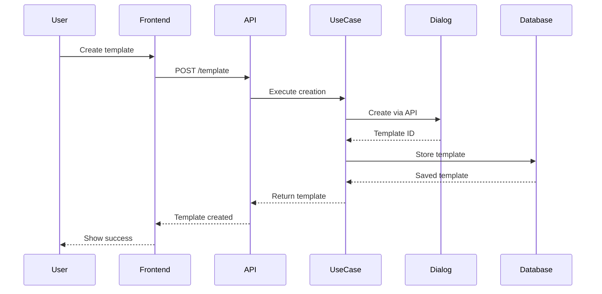
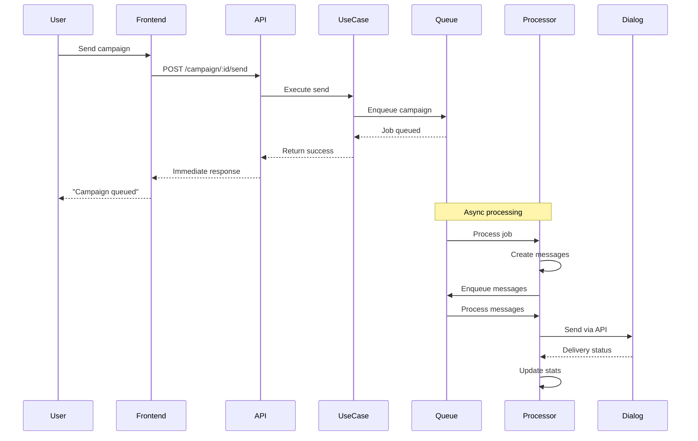
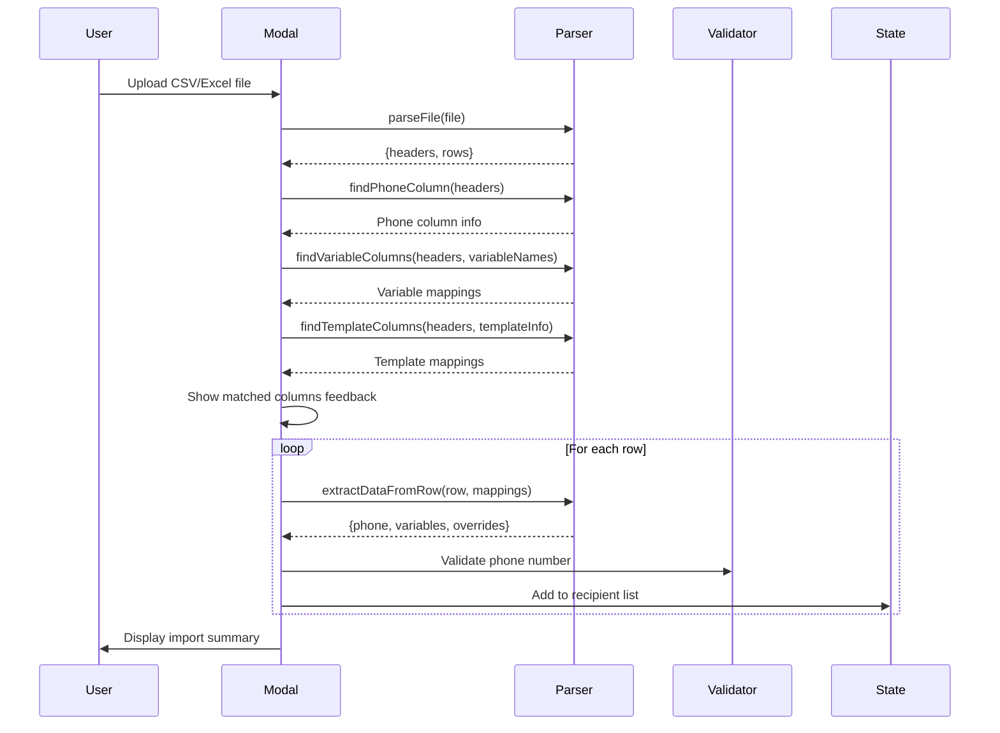

# Marketing Campaigns Technical Documentation

This document provides a comprehensive technical overview of the WhatsApp marketing campaigns feature implementation, including the architecture, data flows, and key components.

## Architecture Overview

The marketing campaigns feature is built on a multi-layered architecture following Domain-Driven Design (DDD) principles:



## Core Components

### 1. Domain Entities

#### TemplateMessage Entity

Located at: `src/domain/entities/message/template/template-message.entity.ts`

- Represents WhatsApp message templates
- Contains header, body, footer, and buttons configuration
- Manages template status (pending, approved, rejected)
- Stores Dialog API identifiers and WABA ID

#### MarketingCampaign Entity

Located at: `src/domain/entities/marketing-campaign/marketing-campaign.entity.ts`

- Represents a marketing campaign instance
- Links to a TemplateMessage
- Stores nexus instructions and variable definitions
- Manages campaign status (draft, pending, accepted, sent, closed)
- Contains campaign statistics (sent, delivered, read counts)

#### MarketingMessage Entity

Located at: `src/domain/entities/marketing-message/marketing-message.entity.ts`

- Represents individual messages within a campaign
- Stores recipient information and message status
- Contains resolved template variables
- Tracks delivery and read receipts

### 2. Application Layer - Use Cases

#### CreateTemplateMessageByEntityUsecase

**Purpose**: Creates WhatsApp message templates for locations or business organizations

**Flow**:

1. Validates entity (location/business organization) exists
2. Checks WhatsApp integration is configured
3. Calls 360dialog API to create template
4. Stores template in database with Dialog ID
5. Returns created template

**Error Handling**:

- `TEMPLATE_VALIDATION_ERROR`: Invalid input data
- `TEMPLATE_LOCATION_NOT_FOUND`: Location doesn't exist
- `TEMPLATE_WHATSAPP_NOT_CONFIGURED`: No WhatsApp integration
- `TEMPLATE_WHATSAPP_API_ERROR`: 360dialog API failure

#### CreateWhatsappCampaignUsecase

**Purpose**: Creates a new marketing campaign

**Flow**:

1. Validates template message exists and is approved
2. Validates entity has WhatsApp integration
3. Creates campaign with initial status (draft or accepted based on user role)
4. Stores nexus instructions and variable definitions
5. Admin-created campaigns are auto-accepted

**Key Features**:

- Auto-acceptance for admin users
- Variable validation and type checking
- Integration validation

#### SendMarketingCampaignUsecase

**Purpose**: Initiates campaign sending to recipients

**Flow**:

1. Validates campaign is in 'accepted' status
2. Deduplicates recipient phone numbers
3. Enqueues campaign data to BullMQ for processing
4. Returns immediately (async processing)
5. Emits `marketing.campaign.sent` event

**Queue Payload**:

```typescript
{
  campaignId: string;
  recipientNumbers: string[];
  whatsappNumber: string;
  sendAt?: Date;
  recipientVariables: Array<{
    phoneNumber: string;
    variables: Record<string, string>;
  }>;
  recipientTemplateOverrides: Array<{
    phoneNumber: string;
    overrides: {
      headerVariable?: string;
      bodyVariables?: string[];
      buttonVariables?: string[];
    };
  }>;
  delayMs: number;
}
```

#### SendMarketingMessageUsecase

**Purpose**: Sends individual marketing messages

**Flow**:

1. Creates MarketingMessage record
2. Resolves all template variables (reserved + custom)
3. Builds Dialog API payload
4. Sends via 360dialog
5. Updates message status
6. Handles conversation initialization

**Variable Resolution**:

- Reserved variables (e.g., `customerFirstName`) pull from database
- Custom variables come from campaign or recipient overrides
- Fallback to default values if not found

### 3. Infrastructure Layer

#### MarketingQueue Implementation

Located at: `src/infrastructure/queues/marketing.queue.ts`

**Configuration**:

- Queue name: `marketing`
- Default concurrency: 5
- Retry attempts: 3
- Backoff strategy: Exponential

**Job Types**:

1. **`send-campaign` Job**: Entry point for campaign processing

   - Receives the entire campaign data with all recipients
   - Creates MarketingMessage records in the database
   - Splits recipients into batches for processing
   - Enqueues individual `send-message` jobs for each recipient
   - This job doesn't send any messages directly

2. **`send-message` Job**: Handles individual message sending
   - Receives a single MarketingMessage ID
   - Loads message and related data from database
   - Resolves all variables (reserved and custom)
   - Calls 360dialog API to send the actual WhatsApp message
   - Updates message status (sent, failed, etc.)
   - Handles retries on failure

#### MarketingProcessor

Located at: `src/infrastructure/queues/processors/marketing.processor.ts`

**Detailed Processing Flow**:

1. **Campaign Job Processing** (`processSendCampaign`):

   ```typescript
   async processSendCampaign(job: Job) {
     const { campaignId, recipientNumbers, recipientVariables, recipientTemplateOverrides } = job.data;

     // 1. Load campaign with template message
     const campaign = await this.campaignRepository.findById(campaignId, true);

     // 2. Process recipients in batches to avoid memory issues
     const BATCH_SIZE = 100;
     for (let i = 0; i < recipientNumbers.length; i += BATCH_SIZE) {
       const batch = recipientNumbers.slice(i, i + BATCH_SIZE);

       // 3. Create MarketingMessage records for this batch
       const messages = await this.createMessagesForBatch(batch, campaign, recipientVariables);

       // 4. Enqueue individual send-message jobs
       for (const message of messages) {
         await this.marketingQueue.enqueueSendMessage({
           messageId: message.id,
           delay: calculateDelay(i), // Rate limiting
         });
       }
     }

     // 5. Update campaign status
     await this.campaignRepository.updateStatus(campaignId, 'sending');
   }
   ```

2. **Message Job Processing** (`processSendMessage`):

   ```typescript
   async processSendMessage(job: Job) {
     const { messageId } = job.data;

     try {
       // 1. Load message with all relations
       const message = await this.messageRepository.findById(messageId);

       // 2. Initialize conversation data if needed
       await this.initializeConversationData(message.recipientNumber);

       // 3. Send via SendMarketingMessageUsecase
       await this.sendMarketingMessageUsecase.execute({
         marketingMessageId: messageId,
         // Variable resolution happens inside the usecase
       });

       // 4. Message status is updated by the usecase
     } catch (error) {
       // 5. Handle failures - job will be retried by BullMQ
       throw error;
     }
   }
   ```

**Rate Limiting Strategy**:

```typescript
// Spread messages over time to respect WhatsApp limits
const MESSAGES_PER_SECOND = 80;
const DELAY_PER_MESSAGE = 1000 / MESSAGES_PER_SECOND; // ~12.5ms per message

function calculateDelay(messageIndex: number): number {
  return messageIndex * DELAY_PER_MESSAGE;
}
```

#### DialogClient Integration

Located at: `src/infrastructure/services/dialog/client/dialog.client.ts`

**Key Methods**:

- `template.createTemplateMessage()`: Creates templates
- `template.sendTemplateMessage()`: Sends messages
- `template.getTemplateStatus()`: Checks approval status

### 4. Frontend Implementation

#### Marketing Campaign Components

**MarketingCampaignsModal**

- Creates new campaigns
- Variable definition with visual indicators
- Nexus instructions editor
- Template selection

**SendCampaignModal**

- File upload (CSV/Excel) support
- Automatic column matching
- Variable preview and editing
- Recipient management

**Key Features**:

1. **Reserved Variable Indicators**

   - Blue badges for database variables
   - Tooltips explaining data sources
   - Automatic value resolution

2. **File Processing**

   - Supports CSV and Excel formats
   - Case-insensitive column matching
   - Visual feedback for matched columns

3. **Variable Management**
   - Three types: reserved, file-sourced, manual
   - Inline editing capabilities
   - Clear visual differentiation

## Campaign Acceptance Workflow

### Admin Dashboard Integration

The campaign acceptance feature ensures compliance with WhatsApp Business policies and maintains quality standards.

#### Acceptance Flow

1. **Campaign Creation**:

   - Regular users create campaigns with status `draft`
   - Admin users' campaigns are auto-accepted with status `accepted`

2. **Admin Review Dashboard**:

   - Located at `/admin/campaigns`
   - Shows all campaigns pending approval
   - Displays campaign details:
     - Template message content
     - Variable definitions
     - Nexus instructions

3. **Review Actions**:

   **Approve Campaign** (`POST /campaign/:id/approve`):

   ```typescript
   async approveCampaign(campaignId: string): Promise<void> {
     // 1. Verify admin permissions
     const isAdmin = request.user.role === 'admin';
     if (!isAdmin) throw new ForbiddenException();

     // 2. Update campaign status
     await this.campaignRepository.updateStatus(campaignId, 'accepted');
   }
   ```

   **Reject Campaign** (`POST /campaign/:id/reject`):

   ```typescript
   async rejectCampaign(campaignId: string, reason: string): Promise<void> {
     // 1. Update status with rejection reason
     await this.campaignRepository.reject(campaignId, {
       status: 'rejected',
       rejectionReason: reason,
       rejectedAt: new Date(),
       rejectedBy: request.user.id,
     });
   }
   ```

4. **Compliance Checks**:

   - Template content appropriateness
   - Variable usage correctness

5. **Status Transitions**:
   ```
   draft → pending → accepted → sent → closed
              ↓
           rejected
   ```

### Admin Dashboard UI Components

**Campaign Review Card**:

- Preview of template message with resolved variables
- Variable mapping visualization
- Nexus instructions preview
- Quick approve/reject buttons
- Rejection reason modal

**Bulk Actions**:

- Approve multiple campaigns
- Apply consistent rejection reasons
- Filter by location/organization

## Data Flow Diagrams

### Template Creation Flow



### Campaign Sending Flow



## Queue Processing Architecture

### Why Two Separate Job Types?

The separation between `send-campaign` and `send-message` jobs provides several architectural benefits:

1. **Scalability**:

   - Campaign jobs are lightweight - they only create database records
   - Message jobs can be distributed across multiple workers
   - Failed messages don't block the entire campaign

2. **Reliability**:

   - Individual message failures can be retried independently
   - Campaign progress is trackable at the message level
   - Partial campaign completion is possible

3. **Rate Limiting**:

   - Messages are spread over time to respect API limits
   - Each message has its own delay calculation
   - Prevents overwhelming the WhatsApp API

4. **Observability**:
   - Clear separation of concerns for monitoring
   - Individual message status tracking
   - Detailed error reporting per recipient

### Queue Processing Timeline

```
Time 0s: Campaign job received
├── 0-2s: Load campaign data
├── 2-5s: Create 1000 MarketingMessage records
├── 5-10s: Enqueue 1000 send-message jobs with delays
└── 10s: Campaign job complete

Time 10s-60s: Message jobs processing
├── 10.000s: Message 1 sent
├── 10.012s: Message 2 sent (12.5ms delay)
├── 10.025s: Message 3 sent
├── ...continuing at ~80 messages/second
└── 60s: All messages sent
```

## Queue Processing Details

### Rate Limiting

The system implements rate limiting to comply with WhatsApp Business API limits:

```typescript
// Configuration
const MESSAGES_PER_SECOND = 80;
const BATCH_SIZE = 5;
const DELAY_BETWEEN_BATCHES = 1000 / (MESSAGES_PER_SECOND / BATCH_SIZE);
```

### Error Handling Strategy

**Campaign Job Failures**:

- Retry entire campaign creation
- Idempotent operation (won't duplicate messages)
- Maximum 3 retries with exponential backoff

**Message Job Failures**:

- Individual retry per message
- Failed messages marked with error status
- After 3 retries, moved to dead letter queue
- Campaign continues for other recipients

## Reserved Variables System

The system supports automatic variable resolution from the database:

### Supported Reserved Variables

| Variable Name       | Database Field       | Description           |
| ------------------- | -------------------- | --------------------- |
| `customerFirstName` | `customer.firstName` | Customer's first name |
| `customerLastName`  | `customer.lastName`  | Customer's last name  |

### Resolution Process

1. **Identification**: System identifies reserved variables in template
2. **Customer Lookup**: Finds customer by phone number
3. **Data Extraction**: Retrieves values from customer record
4. **Fallback**: Uses default or empty string if not found

## CSV and Excel File Import System

The marketing campaign system supports importing recipient data from CSV and Excel files with automatic column matching and variable mapping.

### File Processing Architecture

#### Supported Formats

- **CSV**: Comma, semicolon, or tab-separated values
- **Excel**: .xlsx and .xls formats (via `xlsx` library)

#### File Parser Implementation

Located at: `src/features/whatsapp/utils/file-parser.ts`

**Core Functions**:

1. **`parseFile(file: File)`**: Main entry point

   ```typescript
   export async function parseFile(file: File): Promise<ParsedData> {
     const fileExtension = file.name.split(".").pop()?.toLowerCase();

     if (fileExtension === "csv") {
       return parseCSV(file);
     } else if (["xlsx", "xls"].includes(fileExtension || "")) {
       return parseExcel(file);
     } else {
       throw new Error(
         "Format de fichier non supporté. Utilisez CSV ou Excel."
       );
     }
   }
   ```

2. **CSV Parsing**:

   - Supports multiple delimiters: comma, semicolon, tab
   - First row is always treated as headers
   - Empty lines are automatically filtered out

3. **Excel Parsing**:
   - Uses the first sheet only
   - Converts to JSON array format
   - Empty cells are converted to empty strings

### Column Matching Logic

The system uses intelligent column matching to automatically map file columns to campaign variables:

#### 1. Phone Number Detection

```typescript
export function findPhoneColumn(headers: string[]): PhoneColumnInfo | null {
  const phonePatterns = ["phone", "numero", "numéro", "tel", "mobile"];

  // Case-insensitive partial matching
  const phoneColumnIndex = headers.findIndex((h) =>
    phonePatterns.some((pattern) => h.toLowerCase().includes(pattern))
  );
}
```

**Supported column names**:

- `phone`, `phoneNumber`, `phone_number`
- `numero`, `numéro`, `numeroTelephone`
- `tel`, `telephone`, `mobile`

#### 2. Variable Column Matching

```typescript
export function findVariableColumns(
  headers: string[],
  variableNames: string[]
): VariableColumnMapping[] {
  // Case-insensitive matching with normalization
  headers.findIndex(
    (h) =>
      h.toLowerCase() === varName.toLowerCase() ||
      h.toLowerCase().replace(/[_\s-]/g, "") ===
        varName.toLowerCase().replace(/[_\s-]/g, "")
  );
}
```

**Matching Rules**:

- Case-insensitive comparison
- Ignores underscores, spaces, and hyphens
- Example: `customer_first_name` matches `customerFirstName`

#### 3. Template Variable Override Matching

The system can also match columns to template message variables (header, body, button) based on the actual variable values defined in the campaign.

### Import Flow in Send Campaign Modal



### Data Processing Pipeline

1. **File Upload Handling**:

   ```typescript
   const handleFileUpload = async (e: React.ChangeEvent<HTMLInputElement>) => {
     const file = e.target.files?.[0];
     if (!file) return;

     // Parse file
     const { headers, rows } = await parseFile(file);

     // Find columns
     const phoneColumn = findPhoneColumn(headers);
     const variableColumns = findVariableColumns(headers, variableNames);
     const templateColumns = findTemplateColumns(headers, templateVariableInfo);
   };
   ```

2. **Row Processing**:

   - Each row is processed individually
   - Phone numbers are normalized and validated
   - Variables are extracted based on column mappings
   - Template overrides are applied if matching columns found

3. **Duplicate Handling**:
   - Phone numbers are deduplicated automatically
   - Existing recipients are updated with new variable values
   - User receives feedback on duplicates

### Variable Priority System

When sending a campaign, variables are resolved in this priority order:

1. **File Import Values** (highest priority)
   - Values from CSV/Excel columns that match variable names
2. **Manual Overrides**
   - Values manually edited in the UI after import
3. **Reserved Variables**
   - Database values (e.g., customerFirstName)
4. **Default Values** (lowest priority)
   - Values defined during campaign creation

### Import Validation and Feedback

The system provides comprehensive feedback during import:

```typescript
// Success feedback with matched columns
toast.success(
  <div>
    <div>✓ {result.added} numéros ajoutés</div>
    <div className="text-xs mt-1 opacity-90">
      Colonnes trouvées: Variables: discount, promoCode • Template: headerText
    </div>
  </div>
);
```

**Validation Checks**:

- Phone number format validation
- Required variable presence
- Data type compatibility
- File size limits (10MB)
- Row count limits (50,000 rows)

### Error Handling

Common import errors and their handling:

1. **Missing Phone Column**:

   - Error: "Aucune colonne de numéro de téléphone trouvée"
   - Solution: Ensure file has a column with phone-related name

2. **Invalid File Format**:

   - Error: "Format de fichier non supporté"
   - Solution: Use CSV or Excel formats only

3. **Empty File**:

   - Error: "Le fichier est vide"
   - Solution: Ensure file contains headers and data

4. **Large Files**:
   - Files are processed in memory
   - Progress feedback for files > 1000 rows
   - Chunked processing to prevent UI freezing

### Error Handling

1. **Retry Logic**:

   - Automatic retry with exponential backoff
   - Maximum 3 retry attempts
   - Failed messages marked with error status

2. **Dead Letter Queue**:

   - Messages failing after retries go to DLQ
   - Manual inspection and reprocessing available

3. **Status Updates**:
   - Real-time status via WebSocket events
   - Campaign statistics updated after each batch
