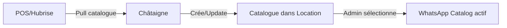
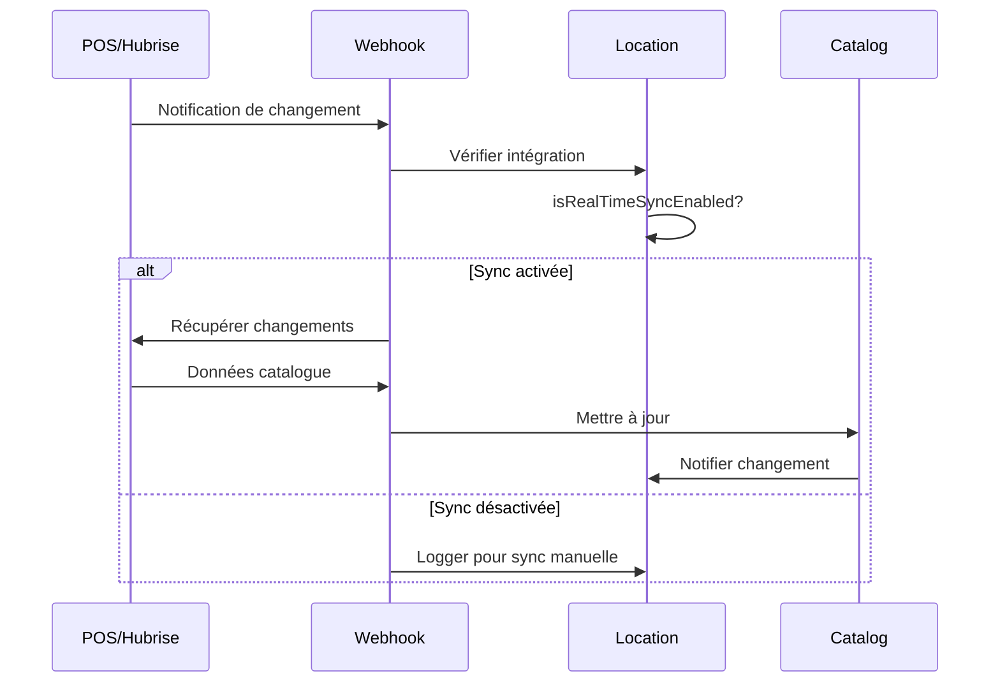

# Architecture des Intégrations

Cette documentation détaille le système d'intégrations qui permet à chaque restaurant (Location) de se connecter aux systèmes de caisse (POS) et autres services tiers.

## Vue d'ensemble

Chaque **Location** (restaurant) peut avoir plusieurs intégrations actives simultanément. Le système est conçu de manière modulaire avec une classe abstraite `Integration` que chaque service tiers étend.

<Note>
  **Principe clé** : Une location peut avoir une seule intégration par type (ex: une seule intégration Hubrise, une seule Stripe, etc.)
</Note>

## Types d'intégrations supportés

```typescript
enum IntegrationType {
  Whatsapp = 'whatsapp',   // Communication et catalogue WhatsApp Business
  Stripe = 'stripe',        // Paiements en ligne
  Hubrise = 'hubrise',      // Synchronisation POS et commandes
  Expedy = 'expedy',        // Impression de reçus
  UberDirect = 'uberDirect' // Service de livraison
}
```

## Structure d'une intégration

### Classe abstraite de base

Toutes les intégrations héritent de cette structure :

```typescript
abstract class Integration {
  public readonly isEnabled: boolean;  // Intégration active/inactive
  public readonly type: IntegrationType;
  
  constructor(params: { isEnabled: boolean }) {
    this.isEnabled = params.isEnabled;
  }
}
```

## Exemple d'intégration POS (Hubrise)

L'intégration Hubrise est la plus importante pour la synchronisation avec les systèmes de caisse.

### Configuration Hubrise

```typescript
class HubriseIntegration extends Integration {
  // Identifiants Hubrise
  hubriseLocationId: string;     // ID de la location dans Hubrise
  accessToken: string;            // Token d'accès API
  catalogId: string;              // ID du catalogue Hubrise
  customerListId: string;         // ID de la liste clients
  
  // Mapping des références (CRITIQUE pour la synchronisation)
  whatsappDeliveryServiceTypeRef?: string;  // Ref pour livraison WhatsApp
  whatsappCollectionServiceTypeRef?: string; // Ref pour collecte WhatsApp
  stripePaymentRef?: string;                // Ref paiement Stripe
  storePaymentRef?: string;                 // Ref paiement en magasin
  deliveryFeesChargeRef?: string;           // Ref frais de livraison
  serviceChargeRef?: string;                // Ref frais de service
  promotionRef?: string;                     // Ref promotions
  catalogVariantRef?: string;               // Ref variante catalogue
  
  // Options de synchronisation
  isRealTimeSyncEnabled: boolean;           // Sync temps réel activée
  isStoreHandlingDelivery?: boolean;        // Livraison gérée par le magasin
}
```

<Warning>
  **Important** : Les références (`*Ref`) doivent correspondre exactement aux codes dans votre système de caisse. Une mauvaise référence empêchera la synchronisation correcte des commandes.
</Warning>

### Synchronisation des catalogues

Le processus de synchronisation suit ces étapes :

<Steps>
  <Step title="Pull du catalogue">
    L'intégration récupère le catalogue depuis l'API Hubrise
  </Step>
  <Step title="Création/Mise à jour">
    Le catalogue est créé ou mis à jour dans la location
  </Step>
  <Step title="Sélection manuelle">
    Un administrateur choisit d'activer ce catalogue pour WhatsApp
  </Step>
</Steps>



### Options de synchronisation temps réel

Quand `isRealTimeSyncEnabled` est activé :

- Les changements de catalogue sont synchronisés automatiquement
- Les mises à jour de stock sont reflétées immédiatement
- Les modifications de prix sont appliquées en temps réel

<Info>
  Si la synchronisation temps réel est désactivée, les mises à jour doivent être déclenchées manuellement via l'interface d'administration.
</Info>

## Gestion des catalogues dans une Location

### Architecture multi-catalogues

Une location peut avoir plusieurs catalogues mais **un seul est actif pour WhatsApp** :

```typescript
class Location {
  private catalogs: Catalog[];           // Tous les catalogues
  private _whatsappCatalogId?: string;   // ID du catalogue WhatsApp actif
  
  // Récupère le catalogue WhatsApp actif
  get whatsappCatalog(): Catalog {
    if (!this._whatsappCatalogId) {
      throw new Error('No WhatsApp catalog configured');
    }
    
    const catalog = this.catalogs.find(c => c.id === this._whatsappCatalogId);
    if (!catalog) {
      throw new Error('WhatsApp catalog not found');
    }
    
    return catalog;
  }
  
  // Met à jour le catalogue WhatsApp actif
  updateWhatsappCatalogId(catalogId: string): void {
    const catalog = this.catalogs.find(c => c.id === catalogId);
    if (!catalog) {
      throw new Error('Catalog not found in location');
    }
    this._whatsappCatalogId = catalogId;
  }
}
```

### Workflow de synchronisation

<Tabs>
  <Tab title="Synchronisation initiale">
    1. **Configuration de l'intégration Hubrise**

       ```typescript
       const integration = new HubriseIntegration({
         isEnabled: true,
         hubriseLocationId: "loc_123",
         accessToken: "token_xyz",
         catalogId: "cat_456",
         isRealTimeSyncEnabled: true
       });
       location.addIntegration(integration);
       ```
    2. **Pull du catalogue**

       ```typescript
       // Le système récupère le catalogue depuis Hubrise
       const catalog = await pullCatalogFromHubrise(integration);
       location.addCatalog(catalog);
       ```
    3. **Activation pour WhatsApp**

       ```typescript
       // Admin sélectionne ce catalogue
       location.updateWhatsappCatalogId(catalog.id);
       ```
  </Tab>
  <Tab title="Mise à jour de catalogue">
    Quand un catalogue existant est synchronisé :

    ```typescript
    // 1. Récupération des changements
    const updates = await fetchCatalogUpdates(integration);
    
    // 2. Mise à jour du catalogue existant
    const existingCatalog = location.findCatalogById(catalogId);
    existingCatalog.update(updates);
    
    // 3. Si c'est le catalogue WhatsApp actif, les changements
    //    sont immédiatement visibles aux clients
    ```
  </Tab>
  <Tab title="Changement de catalogue actif">
    L'admin peut changer le catalogue utilisé :

    ```typescript
    // Liste des catalogues disponibles
    const catalogs = location.getCatalogs();
    
    // Sélection d'un nouveau catalogue
    location.updateWhatsappCatalogId(newCatalogId);
    
    // Le chatbot utilise maintenant le nouveau catalogue
    ```
  </Tab>
</Tabs>

## Intégration WhatsApp

L'intégration WhatsApp gère la communication et le catalogue visible par les clients.

### Configuration WhatsApp

```typescript
class WhatsappIntegration extends Integration {
  apiKey: string;                        // Clé API Dialog/WhatsApp
  whatsappNumber: string;                // Numéro WhatsApp Business
  isFlowEnabled: boolean;                // Flows interactifs activés
  isWelcomeMessageEnabled: boolean;      // Messages de bienvenue
  whatsappCatalogId?: string;            // Catalogue WhatsApp (géré par Location)
  
  // Profil business
  businessProfile?: {
    description?: string;
    address?: string;
    profilePictureUrl?: string;
    websites?: string[];
  };
  
  // Statut et limites
  channel?: {
    dailyConversationLimit?: number;
    monthlyConversationLimit?: number;
    quality?: 'GREEN' | 'YELLOW' | 'RED';
    status?: 'ACTIVE' | 'SUSPENDED';
  };
}
```

## Intégration Stripe

Gestion des paiements en ligne :

```typescript
class StripeIntegration extends Integration {
  accountId?: string;  // ID du compte Stripe connecté
}
```

## Gestion des intégrations dans Location

### Méthodes disponibles

```typescript
class Location {
  // Ajoute une intégration (vérifie les doublons)
  addIntegration(integration: Integration): void {
    const existing = this.integrations.find(i => i.type === integration.type);
    if (existing) {
      throw new Error(`Integration ${integration.type} already exists`);
    }
    this.integrations.push(integration);
  }
  
  // Récupère une intégration par type
  getIntegrationByType(type: IntegrationType): Integration | undefined {
    return this.integrations.find(i => i.type === type);
  }
  
  // Supprime une intégration
  removeIntegration(type: IntegrationType): void {
    this.integrations = this.integrations.filter(i => i.type !== type);
  }
  
  // Liste toutes les intégrations
  getIntegrations(): Integration[] {
    return this.integrations;
  }
}
```

### Vérification du statut

```typescript
// Vérifier si une intégration est configurée et active
const hubriseIntegration = location.getIntegrationByType(IntegrationType.Hubrise);
if (hubriseIntegration?.isEnabled) {
  // L'intégration Hubrise est active
  // On peut synchroniser les catalogues et commandes
}

// Vérifier plusieurs intégrations
const hasPayment = location.getIntegrationByType(IntegrationType.Stripe)?.isEnabled;
const hasPOS = location.getIntegrationByType(IntegrationType.Hubrise)?.isEnabled;
const canProcessOrders = hasPayment && hasPOS;
```

## Exemple complet de configuration

```typescript
// 1. Création d'une location
const location = new Location({
  name: "Restaurant Example",
  address: { /* ... */ },
  timezone: "Europe/Paris",
  // ...
});

// 2. Configuration Hubrise (POS)
const hubriseIntegration = new HubriseIntegration({
  isEnabled: true,
  hubriseLocationId: "loc_abc123",
  accessToken: "token_xyz789",
  catalogId: "cat_def456",
  customerListId: "list_ghi789",
  
  // Mapping des références
  whatsappDeliveryServiceTypeRef: "DELIVERY_WA",
  whatsappCollectionServiceTypeRef: "PICKUP_WA",
  stripePaymentRef: "PAYMENT_ONLINE",
  storePaymentRef: "PAYMENT_CASH",
  deliveryFeesChargeRef: "CHARGE_DELIVERY",
  serviceChargeRef: "CHARGE_SERVICE",
  
  // Options
  isRealTimeSyncEnabled: true,
  isStoreHandlingDelivery: false
});

location.addIntegration(hubriseIntegration);

// 3. Configuration Stripe (Paiements)
const stripeIntegration = new StripeIntegration({
  isEnabled: true,
  accountId: "acct_1234567890"
});

location.addIntegration(stripeIntegration);

// 4. Configuration WhatsApp
const whatsappIntegration = new WhatsappIntegration({
  isEnabled: true,
  apiKey: "api_key_dialog",
  whatsappNumber: "+33612345678",
  isFlowEnabled: true,
  isWelcomeMessageEnabled: true
});

location.addIntegration(whatsappIntegration);

// 5. Synchronisation du catalogue depuis Hubrise
const catalog = await syncCatalogFromHubrise(hubriseIntegration);
location.addCatalog(catalog);

// 6. Activation du catalogue pour WhatsApp
location.updateWhatsappCatalogId(catalog.id);
```

## Points d'attention pour l'intégration POS

### 1. Références critiques

Les références dans `HubriseIntegration` DOIVENT correspondre exactement à celles du POS :

- Types de service (livraison/collecte)
- Méthodes de paiement
- Types de frais
- Codes promotions

### 2. Gestion des catalogues

- Un seul catalogue actif pour WhatsApp à la fois
- Les catalogues synchronisés ne sont pas automatiquement activés
- Prévoir une interface admin pour la sélection du catalogue actif

### 3. Synchronisation temps réel

Quand `isRealTimeSyncEnabled` est activé :

- Prévoir la charge sur l'API
- Gérer les conflits de mise à jour
- Implémenter des mécanismes de retry

### 4. Validation des données

Toujours valider :

- L'existence du catalogue avant activation
- La cohérence des références POS
- Les permissions API (tokens valides)

## Webhooks et callbacks

### Hubrise webhook

Endpoint pour recevoir les mises à jour Hubrise :

```http
POST /api/webhook/hubrise/callback
```

### Flux de mise à jour



## Bonnes pratiques

1. **`Toujours vérifier isEnabled`** avant d'utiliser une intégration
2. **Gérer les erreurs de synchronisation** avec des retry et des logs
3. **Valider les références POS** lors de la configuration
4. **Tester avec un catalogue de test** avant d'activer en production
5. **Monitorer les webhooks** pour détecter les problèmes de sync
6. **Documenter les mappings de références** pour chaque installation
7. **Prévoir un fallback** si une intégration devient indisponible

Cette architecture modulaire permet d'ajouter facilement de nouvelles intégrations tout en maintenant la cohérence et la fiabilité du système.