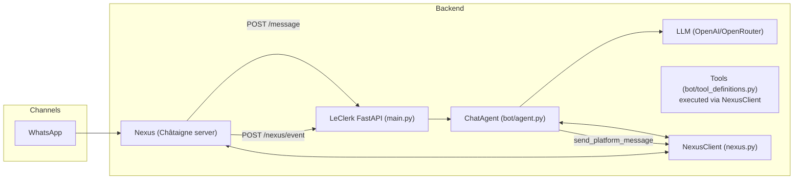
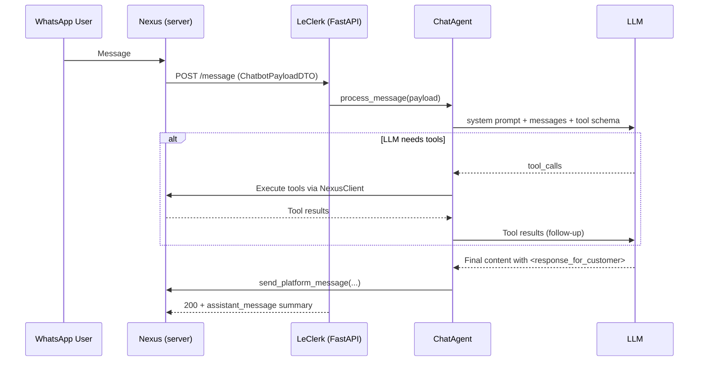
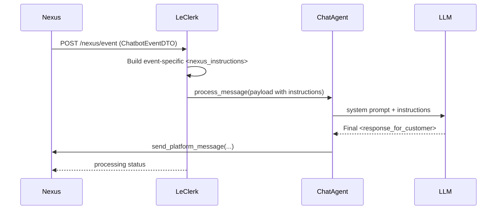
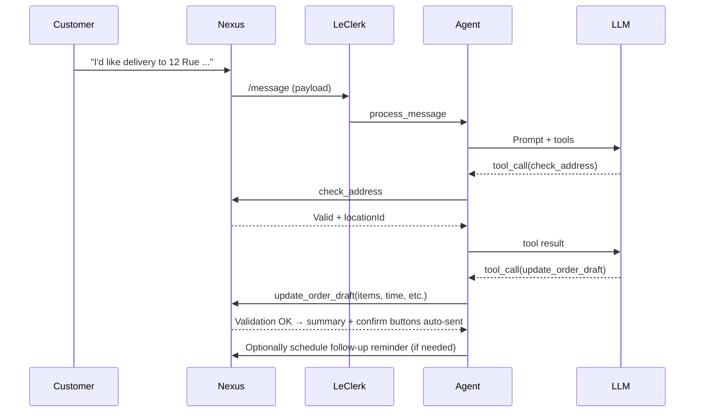

## LeClerk Chatbot – Architecture & Developer Guide

This document explains the overall architecture, core modules, and runtime flows of the LeClerk chatbot. It’s designed to help a new developer quickly understand how the system is organized and where to make changes.

### High-level Overview

- **Purpose**: LeClerk processes WhatsApp conversations for restaurants: answering questions, guiding ordering, validating addresses, building order drafts, and sending structured messages via the Nexus backend.
- **Core Pattern**: A FastAPI app exposes endpoints that receive either customer messages or system events. Both paths prepare a structured payload and delegate to the `ChatAgent` that orchestrates prompt construction, tool calls (via the Nexus API), and message responses.
- **Observability**: Tracing via Langfuse, structured/beautiful logs via Rich, and notifications to Discord/Linear for incidents.

### Key Responsibilities by Module

- `LeClerk/src/chataigne_clerk/main.py`
  - FastAPI app, CORS, authentication middleware, startup/shutdown hooks.
  - Endpoints: `/health`, `/debug/*`, `/message`, `/nexus/event`.
  - Initializes `NexusClient`, `ChatAgent`, notifications, optional Linear client, and Langfuse.
- `LeClerk/src/chataigne_clerk/bot/agent.py`
  - The orchestrator. Builds prompts, manages tool calls, integrates results, and returns final messages (XML-tagged segments like `<response_for_customer>`).
  - Handles location mode vs organization mode; tracks effective location; batches and sequences tool use.
- `LeClerk/src/chataigne_clerk/bot/prompts.py`
  - Builds system prompts and guidelines, with dynamic customer/menu/store info.
- `LeClerk/src/chataigne_clerk/bot/tool_definitions.py`
  - Defines the tool catalog exposed to the LLM (address checks, menu lookup, update order draft, feedback, scheduling, etc.).
- `LeClerk/src/chataigne_clerk/nexus.py`
  - HTTP client to the Nexus backend with retry and tracing. Implements operations like `send_platform_message`, `update_order_draft`, `check_address`, `create_feedback`, etc.
- `LeClerk/src/chataigne_clerk/models.py`
  - Pydantic DTOs for conversation, orders, payments, locations, catalog, events.
- `LeClerk/src/chataigne_clerk/bot/*` (supporting)
  - `store_info.py`: extracts store/menu/customer summary for prompts.
  - `fuzzy_menu_search.py`, `menu_query_system.py`, `menu_formatter.py`: menu search and formatting utilities.
  - `nexus_instructions.py`: standardized injection/extraction of `<nexus_instructions>`.
- `LeClerk/src/chataigne_clerk/sse_client.py`
  - Optional SSE client for real-time interruption (e.g., new incoming messages mid-processing).
- `LeClerk/src/chataigne_clerk/services/*`
  - `notifications.py`: Discord notifications; `linear.py`: creates Linear issues.
- Cross-cutting: `logger_config.py`, `log_utils.py`, `auth.py`, `utils.py`.

### Runtime Flows

#### 1) Customer message flow (POST /message)

Highlights

- `main.py` logs receipt, sets Langfuse tags (store/org, user id), injects closing-time instructions if relevant, and calls `ChatAgent.process_message`.
- `ChatAgent` builds a system prompt using `prompts.py` and attaches `tool_definitions` dynamically (location/org mode aware).
- LLM responses are XML-normalized (`AssistantMessage` extracts `<response_for_customer>` and strips nested `<thinking>/<scratchpad>` before sending outbound messages).

#### 2) System event flow (POST /nexus/event)

Highlights

- Events include `payment_*`, `order_status_changed`, `delivery_status_changed`, `feedback_request`, `nexus_instruction`.
- The handler constructs context and instructions (e.g., delivery ETAs, courier info) and funnels them to the agent as `<nexus_instructions>`.

### Message Structure & Tags

- The agent returns XML-tagged blocks; only `<response_for_customer>` is sent to the customer.
- Other tags like `<thinking>`, `<scratchpad>`, `<nexus_response>` are internal and stripped before delivery.

### Tools – What the LLM Can Do

Defined in `bot/tool_definitions.py` and executed through `NexusClient`:

- Address & Location
  - `check_address`: validate serviceability; in organization mode returns best `locationId`.
  - `switch_location` (org mode): reset context to another location.
- Menu & Orders
  - `menu_lookup`: browse/search categories, SKUs, deals; optionally with fields/filters.
  - `update_order_draft`: central order state update (service type, items/options, time, codes, deals, etc.).
  - `send_order_form`: send a WhatsApp order flow (if enabled for the location).
- Customer Context
  - `get_customer_previous_orders`: history/favorites/stats.
  - `manage_customer_memory`: get/set/delete persistent notes.
  - `change_customer_language`: sync deterministic UI elements’ language.
- Live Order Status & Engagement
  - `query_live_order_status`: status/payment/tracking/driver/collection/timing.
  - `schedule_message`, `list_scheduled_messages`, `cancel_scheduled_message`.
  - `react_to_message`.
- Feedback & Reporting
  - `register_feedback`: store structured satisfaction scores.
  - `report`: raise issues (Linear) and notify (Discord).

Tool Usage Principles (enforced by prompts)

- Be latency-aware, batch lookups when possible, and prefer minimal field sets.
- Validate delivery early (`check_address`) for delivery intents.
- Always try `update_order_draft` when the customer selects items; let the server validate.

### Location Mode vs Organization Mode

- Location mode: `payload.location` is present; use that catalog and settings.
- Organization mode: no location at first; use `check_address` to select a location, then proceed.
- The agent tracks an effective `locationId` and ensures menu lookups and order updates target the correct site.

### DTOs & Core Data Shapes

- `ChatbotPayloadDTO`: mode, lastMessage, conversation, location? (optional), customer, orders, organization? (optional).
- `ChatbotEventDTO`: type, mode, conversation, location?, customer, order?, paymentMethod?, message?, businessOrganization?.
- `OrderDraft*`, `Order*`, `Delivery*`, `Payment*`: used both in prompts and tool execution.
- `ChatbotCatalogDTO` / `CatalogDTO`: menu data structures (categories, products, skus, option lists, options, deals).

### Prompt Construction

- `prompts.py` builds the system prompt:
  - Background, role, formatting/tone, guidelines, sales tips
  - Store info (opening hours, delivery/payment settings)
  - Customer context (history, memory, language), simplified menu
- Uses lightweight menu formatting (`menu_formatter`) to keep prompts efficient; the agent queries details via tools as needed.

### NexusClient – Server Integration

- Provides typed operations to the Nexus backend with retry/backoff and Langfuse tracing:
  - `send_platform_message`, `register_text_message`, tool results registration
  - `update_order_draft`, `register_order_draft`
  - `check_address`, `get_payment_method_register_url`
  - `create_feedback`, `update_customer`, memory updates
  - `create_scheduled_message`, `cancel_scheduled_message`, `list_scheduled_messages`

### Logging & Observability

- Tracing with Langfuse:
  - Endpoints and client methods are decorated with `@observe()`; traces tagged with store/org, user, session.
  - `utils.create_langfuse_tags` and `format_user_id` standardize trace tags.
- Logging:
  - Rich-based formatting (`logger_config.py`) for clean, structured logs.
  - Message ingress/egress visually logged via `RichLogger.log_message_flow`.
- Notifications:
  - Discord: `NotificationsService.send_discord_notification` with direct links to conversation, Langfuse trace, and logs.
  - Linear: `services/linear.py` for issue creation and attachments.

### SSE Client (Optional)

- `sse_client.ConversationSSEClient`: connects to `NEXUS_URL/sse/conversations/{id}/messages` for real-time interruption.
- Maintains connection status, buffers pending messages, and supports interruption callbacks.

### Security & Auth

- Middleware in `main.py` validates `Authorization: Bearer ...` against `NEXUS_API_KEY` via `auth.get_api_key`.
- CORS is permissive by default; tighten for production.

### Configuration

Environment variables (subset; see `main.Settings` and `.env`):

- Nexus: `NEXUS_URL`, `NEXUS_API_KEY`
- Langfuse: `LANGFUSE_PUBLIC_KEY`, `LANGFUSE_SECRET_KEY`, `LANGFUSE_HOST`, optional `DEV_MODE`
- LLM: `OPENAI_API_KEY` or `OPENROUTER_API_KEY`, `USE_OPENROUTER`
- Integrations: `DISCORD_WEBHOOK_URL`, optional `LINEAR_API_KEY`, `LINEAR_TEAM_ID`

### Error Handling

- API returns proper HTTP errors on failures during processing.
- Validation and business logic errors are surfaced via `<nexus_instructions>` for the agent to act on.
- Technical incidents should be reported via the `report` tool (Linear + Discord), guided by prompt guidelines.

### Extending the System

- Add a tool:
  1. Define schema in `bot/tool_definitions.py`.
  2. Implement execution path in `ChatAgent` to call the right `NexusClient` method(s).
  3. Add server-side endpoint if needed in the Nexus backend, then wire it in `nexus.py`.
  4. Update prompts if guidance is needed for when/how to use the tool.
- Change prompt/policies:
  - Edit `bot/prompts.py` sections (role, formatting, guidelines). Keep dynamic parts small and stable for caching.
- Menu/search UX:
  - Use `menu_lookup` (primary), leverage `fuzzy_menu_search` if/when integrated for discovery.

### Endpoints Recap

- `GET /health`: liveness.
- `GET /debug/config`, `GET /debug/langfuse`: diagnostics.
- `POST /message`: main customer-message ingress.
- `POST /nexus/event`: system-events ingress (payments, delivery, instruction, feedback requests).

### Typical Order Scenario

### File Map (Where to Look)

- API surface: `main.py`
- Orchestrator: `bot/agent.py`
- Tool catalog: `bot/tool_definitions.py`
- Prompting/policies: `bot/prompts.py`
- Nexus HTTP integration: `nexus.py`
- Data models: `models.py`
- Utilities: `bot/store_info.py`, `utils.py`, `logger_config.py`, `log_utils.py`
- Notifications/Incidents: `services/notifications.py`, `services/linear.py`

---

If you need more depth in any area (e.g., delivery status branching or payment flows), start from the corresponding case blocks in `main.py`’s `/nexus/event` handler and trace into `ChatAgent` interactions.
