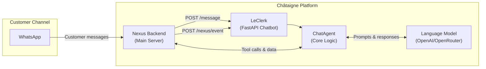
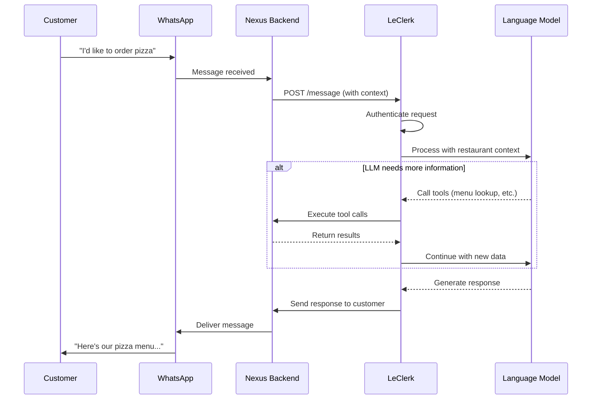
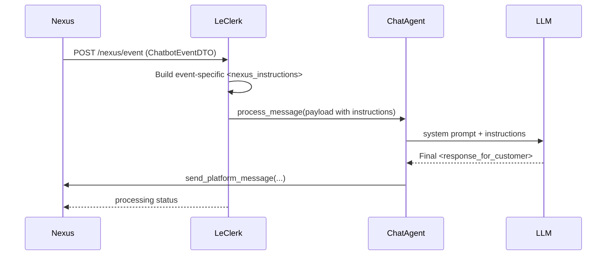
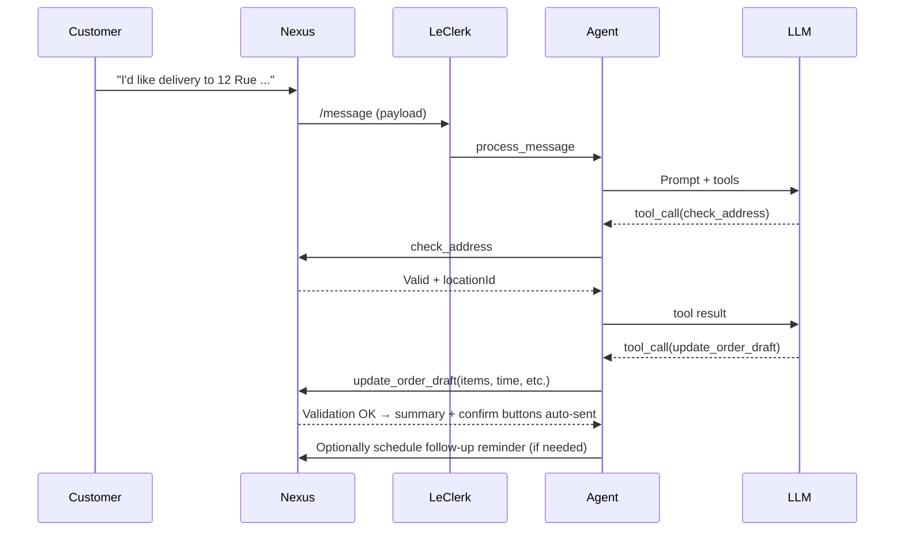

## LeClerk Chatbot – Architecture & Developer Guide

Welcome to the LeClerk chatbot documentation! This guide will help you understand how our AI-powered restaurant assistant works and how to contribute to its development.

### What is LeClerk?

LeClerk is an intelligent chatbot that handles WhatsApp conversations for restaurants. Think of it as a digital assistant that can:

- Answer customer questions about menus, hours, and services
- Help customers place orders step by step
- Validate delivery addresses and suggest the nearest location
- Handle payment processes and order tracking
- Provide personalized recommendations based on customer history

The chatbot integrates seamlessly with the Châtaigne platform, acting as the conversational layer between customers and the restaurant's backend systems.

### How It Works (High Level)

LeClerk follows a simple but powerful pattern:

1. **Input**: Customers send messages via WhatsApp, which reach our Nexus backend
2. **Processing**: Nexus forwards these messages to LeClerk's FastAPI application
3. **Intelligence**: LeClerk uses an LLM (Large Language Model) with specialized tools to understand and respond
4. **Action**: The system can query menus, update orders, check addresses, and more through the Nexus API
5. **Output**: Responses are sent back to customers via WhatsApp

The system also handles automated events like payment confirmations, delivery updates, and order status changes.

### System Architecture

LeClerk is built as a modular system where each component has a specific responsibility. Let's explore each layer:

## Authentication & Security

LeClerk uses a simple but secure authentication model. The system validates requests using **Bearer token authentication** with a shared API key between the Nexus backend and the LeClerk service.

When Nexus sends a request to LeClerk (either for message processing or event notifications), it includes an `Authorization: Bearer <API_KEY>` header. LeClerk validates this against the `NEXUS_API_KEY` environment variable. This ensures that only trusted systems can trigger chatbot responses.

The authentication is handled by middleware in `main.py` that checks every incoming request, providing a secure foundation for all chatbot operations.

## Core Components

### 1. FastAPI Application (`main.py`)

This is the entry point of LeClerk. It's a FastAPI web application that:

- Exposes HTTP endpoints for receiving messages and events from Nexus
- Handles authentication using Bearer tokens
- Manages application lifecycle (startup, shutdown, health checks)
- Initializes all other components like the ChatAgent, logging, and monitoring

### 2. ChatAgent (`bot/agent.py`)

The brain of the operation. The ChatAgent:

- Receives conversation data and decides how to respond
- Builds prompts for the language model using customer context and conversation history
- Manages tool calls (like checking addresses or updating orders)
- Handles both single-location restaurants and multi-location organizations
- Returns structured responses that get sent back to customers

### 3. NexusClient (`nexus.py`)

This is the bridge between LeClerk and the main Châtaigne backend. It:

- Makes HTTP requests to Nexus API endpoints
- Handles retries and error recovery
- Provides typed methods for all backend operations (orders, payments, addresses, etc.)
- Includes observability tracing for debugging

### 4. Language Model Integration

LeClerk uses either OpenAI or OpenRouter APIs to power its conversations. The LLM:

- Receives carefully crafted prompts with restaurant and customer context
- Has access to a set of tools it can call to perform actions
- Generates natural language responses for customers
- Can reason about complex ordering scenarios and provide helpful assistance

### 5. Tool System (`bot/tool_definitions.py`)

Tools are special functions the LLM can call to interact with the restaurant's systems:

- **Menu tools**: Search products, check availability, get pricing
- **Order tools**: Create and update order drafts, apply discounts
- **Address tools**: Validate delivery addresses, suggest nearest locations
- **Customer tools**: Access order history, manage preferences
- **Communication tools**: Send messages, schedule follow-ups

For complete details on all available tools, see our [Tools Reference Guide](/working-with-the-chatbot/leclerk-tools).

### 6. Supporting Systems

- **Logging**: Rich, colorful logs with structured data for debugging
- **Monitoring**: Langfuse integration for tracing AI interactions
- **Notifications**: Discord alerts and Linear issue creation for problems
- **Models**: Pydantic data structures that define how information flows through the system

## How LeClerk Processes Conversations

LeClerk handles two main types of interactions: customer messages and system events. Let's see how each works:

### Customer Message Flow

When a customer sends a message via WhatsApp, here's what happens:

The key insight is that LeClerk receives rich context about the customer, their location, conversation history, and current orders. This allows it to provide personalized, contextual responses.

For detailed information about message processing, see [Message Webhook Processing](/working-with-the-chatbot/message-webhook).

### Event Processing Flow

LeClerk also handles system events like payment confirmations, delivery updates, and order status changes. These events trigger proactive customer communication.

For complete details about event handling, see [Event Webhook Processing](/working-with-the-chatbot/event-webhook).

## Detailed Component Guides

This architecture overview provides the foundation, but each component has dedicated documentation:

### Core Processing

- **[Message Webhook Processing](/working-with-the-chatbot/message-webhook)**: How customer messages are received and processed
- **[Event Webhook Processing](/working-with-the-chatbot/event-webhook)**: How system events trigger customer communication
- **[Message Processing Logic](/working-with-the-chatbot/message-processing)**: Internal XML tag system and response generation

### Key Operations

- **[Check Address Functionality](/working-with-the-chatbot/check-address)**: Address validation and location selection
- **[Update Order Draft](/working-with-the-chatbot/update-order-draft)**: Order management and cart operations
- **[Multi-Location Management](/working-with-the-chatbot/multi-location-management)**: How restaurant chains are handled

### Tools & Integration

- **[Complete Tools Reference](/working-with-the-chatbot/all-tools-reference)**: Every tool available to the AI agent

## Getting Started

For new developers joining the LeClerk project:

1. **Start here**: Read this architecture overview to understand the big picture
2. **Message Flow**: Review [Message Webhook Processing](/working-with-the-chatbot/message-webhook) to understand customer interactions
3. **Core Logic**: Study [Message Processing Logic](/working-with-the-chatbot/message-processing) to understand the AI reasoning system
4. **Key Operations**: Deep dive into [Check Address](/working-with-the-chatbot/check-address) and [Update Order Draft](/working-with-the-chatbot/update-order-draft)
5. **Advanced Features**: Learn about [Multi-Location Management](/working-with-the-chatbot/multi-location-management) for enterprise scenarios
6. **Reference**: Keep the [Tools Reference](/working-with-the-chatbot/all-tools-reference) handy while developing

#### 2) System event flow (POST /nexus/event)

Highlights

- Events include `payment_*`, `order_status_changed`, `delivery_status_changed`, `feedback_request`, `nexus_instruction`.
- The handler constructs context and instructions (e.g., delivery ETAs, courier info) and funnels them to the agent as `<nexus_instructions>`.

### Message Structure & Tags

- The agent returns XML-tagged blocks; only `<response_for_customer>` is sent to the customer.
- Other tags like `<thinking>`, `<scratchpad>`, `<nexus_response>` are internal and stripped before delivery.

### Tools – What the LLM Can Do

Defined in `bot/tool_definitions.py` and executed through `NexusClient`:

- Address & Location
  - `check_address`: validate serviceability; in organization mode returns best `locationId`.
  - `switch_location` (org mode): reset context to another location.
- Menu & Orders
  - `menu_lookup`: browse/search categories, SKUs, deals; optionally with fields/filters.
  - `update_order_draft`: central order state update (service type, items/options, time, codes, deals, etc.).
  - `send_order_form`: send a WhatsApp order flow (if enabled for the location).
- Customer Context
  - `get_customer_previous_orders`: history/favorites/stats.
  - `manage_customer_memory`: get/set/delete persistent notes.
  - `change_customer_language`: sync deterministic UI elements’ language.
- Live Order Status & Engagement
  - `query_live_order_status`: status/payment/tracking/driver/collection/timing.
  - `schedule_message`, `list_scheduled_messages`, `cancel_scheduled_message`.
  - `react_to_message`.
- Feedback & Reporting
  - `register_feedback`: store structured satisfaction scores.
  - `report`: raise issues (Linear) and notify (Discord).

Tool Usage Principles (enforced by prompts)

- Be latency-aware, batch lookups when possible, and prefer minimal field sets.
- Validate delivery early (`check_address`) for delivery intents.
- Always try `update_order_draft` when the customer selects items; let the server validate.

### Location Mode vs Organization Mode

- Location mode: `payload.location` is present; use that catalog and settings.
- Organization mode: no location at first; use `check_address` to select a location, then proceed.
- The agent tracks an effective `locationId` and ensures menu lookups and order updates target the correct site.

### DTOs & Core Data Shapes

- `ChatbotPayloadDTO`: mode, lastMessage, conversation, location? (optional), customer, orders, organization? (optional).
- `ChatbotEventDTO`: type, mode, conversation, location?, customer, order?, paymentMethod?, message?, businessOrganization?.
- `OrderDraft*`, `Order*`, `Delivery*`, `Payment*`: used both in prompts and tool execution.
- `ChatbotCatalogDTO` / `CatalogDTO`: menu data structures (categories, products, skus, option lists, options, deals).

### Prompt Construction

- `prompts.py` builds the system prompt:
  - Background, role, formatting/tone, guidelines, sales tips
  - Store info (opening hours, delivery/payment settings)
  - Customer context (history, memory, language), simplified menu
- Uses lightweight menu formatting (`menu_formatter`) to keep prompts efficient; the agent queries details via tools as needed.

### NexusClient – Server Integration

- Provides typed operations to the Nexus backend with retry/backoff and Langfuse tracing:
  - `send_platform_message`, `register_text_message`, tool results registration
  - `update_order_draft`, `register_order_draft`
  - `check_address`, `get_payment_method_register_url`
  - `create_feedback`, `update_customer`, memory updates
  - `create_scheduled_message`, `cancel_scheduled_message`, `list_scheduled_messages`

### Logging & Observability

- Tracing with Langfuse:
  - Endpoints and client methods are decorated with `@observe()`; traces tagged with store/org, user, session.
  - `utils.create_langfuse_tags` and `format_user_id` standardize trace tags.
- Logging:
  - Rich-based formatting (`logger_config.py`) for clean, structured logs.
  - Message ingress/egress visually logged via `RichLogger.log_message_flow`.
- Notifications:
  - Discord: `NotificationsService.send_discord_notification` with direct links to conversation, Langfuse trace, and logs.
  - Linear: `services/linear.py` for issue creation and attachments.

### Configuration

Environment variables (subset; see `main.Settings` and `.env`):

- Nexus: `NEXUS_URL`, `NEXUS_API_KEY`
- Langfuse: `LANGFUSE_PUBLIC_KEY`, `LANGFUSE_SECRET_KEY`, `LANGFUSE_HOST`, optional `DEV_MODE`
- LLM: `OPENAI_API_KEY` or `OPENROUTER_API_KEY`, `USE_OPENROUTER`
- Integrations: `DISCORD_WEBHOOK_URL`, optional `LINEAR_API_KEY`, `LINEAR_TEAM_ID`

### Error Handling

- API returns proper HTTP errors on failures during processing.
- Validation and business logic errors are surfaced via `<nexus_instructions>` for the agent to act on.
- Technical incidents should be reported via the `report` tool (Linear + Discord), guided by prompt guidelines.

### Endpoints Recap

- `GET /health`: liveness.
- `GET /debug/config`, `GET /debug/langfuse`: diagnostics.
- `POST /message`: main customer-message ingress.
- `POST /nexus/event`: system-events ingress (payments, delivery, instruction, feedback requests).

### Typical Order Scenario

### File Map (Where to Look)

- API surface: `main.py`
- Orchestrator: `bot/agent.py`
- Tool catalog: `bot/tool_definitions.py`
- Prompting/policies: `bot/prompts.py`
- Nexus HTTP integration: `nexus.py`
- Data models: `models.py`
- Utilities: `bot/store_info.py`, `utils.py`, `logger_config.py`, `log_utils.py`
- Notifications/Incidents: `services/notifications.py`, `services/linear.py`

---

If you need more depth in any area (e.g., delivery status branching or payment flows), start from the corresponding case blocks in `main.py`’s `/nexus/event` handler and trace into `ChatAgent` interactions.
