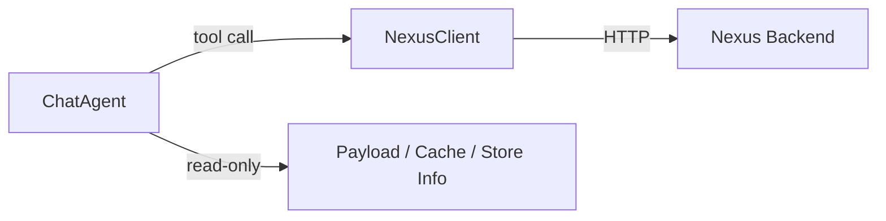

## LeClerk Chatbot – Tools Reference

This document explains every tool exposed to the LLM in LeClerk, what each does, when to use it, and which backend operations they drive. Tools are defined in `LeClerk/src/chataigne_clerk/bot/tool_definitions.py` and are executed by the agent through `NexusClient` or internal services.

### How tools are executed

- Agent decides from the prompt whether to call a tool.
- Tool requests are transformed to concrete actions:
  - API calls via `NexusClient` (e.g., `check_address`, `update_order_draft`, `send_platform_message`, scheduling, feedback, memory updates).
  - Read-only computations (e.g., current time, customer order history, menu queries) using local helpers in `bot/store_info.py`, `bot/menu_*`, etc.
- Results are fed back into the LLM to finalize a customer-facing response.

---

### Address & Location

#### check_address

- **Purpose**: Validate delivery serviceability from an address string or coordinates.
- **Parameters**: `address_string?`, or `latitude?` + `longitude?`.
- **Behavior**:
  - Location mode: validates against the restaurant’s delivery zone.
  - Organization mode: finds the best location (e.g., lowest fee/closest) and returns a `locationId` to use for subsequent tools.
- **Backend**: `NexusClient.check_address()` → `POST /chatbot/check-address`.
- **When to use**: Early for delivery intents; before building large orders.
- **Notes**: Don’t use a generic city point as final address. Ask for exact address if necessary.

#### switch_location (org mode)

- **Purpose**: Switch active location for the current order in organization mode.
- **Parameters**: `location_id`.
- **Behavior**: Resets current draft to the chosen location.
- **Backend**: Implemented by the agent using order-draft updates (location-aware).
- **When to use**: After customer selects another location.

#### organization_location_query (org mode)

- **Purpose**: Read-only info about other locations (list, details, availability).
- **Parameters**: `query_type`, `location_id?`, `service_type?`.
- **Backend**: Read from payload/context; no write.
- **When to use**: Answer customer questions about other branches.

---

### Menu & Orders

#### menu_lookup

- **Purpose**: Browse/search categories, SKUs, deals with flexible fields and filters.
- **Parameters**: `query_type` (browse/list/search/get details), `query?`, `sku_id?`, `deal_id?`, `fields?`, `filters?`, `limit?`, `min_score?`, `location_id?`, `search_all_locations?`.
- **Backend**: Local catalog access (payload), helpers in `menu_formatter.py`, `fuzzy_menu_search.py`, `menu_query_system.py`.
- **When to use**: Any menu discovery, price/options queries, or SKU validation before ordering.
- **Notes**: Prefer minimal `fields` to save tokens; batch queries when possible.

#### update_order_draft

- **Purpose**: Central write for order state (service type, customer details, items/options, deals, delivery time/address, codes, etc.).
- **Parameters**: Structured object with `service_type`, `requested_time`, `items[]`, `deals[]`, `delivery_address_*`, `customer_*`, `payment_method`, `customer_language`, `location_id`, `codes`, `delivery_instructions`.
- **Backend**: `NexusClient.update_order_draft(order_draft_id, updates)` → `PATCH /order-draft/{id}`.
- **When to use**: As soon as the customer selects items or changes state; rely on server validation.
- **Notes**: Server returns validation results and, on ready, triggers order summary + confirmation buttons.

#### send_order_form

- **Purpose**: Send a WhatsApp native Flow (form) to browse/select items.
- **Parameters**: `message` (localized text sent along with the form).
- **Backend**: `NexusClient.send_platform_message(type="flow", cta=...)`.
- **When to use**:
  - Location mode: first message, new customers, after ordering intent, or on request.
  - Organization mode: only after a location is selected.

---

### Customer Context

#### get_customer_previous_orders

- **Purpose**: Fetch history, favorites, and stats to personalize.
- **Parameters**: none.
- **Backend**: Local computation via `store_info.get_customer_orders(payload)`; or pre-fetched data in `<nexus_instructions>`.
- **When to use**: At start or when personalization is helpful.

#### manage_customer_memory

- **Purpose**: Read/write/delete persistent notes about the customer.
- **Parameters**: `operation` (get/set/delete), `memory?`, `memory_type?` (location|businessOrganization).
- **Backend**: `NexusClient.get_customer(...)` and `NexusClient.update_customer_memory(...)`.
- **When to use**: Save preferences, constraints, or helpful context (non-sensitive).

#### change_customer_language

- **Purpose**: Update customer’s preferred language for deterministic UI (flows/buttons/summaries) and future chats.
- **Parameters**: `language` (fr|en|de|it|es).
- **Backend**: Implemented via `NexusClient.update_customer(...)`.
- **When to use**: Before sending flows or order summary if the chat language differs from stored preference; when customer explicitly requests.

#### get_current_time

- **Purpose**: Get current time in a timezone to compute scheduled times accurately.
- **Parameters**: `timezone` (IANA string).
- **Backend**: `store_info.get_current_time` (local).
- **When to use**: Any time-based scheduling (e.g., “in 30 minutes”).

#### get_store_information

- **Purpose**: Retrieve store metadata for prompt context (address, opening hours, payment/delivery settings, catalog presence).
- **Parameters**: `info_types[]`.
- **Backend**: `store_info.get_store_info(payload)`; menu formatting via `menu_formatter`.
- **When to use**: Populate/refresh prompt context.

---

### Live Order Status & Engagement

#### query_live_order_status

- **Purpose**: Answer questions about the customer’s current (non-completed) order: status/payment/tracking/driver/collection/timing.
- **Parameters**: `query_type` (status|payment|delivery|tracking|driver|collection|timing|all), `order_id?`.
- **Backend**: Read from `payload.orders` and order/delivery sub-objects; may combine with recent updates.
- **When to use**: “Where’s my order?”, “Do I have tracking?”, etc.

#### react_to_message

- **Purpose**: Send an emoji reaction to a specific customer message.
- **Parameters**: `emoji`, `message_to_react` (subset of the content to identify the message).
- **Backend**: `NexusClient.send_reaction(...)` → `POST /message/platform` with type `reaction`.
- **When to use**: Lightweight acknowledgment.

#### schedule_message / list_scheduled_messages / cancel_scheduled_message

- **Purpose**: Manage scheduled customer messages.
- **Parameters**:
  - schedule_message: `message`, `scheduled_for` (ISO), `type` (permanent|until_next_message).
  - list_scheduled_messages: none.
  - cancel_scheduled_message: `scheduled_message_id`.
- **Backend**: `NexusClient.create_scheduled_message`, `list_scheduled_messages`, `cancel_scheduled_message`.
- **When to use**: Reminders, gentle follow-ups. Use sparingly.

---

### Feedback & Reporting

#### register_feedback

- **Purpose**: Persist structured customer feedback with scores.
- **Parameters**: `feedback`, `general_score`, optional `food_score`, `delivery_score`, `ordering_experience_score`, `order_id?`.
- **Backend**: `NexusClient.create_feedback(...)` → `POST /feedback`.
- **When to use**: After `feedback_request` events or when customer shares feedback.

#### report

- **Purpose**: Create a report (Linear issue) and send Discord notification.
- **Parameters**: `title`, `description`, `priority` (P0–P4).
- **Backend**: `services/linear.py` + `services/notifications.py` (Discord + links to Langfuse and conversation).
- **When to use**: Technical issues, edge cases, abuse, or anything needing follow-up.

---

### Utilities & Internal

#### think

- **Purpose**: Internal reflection for complex reasoning; appends thought to log.
- **Parameters**: `thought`.
- **Backend**: None (latency cost; not customer-visible).
- **When to use**: Complex parsing/validation/ambiguity or large orders.

#### generate_fortune_wheel_link (conditional)

- **Purpose**: Generates a gamified link for specific stores.
- **Parameters**: `customer_message`, `customer_name`.
- **Backend**: Custom logic gated by specific `whatsappNumber`s.
- **When to use**: Only for the configured store numbers when the customer asks about the game.

---

### Best Practices

- Prefer minimal tool calls; batch menu lookups; avoid redundant reads.
- Validate delivery feasibility early with `check_address` for delivery flows.
- After any selection, try `update_order_draft` and let server validation guide next steps.
- Localize UI primitives with `change_customer_language` before flows/summaries.
- Use scheduling sparingly; favor real-time conversation.
- Always keep the customer response under `<response_for_customer>`; internal thoughts under `<thinking>` are stripped before sending.

### Related

- Architecture: [LeClerk Architecture](/working-with-the-chatbot/leclerk-architecture)
- API client: `LeClerk/src/chataigne_clerk/nexus.py`
- Tool definitions: `LeClerk/src/chataigne_clerk/bot/tool_definitions.py`
