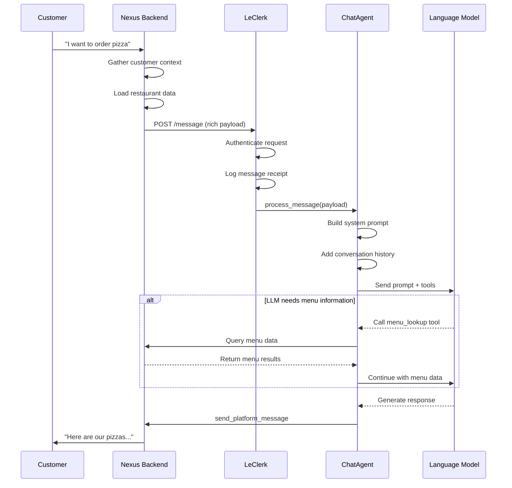

## Message Webhook Processing

The Message Webhook endpoint (`POST /message`) is the primary entry point for customer conversations. Every time a customer sends a message via WhatsApp, it flows through this endpoint to LeClerk for processing.

### What Happens When a Customer Sends a Message

When a customer types "I'd like to order pizza" or "What are your hours?", here's the journey their message takes:

1. **WhatsApp** receives the message
2. **Nexus Backend** processes it and gathers context
3. **LeClerk** receives a rich payload with everything needed to respond intelligently
4. **ChatAgent** crafts a personalized response
5. **Customer** receives a helpful reply

### The Message Payload

LeClerk doesn't just receive the raw text—it gets a comprehensive payload with context:

#### Customer Information

- **Identity**: Customer ID, name, phone number, language preferences
- **History**: Previous orders, favorite items, dietary restrictions
- **Memory**: Any notes the chatbot has saved about this customer's preferences

#### Conversation Context

- **Current Conversation**: Full message history for this session
- **Mode**: Whether this is a single location or multi-location organization
- **Platform**: WhatsApp, with specific conversation ID

#### Location & Restaurant Data

- **Restaurant Info**: Hours, contact details, service types (delivery/pickup)
- **Menu**: Current catalog with prices, availability, and options
- **Settings**: Payment methods, delivery zones, special promotions

#### Current Orders

- **Active Drafts**: Any orders the customer is currently building
- **Recent Orders**: Order history for quick reordering
- **Payment Status**: Saved payment methods and preferences

### Processing Flow

### Message Types LeClerk Handles

#### 1. Menu Inquiries

- "What pizzas do you have?"
- "Do you have gluten-free options?"
- "What's in the Margherita?"

**Response Pattern**: LeClerk searches the menu, formats results clearly, and may suggest related items or deals.

#### 2. Ordering Requests

- "I want a large pepperoni pizza"
- "Add a Coke to my order"
- "I'll take the lunch special"

**Response Pattern**: LeClerk validates the request, updates the order draft, confirms details, and guides toward checkout.

#### 3. Service Questions

- "Do you deliver to [address]?"
- "What are your hours?"
- "How much is delivery?"

**Response Pattern**: LeClerk checks business settings, validates addresses if needed, and provides accurate information.

#### 4. Order Management

- "Cancel my order"
- "Change my address"
- "When will my food arrive?"

**Response Pattern**: LeClerk accesses current order status and makes appropriate updates or provides tracking information.

#### 5. Account & History

- "What did I order last time?"
- "Save this as my usual order"
- "Update my payment method"

**Response Pattern**: LeClerk accesses customer history and preferences, making personalized suggestions.

### Location vs Organization Mode

#### Location Mode

When a customer is talking to a specific restaurant location:

- All menu queries target that location's catalog
- Orders are placed for that specific restaurant
- Address validation checks that location's delivery zone
- Store hours and contact info are location-specific

#### Organization Mode

When a customer contacts a restaurant chain:

- First step is usually address validation to find the nearest location
- Once location is determined, behavior switches to location-specific mode
- Customers can switch between locations during the conversation

### Authentication & Security

Every message request includes:

- **Bearer Token**: Validates the request comes from trusted Nexus backend
- **Customer Verification**: Ensures the conversation belongs to the stated customer
- **Rate Limiting**: Prevents abuse and ensures fair usage

### Error Handling

When something goes wrong:

#### Validation Errors

- Invalid customer ID → Ask customer to restart conversation
- Malformed payload → Log error, request retry from Nexus
- Authentication failure → Return 401, trigger security alerts

#### Processing Errors

- LLM API failure → Fallback to simple canned responses
- Tool call failure → Graceful degradation with apology
- Menu data unavailable → Inform customer and suggest callback

#### Recovery Patterns

- Always try to keep the conversation going
- Provide clear error messages when possible
- Escalate to human support when automated recovery fails

### Response Quality

LeClerk aims for responses that are:

- **Contextual**: Use customer history and preferences
- **Accurate**: Verify information before stating it
- **Helpful**: Guide customers toward successful completion
- **Natural**: Sound conversational, not robotic
- **Concise**: Provide needed information without overwhelming

### Development Considerations

When working with message processing:

#### Testing Messages

Use the `/debug/config` endpoint to verify your LeClerk instance is properly configured before testing message flows.

#### Adding New Message Types

1. Consider what context the LLM needs
2. Determine if new tools are required
3. Update prompts to handle the new scenarios
4. Test with realistic customer data

#### Performance Optimization

- Message processing should complete in under 3 seconds
- Use parallel tool calls when possible
- Cache frequently accessed data
- Monitor LLM token usage and response times

### Monitoring & Analytics

Every message is tracked for:

- **Response Time**: How long it takes to process
- **Tool Usage**: Which tools were called and why
- **Customer Satisfaction**: Track successful order completions
- **Error Rates**: Monitor and alert on processing failures

The message webhook is the heart of LeClerk's customer interaction system. Understanding its flow and capabilities is essential for anyone working on the chatbot or integrating with it.
