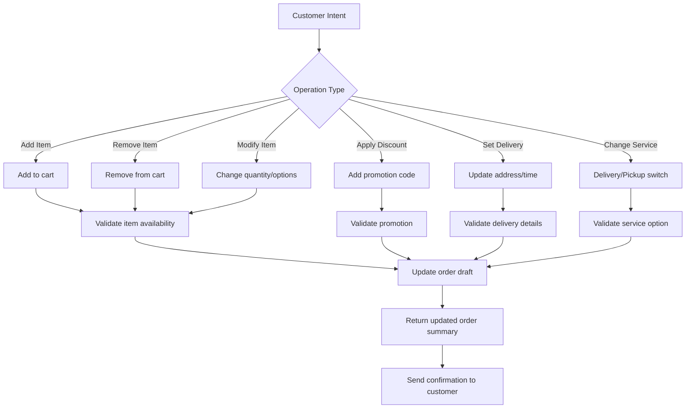

## Update Order Draft Functionality

The `update_order_draft` tool is the central hub for all order management in LeClerk. It handles everything from adding items to a cart to applying discounts, setting delivery details, and managing customer preferences. Understanding how this tool works is essential for anyone working on the ordering experience.

### What is an Order Draft?

An order draft is a "work in progress" order that lives in the system until the customer decides to finalize and pay for it. Think of it as a shopping cart that remembers what the customer wants, where they want it delivered, and how they want to pay.

Order drafts are:

- **Persistent**: They survive across conversation sessions
- **Flexible**: Can be modified at any time before payment
- **Intelligent**: Automatically validate items, calculate totals, and apply business rules
- **Customer-Specific**: Each customer can have multiple drafts for different occasions

### Core Order Draft Operations



### Adding Items to Orders

When a customer says "I want a large pepperoni pizza," here's what happens:

#### Item Resolution

The system needs to figure out exactly what the customer wants:

```json
{
  "operation": "add_item",
  "item_search": "large pepperoni pizza",
  "quantity": 1
}
```

#### Smart Matching

LeClerk matches customer requests to actual menu items:

- "pepperoni pizza" → "Pizza Pepperoni"
- "large" → Size option: "Large"
- "extra cheese" → Additional topping: "Extra Cheese"
- "no onions" → Remove ingredient: "Onions"

#### Validation and Options

Before adding items, the system validates:

- **Availability**: Is the item currently available?
- **Size Options**: What sizes are available?
- **Required Choices**: Does the customer need to pick a crust type?
- **Pricing**: What's the current price including any promotions?

#### Successful Addition

```json
{
  "success": true,
  "item_added": {
    "name": "Pizza Pepperoni",
    "size": "Large",
    "price": 14.0,
    "quantity": 1
  },
  "order_total": 14.0,
  "message": "Added Large Pepperoni Pizza (€14.00) to your order."
}
```

### Handling Complex Orders

#### Multiple Items

```xml
<thinking>
Customer said "I want 2 large pepperonis and a Coke". This is multiple items in one request.
I should add them all in a single update_order_draft call.
</thinking>

<!-- Tool call with multiple items -->

<response_for_customer>
Perfect! I've added to your order:
• 2x Large Pepperoni Pizza (€14.00 each)
• 1x Coca-Cola (€2.50)

Your current total is €30.50. What else would you like?
</response_for_customer>
```

#### Customizations and Options

```json
{
  "operation": "add_item",
  "item_id": "pizza_margherita",
  "size": "large",
  "options": {
    "crust": "thin",
    "extra_toppings": ["extra_cheese", "mushrooms"],
    "remove_ingredients": ["basil"]
  },
  "special_instructions": "Well done, please"
}
```

#### Bundle and Deal Handling

```json
{
  "operation": "add_item",
  "deal_id": "family_combo",
  "deal_selections": {
    "pizza_1": { "id": "pizza_pepperoni", "size": "large" },
    "pizza_2": { "id": "pizza_margherita", "size": "large" },
    "drink": { "id": "coke_2l" },
    "side": { "id": "garlic_bread" }
  }
}
```

### Order Modifications

#### Changing Quantities

```xml
<thinking>
Customer wants to change from 1 to 2 pizzas. I need to update the quantity of the existing item.
</thinking>

<response_for_customer>
Updated! You now have 2x Large Pepperoni Pizza in your order.
New total: €28.00
</response_for_customer>
```

#### Removing Items

```json
{
  "operation": "remove_item",
  "item_reference": "pizza_pepperoni_large",
  "quantity": 1
}
```

#### Swapping Items

```json
{
  "operation": "replace_item",
  "old_item": "pizza_pepperoni_large",
  "new_item": "pizza_hawaiian_large"
}
```

### Service Type Management

#### Delivery Setup

```json
{
  "operation": "set_service_type",
  "service_type": "delivery",
  "delivery_address": "123 Rue de Rivoli, Paris 75001",
  "delivery_time": "asap"
}
```

#### Pickup Configuration

```json
{
  "operation": "set_service_type",
  "service_type": "pickup",
  "pickup_time": "2024-01-15T19:30:00Z"
}
```

#### Scheduled Orders

```json
{
  "operation": "set_timing",
  "service_type": "delivery",
  "scheduled_time": "2024-01-15T20:00:00Z",
  "delivery_address": "456 Avenue des Champs-Élysées"
}
```

### Discount and Promotion Handling

#### Applying Promotion Codes

```json
{
  "operation": "apply_discount",
  "discount_code": "SAVE10",
  "verification": true
}
```

#### Automatic Promotions

The system automatically applies eligible promotions:

- Order value discounts: "Free delivery over €25"
- Time-based promotions: "20% off Tuesday orders"
- Customer-specific offers: "Welcome back! 15% off"

#### Promotion Validation

```json
{
  "discount_applied": true,
  "discount_name": "10% Off Any Order",
  "discount_amount": 2.5,
  "new_total": 22.5,
  "message": "SAVE10 code applied! You saved €2.50"
}
```

### Payment Method Integration

#### Setting Payment Preferences

```json
{
  "operation": "set_payment_method",
  "payment_type": "card",
  "save_method": true
}
```

#### Payment Method Validation

```json
{
  "payment_method_valid": true,
  "payment_type": "Visa ending in 4242",
  "requires_confirmation": false
}
```

### Error Handling and Validation

#### Item Unavailability

```json
{
  "success": false,
  "error": "item_unavailable",
  "message": "Sorry, Large Pepperoni Pizza is currently sold out. Would you like to try our Large Margherita instead?",
  "alternatives": [
    { "name": "Large Margherita", "price": 12.5 },
    { "name": "Large Hawaiian", "price": 13.5 }
  ]
}
```

#### Invalid Discounts

```json
{
  "success": false,
  "error": "invalid_discount",
  "message": "The code 'EXPIRED10' is no longer valid. Here are some current offers available to you:",
  "available_discounts": [
    { "code": "WELCOME15", "description": "15% off your first order" }
  ]
}
```

#### Address Validation Errors

```json
{
  "success": false,
  "error": "delivery_unavailable",
  "message": "We don't deliver to that address. Our delivery radius is 5km from the restaurant. Would you like to try pickup instead?"
}
```

### Order Summary and Confirmation

After each update, customers receive a clear summary:

```xml
<response_for_customer>
Here's your updated order:

🍕 2x Large Pepperoni Pizza - €28.00
🥤 1x Coca-Cola - €2.50
📍 Delivery to: 123 Rue de Rivoli, Paris
🚚 Delivery fee: €3.00
💰 Subtotal: €33.50

⏰ Estimated delivery: 45-60 minutes

Ready to proceed to payment, or would you like to add anything else?
</response_for_customer>
```

### Advanced Features

#### Customer Memory Integration

```json
{
  "operation": "add_favorite_order",
  "customer_memory": "usual_order",
  "items": [
    { "id": "pizza_pepperoni", "size": "large" },
    { "id": "coke", "size": "regular" }
  ]
}
```

#### Order Splitting

```json
{
  "operation": "split_order",
  "split_reason": "different_delivery_times",
  "order_1": { "items": ["pizza_1"], "delivery_time": "asap" },
  "order_2": { "items": ["pizza_2", "dessert"], "delivery_time": "20:00" }
}
```

#### Group Orders

```json
{
  "operation": "start_group_order",
  "participants": ["customer_1", "customer_2"],
  "shared_items": true,
  "payment_split": "equal"
}
```

### Integration with Other Systems

#### Inventory Management

Order drafts check real-time inventory:

- Validate item availability before adding
- Suggest alternatives for unavailable items
- Update availability status during ordering

#### Pricing Engine

Dynamic pricing based on:

- Time of day (peak hour surcharges)
- Customer segment (loyalty discounts)
- Order value (bulk discounts)
- Location-specific pricing

#### Kitchen Integration

Order complexity affects preparation time:

- Simple orders: Standard timing
- Heavy customizations: Extended prep time
- Peak hours: Adjusted estimates

### Development Best Practices

#### Atomic Updates

Always update order drafts atomically—either the entire update succeeds or it fails completely.

#### Validation First

Validate all changes before applying them to prevent inconsistent states.

#### Clear Feedback

Always provide clear feedback about what changed and why.

#### Error Recovery

When updates fail, provide helpful alternatives and recovery paths.

#### Performance Optimization

- Cache frequently accessed menu data
- Batch multiple operations when possible
- Optimize for common ordering patterns

The update_order_draft tool is the workhorse of LeClerk's ordering system. It transforms natural language customer requests into structured order data while ensuring business rules, inventory constraints, and customer preferences are all respected. Mastering this tool is crucial for creating smooth ordering experiences.
