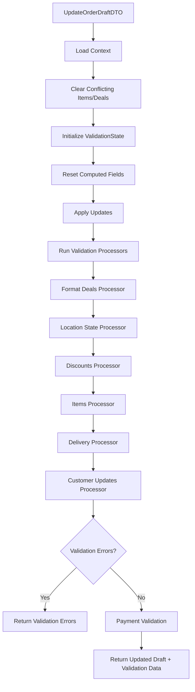

## Update Order Draft Functionality

The `update_order_draft` tool is LeClerk's core order management system. Unlike a traditional shopping cart with simple add/remove operations, this system uses a sophisticated validation and processing pipeline to ensure orders are valid, properly priced, and ready for fulfillment.

### What is an Order Draft?

An order draft represents a customer's order-in-progress within a conversation. It's a stateful entity that accumulates customer choices and gets validated/updated through the `CheckAndUpdateOrderDraftUsecase`.

Key characteristics:

- **Conversation-Scoped**: Each order draft belongs to a specific WhatsApp conversation
- **Stateful**: Maintains items, deals, delivery details, timing, and customer preferences
- **Validated**: Every update triggers comprehensive validation before persistence
- **Mode-Aware**: Handles both single-location and multi-location organization scenarios

### The Update and Validation Pipeline

The system uses a processor-based architecture rather than simple CRUD operations:



### How Order Updates Work

The system receives an `UpdateOrderDraftDTO` which can contain:

```typescript
{
  // Location and delivery
  deliveryAddress?: AddressDTO;
  locationId?: string;
  deliveryAddressString?: string;
  deliveryAddressCoordinates?: { latitude: number; longitude: number };

  // Timing
  requestedTime?: Date | "ASAP";

  // Customer details
  customerFirstName?: string;
  customerLastName?: string;
  customerLanguage?: Language;
  customerNote?: string;
  deliveryInstructions?: string;

  // Order content (mutually exclusive)
  items?: CreateOrderDraftItemDTO[];     // Regular items
  deals?: CreateOrderDraftDealDTO[];     // Deal-based items

  // Service and payment
  serviceType?: ServiceTypeDTO;
  paymentMethod?: PaymentMethodTypeDTO;
  codes?: string[];  // Promotion codes
}
```

### Key Constraint: Items vs Deals

Order drafts support either **items** OR **deals**, but not both simultaneously:

- If `items` are provided in an update, any existing `deals` are cleared
- If `deals` are provided in an update, any existing `items` are cleared
- This ensures clean order structure and prevents pricing conflicts

### The Validation Processors

#### 1. Format Deals Processor

- Validates deal structure and SKU assignments
- Ensures each deal line has exactly one SKU selected
- Optimizes SKU-to-deal-line assignments for best pricing

#### 2. Location State Processor

- Validates the location exists and is operational
- Checks if location is paused or outside operating hours
- Sets up location-specific business rules

#### 3. Discounts Processor

- Applies automatic discounts based on order value, timing, customer segment
- Validates and applies promotion codes from `codes` array
- Calculates discount amounts and updates order totals

#### 4. Items Processor

- Validates each SKU exists in the catalog
- Checks product availability restrictions (time, date, service type)
- Validates option selections and quantities
- Ensures deal-only SKUs aren't ordered outside of deals

#### 5. Delivery Processor

- Validates delivery addresses using geocoding
- Checks delivery zones and restrictions
- Calculates delivery fees based on location and distance
- Handles different delivery modes (UberDirect, Chaskis, postal code, etc.)

#### 6. Customer Updates Processor

- Updates customer profile information
- Handles language preferences and personal details

### Working with Items and SKUs

Items in the order draft are based on **SKU Internal IDs** rather than product names:

```typescript
// Adding items to an order draft
{
  items: [
    {
      skuInternalId: "pizza_pepperoni_large",
      quantity: 2,
      options: [
        {
          optionInternalId: "extra_cheese",
          quantity: 1,
        },
      ],
    },
  ];
}
```

#### Item Structure

Each item contains:

- **`skuInternalId`**: References a specific product variant (Pizza Pepperoni - Large)
- **`quantity`**: How many of this item
- **`options`**: Array of selected options with their quantities

### Working with Deals

Deals represent bundle offers with multiple SKUs at special pricing:

```typescript
{
  deals: [
    {
      dealInternalId: "family_combo",
      skus: [
        {
          skuInternalId: "pizza_pepperoni_large",
          quantity: 1,
          options: [
            {
              optionInternalId: "thin_crust",
              quantity: 1,
            },
          ],
        },
        {
          skuInternalId: "pizza_margherita_large",
          quantity: 1,
          options: [],
        },
        {
          skuInternalId: "coke_2l",
          quantity: 1,
          options: [],
        },
      ],
    },
  ];
}
```

#### Deal Validation Rules

- Each deal line must have exactly one SKU selected
- All SKUs must be available and valid for the deal
- Option selections must be valid for each SKU
- Deal pricing is calculated automatically

### Common Validation Errors

The system returns specific error codes when validation fails:

#### Item-Related Errors

- **`SKU_NOT_FOUND$${skuId}`**: The requested SKU doesn't exist in the catalog
- **`SKU_OUT_OF_STOCK$${skuId}`**: The SKU is temporarily unavailable
- **`SKU_ONLY_AVAILABLE_IN_DEALS$${skuId}`**: This SKU can only be ordered as part of a deal
- **`OPTION_NOT_FOUND$${optionId}`**: The selected option doesn't exist
- **`NOT_ENOUGH_OPTIONS_SELECTED$${skuId}$${optionListId}$${min}$${selected}`**: More options required
- **`TOO_MANY_OPTIONS_SELECTED$${skuId}$${optionListId}$${max}$${selected}`**: Too many options selected

#### Product Restriction Errors

- **`PRODUCT_NOT_AVAILABLE_TODAY$${productId}$${date}$${reason}`**: Product not available on this date
- **`PRODUCT_NOT_AVAILABLE_AT_THIS_TIME_TOO_EARLY$${productId}$${time}$${availableFrom}$${date}`**: Ordered too early
- **`PRODUCT_NOT_AVAILABLE_FOR_DELIVERY$${productId}$${reason}`**: Not available for delivery service

#### Deal-Related Errors

- **`DEAL_NOT_FOUND$${dealId}`**: The deal doesn't exist
- **`DEAL_SKU_NOT_IN_DEAL$${dealId}$${skuId}`**: SKU is not part of this deal
- **`DEAL_INCORRECT_SKU_COUNT$${dealId}$${line}$${expected}`**: Wrong number of SKUs for deal line

#### Service and Delivery Errors

- **`DELIVERY_ADDRESS_REQUIRED`**: Address needed for delivery orders
- **`OUTSIDE_OF_DELIVERY_RADIUS$${distance}`**: Address outside delivery zone
- **`MINIMUM_ORDER_NOT_MET$${minimum}$${current}$${currency}`**: Order below minimum value
- **`LOCATION_IS_PAUSED`**: Restaurant is temporarily closed

### Response Structure

The `CheckAndUpdateOrderDraftUsecase` returns a `CheckAndUpdateOrderDraftReturnDTO`:

```typescript
{
  orderDraft: OrderDraftDTO; // Updated order draft with all changes
  validation: OrderDraftValidationDTO; // Validation results
}
```

#### Validation Types

The validation object indicates the order's readiness state:

##### 1. Validation Errors

```typescript
{
  type: "validationError",
  errors: [
    "SKU_NOT_FOUND$pizza_invalid",
    "DELIVERY_ADDRESS_REQUIRED"
  ],
  validationData: {
    // Any computed data (delivery fees, timing, etc.)
  }
}
```

##### 2. Payment Setup Required

```typescript
{
  type: "noPaymentMethod",
  validationData: {
    paymentMethodSetupUrl: "https://checkout.stripe.com/setup/...",
    availablePaymentMethods: ["card", "ideal", "bancontact"]
  }
}
```

##### 3. Ready for Payment

```typescript
{
  type: "readyForPayment",
  validationData: {
    deliveryTime: "2024-01-15T19:30:00Z",
    deliveryFee: { amount: 350, currency: "EUR" },
    serviceFee: { amount: 150, currency: "EUR" },
    discounts: [
      {
        type: "percentage",
        percentage: 10,
        priceOff: { amount: 250, currency: "EUR" }
      }
    ]
  }
}
```

### Timing and Scheduling

Time handling is complex and considers:

#### Business Hours

- Restaurant operating hours
- Kitchen preparation times
- Delivery time windows

#### Service Type Impact

- **Collection**: Only needs ready time (when food is prepared)
- **Delivery**: Needs both ready time and delivery time (includes travel)

#### Timing Validation

- **`OUTSIDE_OF_STORE_HOURS`**: Requested time outside restaurant hours
- **`OUTSIDE_OF_DELIVERY_HOURS`**: Delivery requested outside delivery window
- **`REQUESTED_TIME_REQUIRED`**: Must specify ASAP or scheduled time

### Delivery Mode Handling

The delivery processor handles different delivery modes based on location settings:

#### UberDirect Integration

- Validates addresses using Uber's API
- Calculates real-time delivery quotes
- Handles special Uber timing and fee requirements
- Error codes: `UBER_ADDRESS_UNDELIVERABLE`, `INVALID_UBER_TIMINGS`

#### Chaskis Delivery

- Validates delivery zones using geographic boundaries
- Calculates distance-based fees
- Considers traffic and route optimization

#### Postal Code Delivery

- Simple postcode-based zone validation
- Fixed fees per postcode area
- Error: `POSTAL_CODE_NOT_SERVED$${postalCode}`

#### Free Delivery

- Validates minimum order requirements
- May have time or zone restrictions

### Multi-Location Considerations

In organization mode, the system handles:

#### Location Assignment

- If no `locationId` is provided, address checking determines the best location
- Error: `LOCATION_ID_NOT_FOUND_IN_BUSINESS_ORGANIZATION`

#### Location Switching

- Updating `locationId` switches the context to a different restaurant
- All subsequent validations use the new location's catalog and settings

### Advanced Features

#### Promotion Code Processing

The `codes` array in `UpdateOrderDraftDTO` triggers automatic discount validation:

- Validates code existence and eligibility
- Applies percentage, fixed amount, BOGO, or free product discounts
- Calculates cumulative effects of multiple codes

#### Customer Memory Integration

The system can update customer preferences:

- Language preferences affect future interactions
- Name updates sync across the customer profile
- Notes and instructions are stored for reuse

#### Order Summary Generation

After successful validation, the system provides:

- Itemized pricing with options
- Applied discounts and their effects
- Delivery fees broken down by type (delivery + service)
- Timing estimates based on kitchen capacity and delivery distance

### Development Considerations

#### State Management

The system uses `ValidationState` internally to track:

- A working copy of the order draft (`draft`)
- Accumulated validation errors (`errors`)
- Computed validation data (`validationData`)
- A log of all patches applied (`patchLog`)

#### Processor Architecture

Each processor is self-contained and can:

- Validate specific aspects of the order
- Apply patches to the working draft
- Add errors to the validation context
- Compute additional data (fees, timing, etc.)

#### Error Recovery

The validation pipeline stops at the first processor that encounters errors, ensuring:

- Fast failure for invalid requests
- Consistent error reporting
- No unnecessary computation after validation fails

#### Testing Strategies

- Mock individual processors for unit testing
- Use full integration tests for complex validation scenarios
- Test error conditions extensively
- Verify that patches are applied correctly

### Performance Characteristics

#### Caching

- Catalog data is cached to avoid repeated database queries
- Geographic validation results are cached by address
- Customer data is loaded once per request

#### Database Interactions

- Context loading happens upfront with optimized queries
- Order draft updates are atomic
- Customer profile updates are separate transactions

#### Scalability Considerations

- Processors run sequentially but could be parallelized for independent validations
- Geographic APIs (geocoding, Uber) are rate-limited
- Complex deals with many SKU combinations can be computationally expensive

### Integration Points

The update order draft system integrates with:

- **Catalog Service**: For product, SKU, and deal validation
- **Customer Service**: For profile updates and preferences
- **Location Service**: For business rules and operational status
- **Pricing Service**: For discount calculation and fee computation
- **Delivery Services**: For address validation and quote generation
- **Payment Service**: For payment method validation and setup

Understanding this sophisticated validation and processing pipeline is essential for working with LeClerk's order management system. The system prioritizes data integrity and business rule compliance while providing detailed feedback for both successful operations and validation failures.
