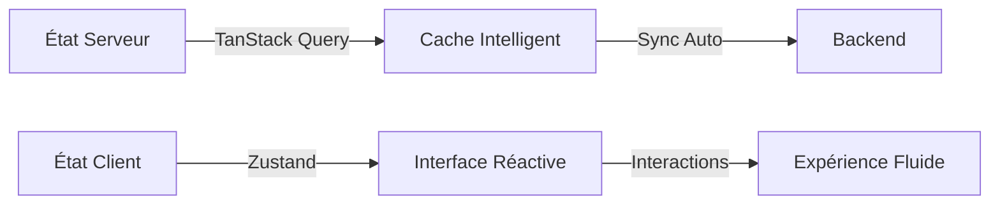

<Info>
  L'interface utilisateur de Châtaigne est construite avec une architecture
  moderne et scalable permettant de gérer efficacement les commandes, les
  clients et l'administration des restaurants via une interface web intuitive.
</Info>

Notre architecture frontend adopte une approche **feature-based** pour une meilleure maintenabilité et scalabilité, en séparant clairement l'état serveur de l'état client pour des performances optimales.

## Principes Architecturaux Fondamentaux

<CardGroup cols={3}>
  <Card title="Feature-Based Architecture" icon="layer-group">
    Organisation modulaire par fonctionnalités métier plutôt que par types de
    fichiers
  </Card>
  <Card title="Séparation des Responsabilités" icon="circle-nodes">
    Distinction claire entre vues, logique métier, services et état
  </Card>
  <Card title="État Hybride" icon="bolt">
    TanStack Query pour l'état serveur, Zustand pour l'état client
  </Card>
</CardGroup>

### 1. Feature-Based Architecture

Notre architecture suit une approche feature-first qui organise le code par fonctionnalités métier. Cela nous permet de :

<Check>Maintenir une autonomie complète de chaque feature</Check>
<Check>Faciliter le développement en équipe avec moins de conflits</Check>
<Check>Faciliter la maintenance et l'évolution du code</Check>

### 2. Organisation Structurelle

L'application est organisée en modules distincts avec des responsabilités claires :

<Steps>
  <Step title="App Router (src/app/)">
    Gestion du routing Next.js uniquement - les pages exportent simplement les
    vues des features
  </Step>
  <Step title="Features (src/features/)">
    Modules métier autonomes contenant toute la logique spécifique à un domaine
  </Step>
  <Step title="Shared (src/shared/)">
    Composants UI, hooks, stores, services et utilitaires partagés entre toutes
    les features
  </Step>
</Steps>

### 3. Gestion d'État Hybride

Notre système sépare intelligemment l'état serveur de l'état client pour éviter les conflits et optimiser les performances :



## Stack Technique

### Technologies Principales

<CardGroup cols={2}>
  <Card title="Framework" icon="react">
    [Next.js 15](https://nextjs.org/) avec App Router
  </Card>
  <Card title="Language" icon="code">
    TypeScript pour la type safety
  </Card>
  <Card title="Styling" icon="palette">
    [Tailwind CSS](https://tailwindcss.com/) +
    [shadcn/ui](https://ui.shadcn.com/)
  </Card>
  <Card title="État Serveur" icon="server">
    [TanStack Query](https://tanstack.com/query) pour le data fetching
  </Card>
  <Card title="État Client" icon="desktop">
    [Zustand](https://zustand-demo.pmnd.rs/) pour l'état local
  </Card>
  <Card title="Validation" icon="shield-check">
    [Zod](https://zod.dev/) pour les schémas runtime
  </Card>
</CardGroup>

### Outils de Développement

<CardGroup cols={2}>
  <Card title="Monitoring" icon="chart-line">
    Sentry pour le tracking d'erreurs
  </Card>
  <Card title="Dev Tools" icon="wrench">
    TanStack Query DevTools
  </Card>
</CardGroup>

## Principes de Design Clés

<Steps>
<Step title="Modularité">
• Architecture feature-based pour l'autonomie des modules

```
• Composants réutilisables et découplés

• Hooks custom pour la logique partagée

```

</Step>

<Step title="Prévisibilité">
• Type safety complète avec TypeScript et Zod

```
• État unidirectionnel et prévisible

• Conventions de nommage cohérentes

```

</Step>

<Step title="Performance">
• Cache intelligent et synchronisation automatique

```
• Optimistic updates pour une UX réactive

• Minimisation des re-renders avec une architecture réactive

```

</Step>

<Step title="Maintenabilité">
• Séparation claire des responsabilités

```
• Tests facilités par l'isolation des couches

• DevTools intégrés pour un debugging efficace

```

</Step>
</Steps>

## Avantages de cette Architecture

Cette approche feature-based avec gestion d'état hybride nous permet de maintenir une interface utilisateur moderne et scalable :

<CardGroup cols={2}>
  <Card title="Autonomie des Features" icon="layer-group">
    Chaque module peut évoluer indépendamment sans impacter les autres
  </Card>
  <Card title="Performance Optimale" icon="gauge">
    Cache intelligent et synchronisation automatique des données
  </Card>
  <Card title="Expérience Développeur" icon="heart">
    Structure prévisible et outils de debugging intégrés
  </Card>
  <Card title="Type Safety Complète" icon="shield">
    Réduction drastique des erreurs avec TypeScript et Zod
  </Card>
</CardGroup>
