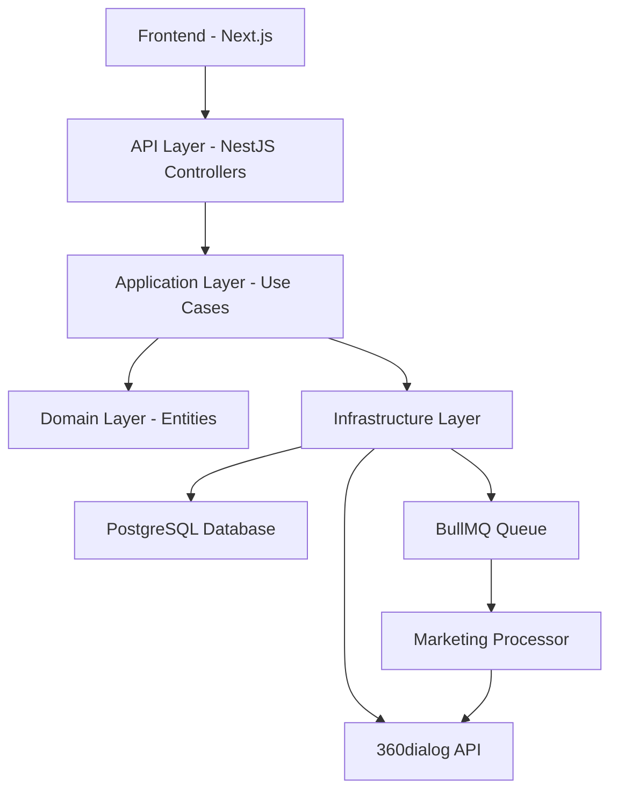
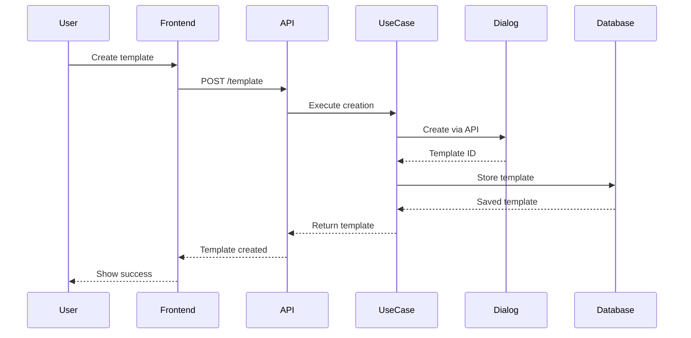
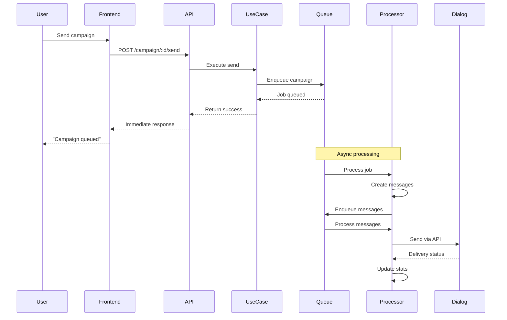

# Marketing Campaigns Technical Documentation

This document provides a comprehensive technical overview of the WhatsApp marketing campaigns feature implementation, including the architecture, data flows, and key components.

## Architecture Overview

The marketing campaigns feature is built on a multi-layered architecture following Domain-Driven Design (DDD) principles:



## Core Components

### 1. Domain Entities

#### TemplateMessage Entity

Located at: `src/domain/entities/message/template/template-message.entity.ts`

- Represents WhatsApp message templates
- Contains header, body, footer, and buttons configuration
- Manages template status (pending, approved, rejected)
- Stores Dialog API identifiers and WABA ID

#### MarketingCampaign Entity

Located at: `src/domain/entities/marketing-campaign/marketing-campaign.entity.ts`

- Represents a marketing campaign instance
- Links to a TemplateMessage
- Stores nexus instructions and variable definitions
- Manages campaign status (draft, pending, accepted, sent, closed)
- Contains campaign statistics (sent, delivered, read counts)

#### MarketingMessage Entity

Located at: `src/domain/entities/marketing-message/marketing-message.entity.ts`

- Represents individual messages within a campaign
- Stores recipient information and message status
- Contains resolved template variables
- Tracks delivery and read receipts

### 2. Application Layer - Use Cases

#### CreateTemplateMessageByEntityUsecase

**Purpose**: Creates WhatsApp message templates for locations or business organizations

**Flow**:

1. Validates entity (location/business organization) exists
2. Checks WhatsApp integration is configured
3. Calls 360dialog API to create template
4. Stores template in database with Dialog ID
5. Returns created template

**Error Handling**:

- `TEMPLATE_VALIDATION_ERROR`: Invalid input data
- `TEMPLATE_LOCATION_NOT_FOUND`: Location doesn't exist
- `TEMPLATE_WHATSAPP_NOT_CONFIGURED`: No WhatsApp integration
- `TEMPLATE_WHATSAPP_API_ERROR`: 360dialog API failure

#### CreateWhatsappCampaignUsecase

**Purpose**: Creates a new marketing campaign

**Flow**:

1. Validates template message exists and is approved
2. Validates entity has WhatsApp integration
3. Creates campaign with initial status (draft or accepted based on user role)
4. Stores nexus instructions and variable definitions
5. Admin-created campaigns are auto-accepted

**Key Features**:

- Auto-acceptance for admin users
- Variable validation and type checking
- Integration validation

#### SendMarketingCampaignUsecase

**Purpose**: Initiates campaign sending to recipients

**Flow**:

1. Validates campaign is in 'accepted' status
2. Deduplicates recipient phone numbers
3. Enqueues campaign data to BullMQ for processing
4. Returns immediately (async processing)
5. Emits `marketing.campaign.sent` event

**Queue Payload**:

```typescript
{
  campaignId: string;
  recipientNumbers: string[];
  whatsappNumber: string;
  sendAt?: Date;
  recipientVariables: Array<{
    phoneNumber: string;
    variables: Record<string, string>;
  }>;
  recipientTemplateOverrides: Array<{
    phoneNumber: string;
    overrides: {
      headerVariable?: string;
      bodyVariables?: string[];
      buttonVariables?: string[];
    };
  }>;
  delayMs: number;
}
```

#### SendMarketingMessageUsecase

**Purpose**: Sends individual marketing messages

**Flow**:

1. Creates MarketingMessage record
2. Resolves all template variables (reserved + custom)
3. Builds Dialog API payload
4. Sends via 360dialog
5. Updates message status
6. Handles conversation initialization

**Variable Resolution**:

- Reserved variables (e.g., `customerFirstName`) pull from database
- Custom variables come from campaign or recipient overrides
- Fallback to default values if not found

### 3. Infrastructure Layer

#### MarketingQueue Implementation

Located at: `src/infrastructure/queues/marketing.queue.ts`

**Configuration**:

- Queue name: `marketing`
- Default concurrency: 5
- Retry attempts: 3
- Backoff strategy: Exponential

**Job Types**:

1. `send-campaign`: Processes entire campaign
2. `send-message`: Sends individual message

#### MarketingProcessor

Located at: `src/infrastructure/queues/processors/marketing.processor.ts`

**Responsibilities**:

1. Processes campaign jobs from queue
2. Creates MarketingMessage records in batches
3. Enqueues individual message jobs
4. Handles rate limiting and retries
5. Updates campaign statistics

**Batch Processing**:

```typescript
// Process recipients in batches
const BATCH_SIZE = 100;
for (let i = 0; i < recipients.length; i += BATCH_SIZE) {
  const batch = recipients.slice(i, i + BATCH_SIZE);
  await this.processBatch(batch, campaign);
}
```

#### DialogClient Integration

Located at: `src/infrastructure/services/dialog/client/dialog.client.ts`

**Key Methods**:

- `template.createTemplateMessage()`: Creates templates
- `template.sendTemplateMessage()`: Sends messages
- `template.getTemplateStatus()`: Checks approval status

### 4. Frontend Implementation

#### Marketing Campaign Components

**MarketingCampaignsModal**

- Creates new campaigns
- Variable definition with visual indicators
- Nexus instructions editor
- Template selection

**SendCampaignModal**

- File upload (CSV/Excel) support
- Automatic column matching
- Variable preview and editing
- Recipient management

**Key Features**:

1. **Reserved Variable Indicators**

   - Blue badges for database variables
   - Tooltips explaining data sources
   - Automatic value resolution

2. **File Processing**

   - Supports CSV and Excel formats
   - Case-insensitive column matching
   - Visual feedback for matched columns

3. **Variable Management**
   - Three types: reserved, file-sourced, manual
   - Inline editing capabilities
   - Clear visual differentiation

## Data Flow Diagrams

### Template Creation Flow



### Campaign Sending Flow



## Reserved Variables System

The system supports automatic variable resolution from the database:

### Supported Reserved Variables

| Variable Name            | Database Field       | Description           |
| ------------------------ | -------------------- | --------------------- |
| `customerFirstName`      | `customer.firstName` | Customer's first name |
| `customerLastName`       | `customer.lastName`  | Customer's last name  |
| `{{customer.firstName}}` | `customer.firstName` | Alternative syntax    |
| `{{customer.lastName}}`  | `customer.lastName`  | Alternative syntax    |
| `{{customer.name}}`      | `customer.name`      | Full name             |
| `{{customer.phone}}`     | `customer.phone`     | Phone number          |

### Resolution Process

1. **Identification**: System identifies reserved variables in template
2. **Customer Lookup**: Finds customer by phone number
3. **Data Extraction**: Retrieves values from customer record
4. **Fallback**: Uses default or empty string if not found

## Queue Processing Details

### Rate Limiting

The system implements rate limiting to comply with WhatsApp Business API limits:

```typescript
// Configuration
const MESSAGES_PER_SECOND = 80;
const BATCH_SIZE = 5;
const DELAY_BETWEEN_BATCHES = 1000 / (MESSAGES_PER_SECOND / BATCH_SIZE);
```

### Error Handling

1. **Retry Logic**:

   - Automatic retry with exponential backoff
   - Maximum 3 retry attempts
   - Failed messages marked with error status

2. **Dead Letter Queue**:

   - Messages failing after retries go to DLQ
   - Manual inspection and reprocessing available

3. **Status Updates**:
   - Real-time status via WebSocket events
   - Campaign statistics updated after each batch

## Testing Strategy

### Unit Tests

Located in `*.spec.ts` files alongside implementation:

1. **Domain Entity Tests**:

   - Validation logic
   - Status transitions
   - Variable management

2. **Use Case Tests**:

   - Business logic validation
   - Error scenarios
   - Integration points mocking

3. **Infrastructure Tests**:
   - Queue processing
   - External API mocking
   - Database operations

### Integration Tests

1. **End-to-End Campaign Flow**:

   - Template creation
   - Campaign configuration
   - Message sending
   - Status tracking

2. **File Processing**:
   - CSV parsing
   - Excel parsing
   - Column matching
   - Variable resolution

## Performance Considerations

### Scalability

1. **Queue-Based Processing**:

   - Handles thousands of recipients
   - Prevents API timeout issues
   - Allows horizontal scaling

2. **Batch Operations**:
   - Database inserts in batches
   - API calls with rate limiting
   - Memory-efficient processing

### Optimization Tips

1. **Database Queries**:

   - Use indexes on phone numbers
   - Batch customer lookups
   - Cache frequently accessed data

2. **File Processing**:
   - Stream large files
   - Process in chunks
   - Validate before processing

## Security Considerations

1. **API Key Management**:

   - Stored encrypted in database
   - Per-location/organization isolation
   - Audit trail for usage

2. **Data Privacy**:

   - Phone number validation
   - PII handling compliance
   - Secure variable storage

3. **Access Control**:
   - Role-based permissions
   - Campaign approval workflow
   - Audit logging

## Monitoring and Debugging

### Key Metrics

1. **Queue Metrics**:

   - Job processing rate
   - Failure rate
   - Queue depth

2. **Campaign Metrics**:

   - Delivery rate
   - Read rate
   - Response rate

3. **System Health**:
   - API response times
   - Database query performance
   - Memory usage

### Debugging Tools

1. **BullMQ Dashboard**: Monitor queue status
2. **Application Logs**: Detailed processing logs
3. **Database Queries**: Campaign and message status
4. **WebSocket Events**: Real-time status updates

## Common Issues and Solutions

### Template Approval Delays

- **Issue**: Templates stuck in pending
- **Solution**: Check 360dialog webhook configuration

### Variable Resolution Failures

- **Issue**: Variables showing as undefined
- **Solution**: Verify customer data exists and column names match

### Queue Processing Delays

- **Issue**: Messages sending slowly
- **Solution**: Adjust concurrency and batch size settings

### File Upload Errors

- **Issue**: Excel files not parsing
- **Solution**: Ensure proper file format and encoding

## Future Enhancements

1. **Advanced Targeting**:

   - Segment-based campaigns
   - Behavioral triggers
   - A/B testing

2. **Analytics**:

   - Conversion tracking
   - ROI calculation
   - Cohort analysis

3. **Automation**:
   - Scheduled campaigns
   - Trigger-based sends
   - Follow-up sequences
