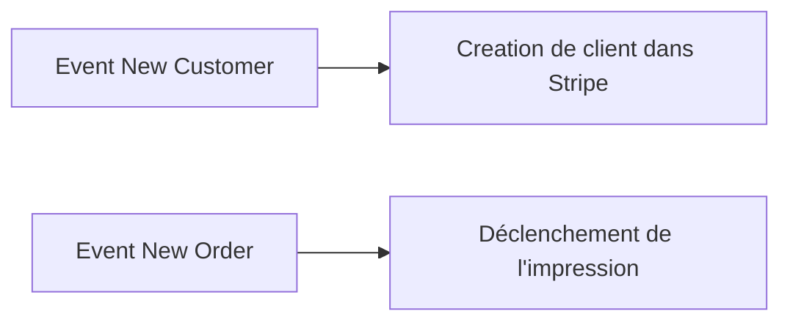

<Info>
  Châtaigne est une plateforme qui transforme WhatsApp en solution complète de
  commande par language naturel pour les restaurants.
</Info>

Notre architecture backend est conçue pour gérer des interactions en temps réel avec les clients via WhatsApp, tout en orchestrant de nombreuses intégrations avec des services tiers (paiement, livraison, POS, etc.).

## Principes Architecturaux Fondamentaux

<CardGroup cols={3}>
  <Card title="Domain-Driven Design" icon="layer-group">
    Séparation claire entre la logique métier et les détails techniques
  </Card>
  <Card title="Clean Architecture" icon="circle-nodes">
    Structure en couches concentriques pour une meilleure organisation
  </Card>
  <Card title="Event-Driven" icon="bolt">
    Architecture orientée événements pour un découplage optimal
  </Card>
</CardGroup>

### 1. Domain-Driven Design (DDD)

Notre architecture suit les principes du Domain Driven Design pour maintenir une séparation claire entre la logique métier et les détails techniques. Cela nous permet de :

<Check>Isoler le domaine métier des détails d'implémentation</Check>
<Check>
  Faciliter l'ajout et la modification des différentes intégrations sans
  impacter le cœur métier
</Check>
<Check>
  Maintenir une cohérence dans le traitement des commandes à travers différents
  canaux
</Check>

### 2. Clean Architecture

L'application est structurée en plusieurs couches concentriques :

<Steps>
  <Step title="Domain Layer">Cœur métier, entités et règles business</Step>
  <Step title="Application Layer">
    Orchestration des use cases et flux métier
  </Step>
  <Step title="Infrastructure Layer">
    Implémentation technique et intégrations
  </Step>
  <Step title="Presentation Layer">API REST et webhooks</Step>
</Steps>

### 3. Event-Driven

Notre système est fortement orienté événements afin de découpler la logique de chaque intégration en réaction à certains évenements :

## Stack Technique

### Technologies Principales

<CardGroup cols={2}>
  <Card title="Framework" icon="node-js">
    [NestJS](https://nestjs.com/) (Node.js)
  </Card>
  <Card title="Base de données" icon="database">
    PostgreSQL avec [Prisma ORM](https://www.prisma.io/)
  </Card>
  <Card title="Message Queue" icon="inbox">
    Redis/BullMQ
  </Card>
  <Card title="Cache" icon="server">
    Redis
  </Card>
  <Card title="API Documentation" icon="book">
    OpenAPI/Swagger
  </Card>
</CardGroup>

### Intégrations Principales

<CardGroup cols={2}>
  <Card title="Messaging" icon="message">
    WhatsApp Business API via 360Dialog
  </Card>
  <Card title="Paiement" icon="credit-card">
    Stripe
  </Card>
  <Card title="POS" icon="cash-register">
    Hubrise
  </Card>
  <Card title="Livraison" icon="truck">
    Uber Direct, Shipday
  </Card>
  <Card title="Impression" icon="print">
    Expedy
  </Card>
</CardGroup>

## Principes de Design Clés

<AccordionGroup>
  <Accordion icon="puzzle-piece" title="Modularité">
    <ul>
      <li>Chaque intégration est isolée dans son propre module</li>
      <li>
        Les adaptateurs permettent de modifier les classes domaine en classe
        adaptée à chaque intégration
      </li>
    </ul>
  </Accordion>

{" "}

<Accordion icon="shield" title="Résilience">
  <ul>
    <li>Gestion des erreurs standardisés</li>
    <li>Retry patterns pour les appels externes</li>
    <li>
      Queue de messages pour les opérations asynchrones lourdes en
      ressources/temps
    </li>
  </ul>
</Accordion>

{" "}

<Accordion icon="arrows-up-down-left-right" title="Scalabilité">
  <ul>
    <li>Architecture modulaire</li>
    <li>
      Interface claires pour certaines fonctionnalités stratégique permettant de
      remplacer facilement l'intégration (Inversion de dépendance)
    </li>
    <li>
      Interface claire des intégrations de Messaging pour un switch simple entre
      Whatsapp et Instagram par exemple
    </li>
  </ul>
</Accordion>

  <Accordion icon="wrench" title="Maintenabilité">
    <ul>
      <li>Tests unitaire, integration et E2E pour chaque fonctionnalités</li>
      <li>Monitoring complet</li>
      <li>Documentation à jour</li>
      <li>Code standardisé</li>
    </ul>
  </Accordion>
</AccordionGroup>
